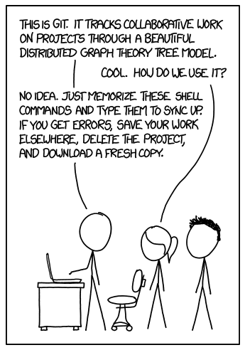
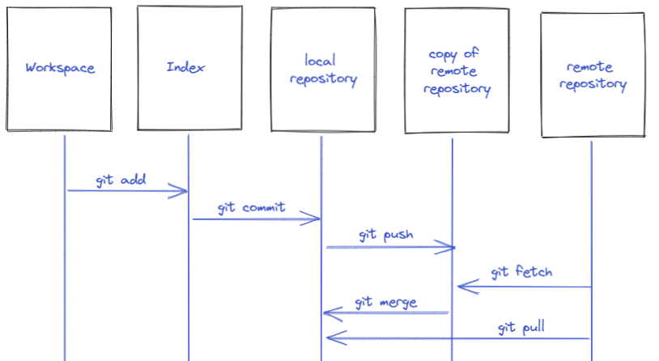
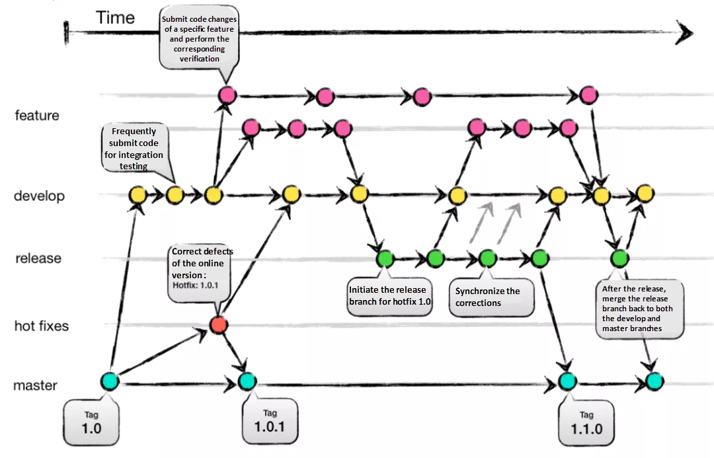
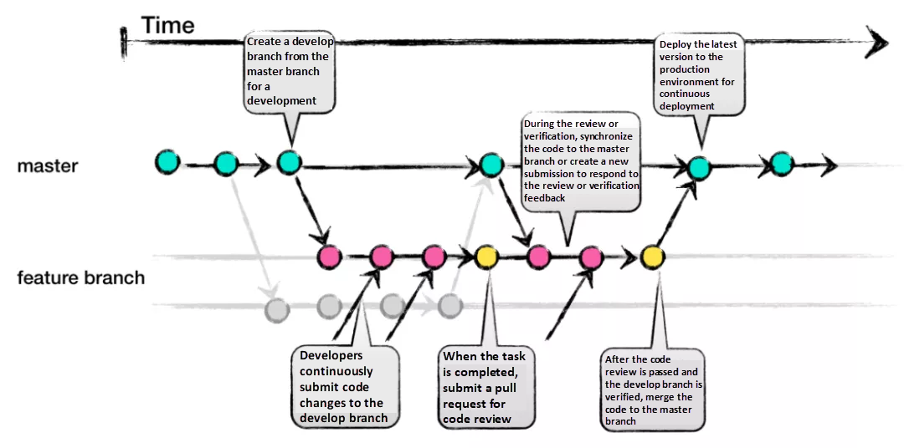
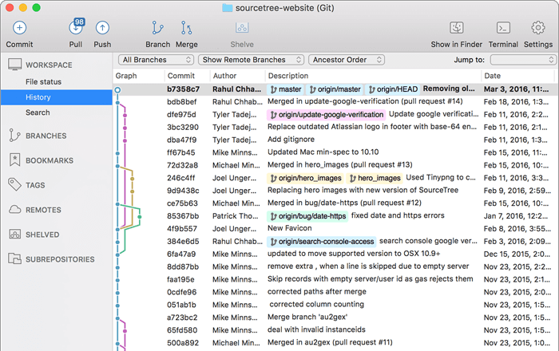
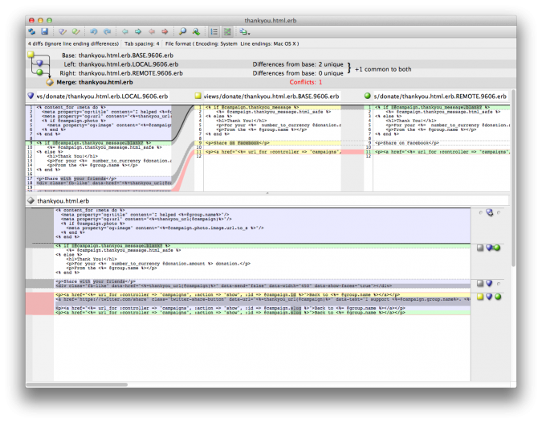

# Git After-Hours Lesson

Looking for some quick help? Check out the [cheetsheet](./cheatsheet.md)!

## Assumptions

This lesson assumes that you already have Git installed/configured and have very basic understanding of repositories, branches and commits. 



<i>If that doesn't fix it, git.txt contains the phone number of a friend of mine who understands git. Just wait through a few minutes of 'It's really pretty simple, just think of branches as...' and eventually you'll learn the commands that will fix everything.</i>

Source: [xkcd: Git](https://xkcd.com/1597/)

## Goals

This lesson will walk you through the following git concepts 
  - [Workspace vs Index vs Repository vs Remote](#workspace--index--repository--remote)
  - [Aliases](#aliases)
  - [GitHub-Flow branch-based workflow](#github-flow-branch-based-workflow)
  - [Visualizing Commit History](#visualizing-commit-history)
  - [Merge](./merge.md)
  - [Rebase](./rebase.md)
  - [Squash](./squash.md)
  - [Reset / Revert](./undo.md)
  - [Cherry Picking](./cherry.md)

## Workspace / Index / Repository / Remote




## Aliases

You may see me use these aliases during lecture. I will try to remember to type out full commands, but muscle memory means that I will probably forget once or twice.
```
git config --global alias.co checkout
git config --global alias.br branch
git config --global alias.st status
```

```
$ git status
On branch main
nothing to commit, working tree clean

$ git st
On branch main
nothing to commit, working tree clean
```

## GitHub-Flow branch-based workflow

Before we get to development scenarios, let's take a moment to understand the concept of a branching model. There are [multiple branching models](https://www.atlassian.com/git/tutorials/comparing-workflows) in use today for Git. [GitFlow](https://www.atlassian.com/git/tutorials/comparing-workflows/gitflow-workflow) is a branching model that can use different branches to track multiple releases simultaneously, and [GitHub-Flow](https://docs.github.com/en/get-started/quickstart/github-flow) is a newer branching model that emphasizes simplicity for frequent deployments. There is no "best" branching model, just different branching models with different pros and cons.

### GitFlow



### GitHub-Flow



We are going to use the GitHub-Flow branching model in this lesson.

## Visualizing Commit History

Git can be frustrating to learn at first. There are tools to make it easier. Sourcetree is a Git GUI client.  It will help us visualize commits, branching, merging.



Install [Sourcetree](https://www.sourcetreeapp.com/)

Consider installing [P4Merge](https://www.perforce.com/downloads/visual-merge-tool)
  - Helix Visual Merge Tool (P4Merge) is a three-way merging and side-by-side file comparison tool.
  - It will help us visualize merge conflicts
  - Can be difficult to setup/configure and we don't have time to do it in this lesson.



## Tiny bit of VIM

VIM is the default git text editing tool that you've probably encountered during various git procedures. A lot of people find VIM intimidating, but it really isn't that bad. We're going to learn just 4 commands to use its most basic features. 

```
i   - Start insert mode
ESC - Cancel insert mode.
:wq - Write and Quit
:q! - Quit without Saving
```

## Next
[Merge Conflicts](./merge.md)
