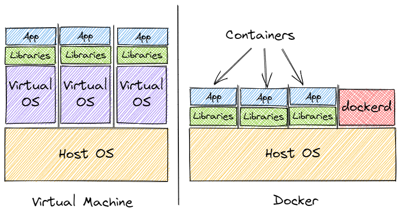
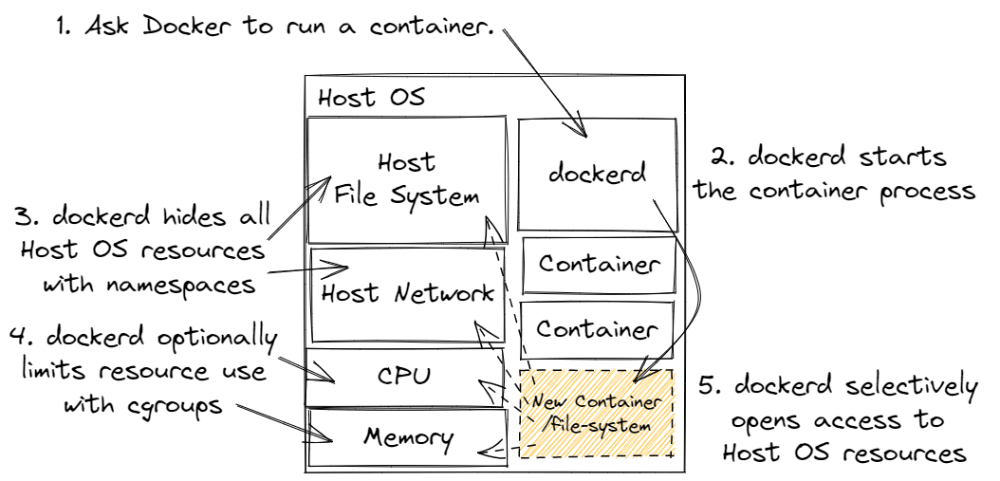
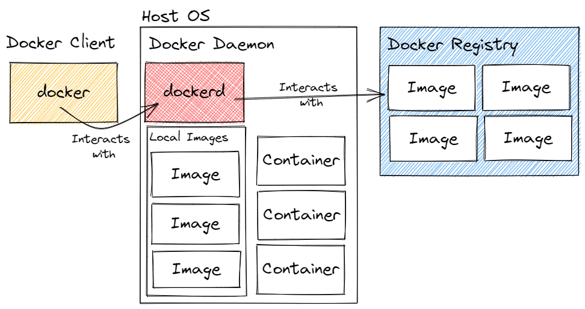

# Lesson: How Docker Works

## Introduction

Docker is a software system that allows us to package an isolated computing environment (a file system, applications, environment variables, and a network) and then execute one or more copies of that environment. A packaged environment is called an **image**. An executing environment is called a **container**. A container is created from an image. Once it's created, a container tracks its own state. Changes to the container's computing environment only apply to the container, not to other containers or its source image.

Docker does not use software virtualization. Its containers and their applications run on the host operating system, not in virtual machines. Despite a shared OS, containers are isolated. Containers are not allowed to communicate with each other or the host operating system, except in special circumstances. This is only possible using the Linux operating system. Docker isolates containers using Linux [namespaces](https://man7.org/linux/man-pages/man7/namespaces.7.html). Docker controls container resource limits using [cgroups](https://man7.org/linux/man-pages/man7/cgroups.7.html). (Docker for Windows and Mac _does_ use a Linux virtual machine to run Docker because Linux is required for the Docker magic to work.)

The Docker software system is made of two components. 

1. `dockerd` is the Docker daemon. A **daemon** is software that is always running in the background. `dockerd` is responsible for creating containers from images, isolating those containers using Linux namespaces, and limiting resource usage with cgroups.
2. `docker` is the Docker client. A **client** is software that coordinates with a daemon or controller application. `docker` is a command-line application. It's our user interface. Without it, the Docker daemon would be useless. `docker` is responsible for creating images, creating containers from images, pushing and pulling images from an image repository, and more.

### Outcomes

When you've finished this lesson and its exercises, you should be able to:
- execute Linux shell commands
- list three benefits of isolating a computing environment
- describe how Docker works differently than virtualization
- point out the problems Linux namespaces and cgroups solve in Docker
- draw the relationship between Docker's three main components

## The Importance of Linux

Docker requires Linux. Even when Docker "runs" on Windows or Mac, the Windows and Mac operating systems must create a Linux virtual machine for Docker to work. Linux contains the technology that makes Docker possible. Further, all Docker images and containers are Linux-based (with the exception of Windows images which are less common and only run on Windows). When we interact with a running container or we build a Docker image, we use Linux and a Linux shell.

For that reason, Linux is very important regardless of the programming language or platform we're using. We need to know a bit of Linux to use Docker effectively. For this course, we can get away with copying specific commands from lessons and exercises. When a new Bash command pops up, we'll do our best to explain it and move along. 

Long term, that won't be the case. When we're asked to solve a novel problem with Docker, we'll need to know what's possible and ideally find the shortest route to a solution. There are a couple approaches:

1. **Look it up on the fly.** This actually isn't the worst idea. It has benefits. It's just-in-time learning. You never learn something that isn't required for your job. Every bit of learning is salient. However, if you're not confident about your ability to learn things quickly, you may want to try approach 2.
2. **Learn Linux and Bash a bit at a time.** If you've never used Linux or Bash before, start playing with Docker. Try things that aren't in lessons and exercises. Stretch yourself. You're bound to get into a situation that requires improvisation.

    - Learn a bit about the Linux file system: https://www.linux.com/training-tutorials/linux-filesystem-explained/
    - Learn a bit about Bash: https://learnxinyminutes.com/docs/bash/

## Isolated Computing Environments

In the past, if we wanted to run an isolated computing environment we'd have to use software virtualization. The key word here is "isolated". If we just want to run a "computing environment", we could do that on any old operating system, without the need for virtualization. A **computing environment** is one or more applications hooked up to one or more software libraries. We do this all the time: 1. Install a program. 2. Run it.

So there's something different about an isolated computing environment. Take a moment to consider why we might need an _isolated_ computing environment. Don't read the next paragraph immediately. Think about it. List the benefits of isolating a computing environment.

On our personal machines, we don't really need an isolated computing environment. That's overkill. It only becomes relevant when we're deploying applications to servers. For the most part, software developers and devops folks are the only people who need to worry about isolated computing environments. For us, there are several benefits. (Maybe you listed even more.)

- **Isolating computing environments avoids conflicts.** If our environments have conflicting language/platform versions, isolating them avoids conflicts. Say we have one application that uses Node.js 16.14.0 and another that uses 14.19.0. It's not safe to run the 14 version on 16 and it's definitely not safe to run the 16 version on 14. So, we isolate both environments. Each environment is self-contained. They don't know about each other.
- **Isolation saves resources.** Even the busiest applications have downtime. If we were to install each application on a separate physical machine, many of those machines would be idle for periods of time. But, if we "install" many applications as isolated computing environments on a single machine, we have a better chance of keeping that machine busy doing useful work.
- **Isolated computing environments are repeatable.** Isolated environments are synonymous with images. An **image** is a file system bundle, environment variables, and other metadata that serves as a template for a runnable environment. Once we have a solid image, we can be confident it will run reliably on any number of physical machines.

### Virtualization

Which brings us back to software virtualization. Before Docker, our only option for isolated environments was a [virtual machine](https://en.wikipedia.org/wiki/Virtual_machine). A **virtual machine** is an emulation of a physical machine, which is just a fancy way of saying we can run one or more operating systems _inside_ a host operating system as software. Typically, an operating system runs "on the metal". When our physical machine boots up, a bit of firmware (the [BIOS](https://en.wikipedia.org/wiki/BIOS)) looks for an operating system. If it finds it, it loads the OS and the OS takes over. The operating system is now in control of the physical machine. 

With a virtual machine, the host operating system is already running. There's no physical boot step. Instead, we make a request to the host OS to start a virtual operating system. With the right software in place (a [hypervisor](https://en.wikipedia.org/wiki/Hypervisor)), the host OS "boots" the virtual OS. The virtual OS doesn't run "on the metal". The hypervisor manages resource limits for each virtual OS.

### Images and Containers

Docker models isolated computing environments as **containers** and **images**.

- **Container**: a running isolated computing environment. Maintains its state during stops, starts, and restarts. Usually a single process or application, but may contain more.
- **Image**: a template for a container. An image contains a local file system, applications, environment variables, and a formal command definition. The command is the executable to run when the container is created.

## How Docker Works

Docker's innovation is that it manages isolated computing environments without using software virtualization. Virtualization is expensive! A virtual machine not only includes our application and its libraries. It also includes an entire operating system with all of its background services and running processes. Those processes use memory and CPU. 

Docker's genius is that we need only include our applications and its libraries. Then we _isolate_ that environment using Linux namespaces and we limit resources with Linux cgroups.

For the diagram below, start with terms.

<dl>
<dt>Host OS</dt>
<dd>The operating system that's running on the metal. It "hosts" either a full guest OS or applications.</dd>
<dt>Virtual OS</dt>
<dd>A virtual operating system managed by a hypervisor. Each guest OS runs many, many processes. Memory and CPU usage increases for each guest OS.</dd>
<dt>Libraries</dt>
<dd>Code or compiled binaries used by our application. For our purposes, libraries also include runtimes or application hosts. Our application may need the Java 17 JRE or Node.js 16 runtime. A React application may need Nginx to serve it. Libraries are anything other than our application that's part of the computing environment.</dd>
<dt>App</dt>
<dd>Our application. This is the thing we ultimately want live and running.</dd>
</dl>

In the virtual machine model, isolation occurs by booting one or more guest OSes. This works, but it's resource-expensive. Each guest OS uses memory and CPU beyond what's required by the application. Depending on application resource demands, the bulk of its resources may be wasted by the virtual OS.

In the Docker model, isolation occurs by using Linux namespaces and cgroups. Each application runs on the host OS. There are no wasted resources because the application is the only thing demanding resources. There's no guest OS. Docker bundles our application and its libraries in an abstraction called a container. `dockerd` is responsible for running those containers.

### Linux Namespaces and Cgroups

(Or how does Docker _really_ work?)

A large part of Docker magic is actually Linux magic. Linux has two features that are essential to Docker's success. In Linux (and other operating systems), a running process can start another process and place restrictions on what it's allowed to do. That's what Docker does. When the Docker process receives a request to start a container, it starts the container and isolates it with the following Linux features:

1. [namespaces](https://man7.org/linux/man-pages/man7/namespaces.7.html): A **namespace** is an abstraction that controls the resources a process can see. Without namespaces, a new process has access to all resources on the host OS: the file system, other processes, the network, and more. When we apply a namespace, we selectively hide system resources. We can choose to show none, some, or all resources. Docker starts out very restrictive. 

    - It hides the host OS file system entirely and makes it seem like the container file system is all there is. 
    - It hides all system processes other than container processes.
    - It hides the host OS network.

    Docker doesn't lock things down permanently. With a bit of configuration, we can open access to the host OS network and selectively allow access to the host OS file system (volumes).

2. [cgroups](https://man7.org/linux/man-pages/man7/cgroups.7.html): A **cgroup** (also called a **control group**) is a Linux feature that limits the amount of resources a process can use. This feels similar to namespaces, but namespaces are all or nothing. Cgroups control the amount of a resource a process can use or assigns a priority when resources are scarce. A cgroup controls things like: 
    
    - the amount of memory a process may use
    - scheduling priority on the CPU
    - network message prioritization
    - device access limits

    Docker uses cgroups to manage container processes that are too hungry. We can also set explicit cgroup policies when we start a container.

Steps for starting a container:

1. _Something_ asks Docker to start a container. This can be the `docker` client or a call to the `dockerd` SDK.
2. `dockerd` launches the container process. (We'll cover the details soon.) Note: it's not the host OS that launches the process. It has to be `dockerd` so it can apply namespaces and cgroups.
3. By default, `dockerd` hides all host OS resources and makes it appear that the container file system is the only file system in existence.
4. Optionally, `dockerd` can apply cgroups to limit access to memory and change process priority on the CPU or a network.
5. With the right configuration, we selectively grant additional host OS resource access. That may be as simple as opening a network port on the host machine or as complex as mapping volumes to network-attached storage.

## Docker Architecture

Docker has three major components:

1. The Docker Client, `docker`
2. The Docker Daemon, `dockerd`
3. A Docker Registry, often Docker Hub

### Docker Client

The Docker client, `docker`, is a command-line user interface. It's the thing we interact with the most. We use it to build images, run containers, push images to and pull images from Docker Hub, attach to running containers, view container logs, and more. 

But, it's not the thing that's actually doing the heavy lifting. `docker` is only a client. It's only the user interface. The real work happens in the Docker daemon, `dockerd`. `docker` interacts with `dockerd` via an SDK. It sends requests to `dockerd`, receives a response, and then displays the response so we know if the operation succeeded or failed. If something went wrong, we usually get useful feedback to help us troubleshoot the issue.

### Docker Daemon

The Docker daemon, `dockerd`, is the workhorse of the trio. Once Docker is started, it's always running in the background. It's responsible for:

- Physically building an image from scratch
- Pulling images from Docker Hub (or another repository)
- Pushing images to a repository
- Running a container based on an image
- Ensuring containers are isolated using Linux namespaces and cgroups
- Stopping and starting containers
- Deleting containers and images
- Creating and deleting networks and volumes
- and more...

We can see all possible actions in the [Docker Engine API documentation](https://docs.docker.com/engine/api/latest). `dockerd` manages the Docker engine.

`dockerd` receives requests from `docker` and returns a response.

`dockerd` interacts with one or more Docker repositories. When an image isn't found locally, `dockerd` does its best to find it in a Docker repository. It can also push images to a repository.

### Docker Registry

A **registry** is a collection of Docker images hosted on reliable server infrastructure. Over time, images will have many versions, so registries support tagging. A tag may denote an image's version. Registries can be either public or private. A public registry doesn't require authentication to pull an image. A private registry requires authentication. Both public and private registries require authentication to push an image.

Registry actions:
- **pull**: fetch an image from a registry to another machine. This makes it available for `dockerd` to use.
- **push**: upload an existing image from a machine to a registry. This makes it available for sharing. It can then be pulled to another machine.

[Docker Hub](https://hub.docker.com/) is the default Docker registry. Many companies host a private registry so they don't have to share their intellectual property with the world. Cloud providers like AWS, Azure, and Google Cloud Platform also offer public and private registries.
