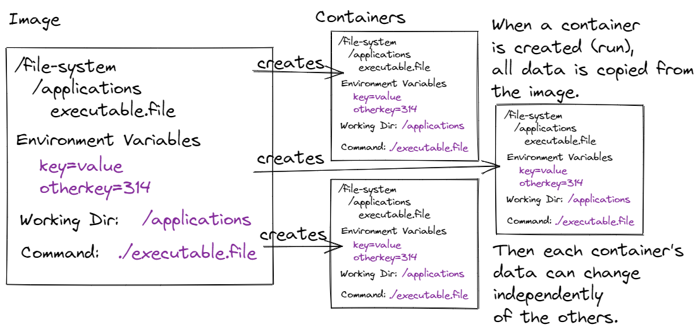
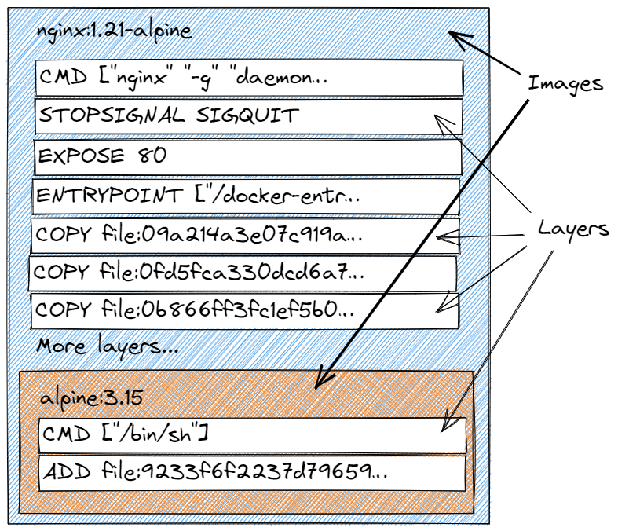

# Lesson: Docker Images

## Introduction

Images are the foundation for running applications in Docker. An image is a template for a container and a container executes an application. Images are formal bundles that contain: a file system, environment variables, a command, a working directory, and more. Images are built up in layers.

Docker Hub and other image repositories make it easy to upload and share images. This is their true power. A huge community has already contributed millions of images (8,893,968 at the time of writing) that can be used directly or used as a basis for a new image. Then that new image can be shared.

Many open source projects like MongoDB, Nginx, Jenkins, and Node.js have **official images** hosted on Docker Hub. These images are supported by the project because a Docker install is often easier than supporting a myriad of operating systems and configurations. Official images (generally) have excellent documentation.

### Outcomes

When you've finished this lesson and its exercises, you should be able to:
- explain to a friend the problem that Docker images solve
- list three things that are part of an image
- use the following `docker` commands: `images`, `pull`, `inspect`, `inspect`, and `history`
- draw a diagram mapping the relationship between images and layers
- explain the difference between regular images and official images on Docker Hub

## Images

A Docker **image** is a template for a container, much like a class is a template for an object or a cake recipe is a template for a baked cake. A **container** is an isolated computing environment. An isolated computing environment consists of:

- a local file system
- environment variables
- commands to start an application
- a working directory
- additional configuration

It would be messy to assemble all of those things on the fly when starting a container. That's where an image comes in. An image bundles the mess. It's a predefined starting point. From that starting point, an image is used to start one or more containers. Once the image bundle is exactly how we want it, we're confident we can create one, two, or ten thousand containers that will be exactly the same.

An image can also be shared. Once we're happy with our image, we can push it to an image repository. This makes it available to our colleagues (in the case of a private repository) or the entire world (in the case of a public repository). This saves people a ton of time. We do the work to carefully configure an image, document it, and then anyone can easily run our templated isolated computing environment as a container.

Examples of what an image might contain:
- HTTP servers (Nginx, Apache...)
- CI/CD tools (Jenkins...)
- project management tools (Redmine...)
- databases (PostgreSQL, MongoDB, Redis...)
- authentication/authorization servers (Ory/Hydra, Keycloak...)
- Linux distros (Ubuntu, CentOS, Alpine...)
- compilers and runtimes (JavaScript, PHP, Go, Java, Erlang, C#...)
- content management systems (Workpress, Drupal, Joomla, Orchard...)
- message queues (RabbitMQ, Kafka, ActiveMQ...)
- our own back-end services and front-end applications!

### Tags

The name of the image, also called its [repository](https://docs.docker.com/docker-hub/repos/), should never change. The image name is called a "repository" because it's a generic label for different image versions. A name references one to many image versions.

Versions can be differentiated with **tags**. A tag has the format:

`image-name:tag`

Concrete examples:
- `python:3.11.0a6-bullseye`
- `python:3.11-rc-slim-buster`
- `python:alpine3.14`
- `python:3.10-windowsservercore-ltsc2022`

where the image name/repository is `python` and version tags are `3.11.0a6-bullseye`, `3.11-rc-slim-buster`, `alpine3.14`, `python:3.10-windowsservercore-ltsc2022`. (Python is a dynamic programming language known for being friendly and easy-to-use.)

If we omit the tag when referencing an image, Docker assumes that we're using the `latest` tag. This can be a source of misunderstanding and mistakes. If we pull an image from a registry using only its name, we get `image-name:latest`. Then, if a new `latest` is pushed to a repository, Docker continues to use our old version. It doesn't know to fetch a new `latest` because the tag already exists locally. Avoid using tag-free commands. Use specific versions whenever possible.

<pre class="console" title="A Mistake">
# This is actually referencing `python:latest`.
docker run --rm -it python

# Some time later...
docker run --rm -it python

# If an updated latest is pushed to the registry,
# our command continues to use our local `python:latest`.
# We don't get the benefit of the new version. :(
</pre>

Each image version has a unique image ID. The ID is a digest. A **digest** is the output of a hash function. One image version can have multiple tags, but a single tag can only ever reference one image version.

### Docker Commands

Open your terminal. The following `docker` commands work on images.

<h4 class="icon-book"><a href="https://docs.docker.com/engine/reference/commandline/images/">docker images</a></h4>

Lists local images (images on your machine). An alias for `docker image ls`. 

Your output will differ below based on your local images.

<pre class="console" noheader>
> docker images
REPOSITORY                       TAG           IMAGE ID       CREATED        SIZE
nginx                            latest        c919045c4c2b   11 days ago    142MB
debian-apache                    1             7d13be5a1cd5   5 weeks ago    252MB
mongo                            latest        5285cb69ea55   5 weeks ago    698MB
phpmyadmin                       latest        991ab31d01ae   6 weeks ago    529MB
adminer                          latest        e7ff5f92e509   2 months ago   88.9MB
redis                            alpine        3900abf41552   3 months ago   32.4MB
alpine                           3.15          c059bfaa849c   3 months ago   5.59MB
alpine                           latest        c059bfaa849c   3 months ago   5.59MB
nginx                            1.21-alpine   b46db85084b8   3 months ago   23.2MB
eclipse-temurin                  17-alpine     cf55f05132a1   3 months ago   335MB
alpine                           3.14          0a97eee8041e   3 months ago   5.61MB
mongo-express                    latest        2d2fb2cabc8f   4 months ago   136MB
mysql                            8             0716d6ebcc1a   6 months ago   514MB
mysql                            latest        0716d6ebcc1a   6 months ago   514MB
rediscommander/redis-commander   latest        778af9bd6397   7 months ago   77.8MB
</pre>

The `docker images` command can be further tweaked with command line options. See the official documentation for examples.

<h4 class="icon-book"><a href="https://docs.docker.com/engine/reference/commandline/search/">docker search</a></h4>

Uses a search term to find images on Docker Hub.

The example below searches for the phrase "alpine".

<pre class="console" noheader>
> docker search alpine
NAME                               DESCRIPTION                                     STARS     OFFICIAL   AUTOMATED
alpine                             A minimal Docker image based on Alpine Linux…   8554      [OK]
alpine/git                         A  simple git container running in alpine li…   195                  [OK]
alpine/socat                       Run socat command in alpine container           79                   [OK]
alpine/helm                        Auto-trigger docker build for kubernetes hel…   52
alpine/bombardier                  Auto-trigger docker build for bombardier whe…   20
alpine/k8s                         Kubernetes toolbox for EKS (kubectl, helm, i…   19
puppet/puppet-agent-alpine         Puppet Agent as a Docker Image. Based on Alp…   17
alpine/httpie                      Auto-trigger docker build for `httpie` when …   16                   [OK]
docker/desktop-kubernetes          Kubernetes binaries for Desktop. Compiled fr…   12
alpine/terragrunt                  Auto-trigger docker build for terragrunt whe…   11
alpinelinux/docker-cli             Simple and lightweight Alpine Linux image wi…   4
puppet/r10k                        r10k on a Docker image. Based on Alpine         4
alpinelinux/alpine-gitlab-ci       Build Alpine Linux packages with Gitlab CI      3
alpine/openssl                                                                     2
alpine/flake8                      Auto-trigger docker build for fake8 via trav…   2
alpine/curl                                                                        2
ibmcom/fhe-toolkit-alpine-amd64    The IBM Fully Homomorphic Encryption (FHE) T…   1
alpinelinux/gitlab-runner-helper   Helper image container gitlab-runner-helper …   1
rancher/alpine-git                                                                 0
grafana/alpine                     Alpine Linux with ca-certificates package in…   0
ibmcom/fhe-toolkit-alpine-s390x    The IBM Fully Homomorphic Encryption (FHE) T…   0
armswdev/c-hello-world             Simple hello-world C program on Alpine Linux…   0
docker/tutum-test-alpine           Alpine 3.12 image                               0
alpinelinux/alpine-drone-ci        Build Alpine Linux packages with drone CI       0
ibmcom/alpine-helm-s390x                                                           0
</pre>

We can also filter results, format the output, show longer descriptions, and limit results.

The search below limits results to 5 stars or better and formats output using the search term "deb".

<pre class="console" noheader>
> docker search --filter stars=5 --format "{{.Name}} | {{.Description}} | {{.StarCount}}" deb
ubuntu | Ubuntu is a Debian-based Linux operating sys… | 13865
debian | Debian is a Linux distribution that's compos… | 4215
neurodebian | NeuroDebian provides neuroscience research s… | 88
debezium/connect | Kafka Connect image with all Debezium connec… | 48
debezium/kafka | Kafka image required when running the Debezi… | 25
debezium/postgres | PostgreSQL for use with Debezium change data… | 18
debezium/zookeeper | Zookeeper image required when running the De… | 16
debezium/example-mysql | Example MySQL database server with a simple … | 11
debian/eol | End of Life Debian versions (pointing at arc… | 10
debezium/server | Debezium Server is a stand-alone runtime for… | 6
</pre>

<h4 class="icon-book"><a href="https://docs.docker.com/engine/reference/commandline/pull/">docker pull</a></h4>

Retrieves an image from a Docker image registry, by default Docker Hub, to our local registry. An alias for `docker image pull`. Use the most specific tag possible when pulling on image. Avoid using `:latest` or not specifying a tag (which defaults to `:latest`).

The command below pulls Python version 3.10.2 hosted inside Alpine Linux version 3.15.

<pre class="console" noheader>
> docker pull python:3.10.2-alpine3.15
3.10.2-alpine3.15: Pulling from library/python
59bf1c3509f3: Already exists
07a400e93df3: Pull complete
64052ee245ef: Pull complete
a44d093ad4a5: Pull complete
0381087ee065: Pull complete
Digest: sha256:4eff19dfce481c125674c902b24aa6667b9bc166f6bbcae79a171ce2e6c64ee1
Status: Downloaded newer image for python:3.10.2-alpine3.15
docker.io/library/python:3.10.2-alpine3.15
</pre>

Again, `docker pull` can be configured with command-line options. The official docs have complete examples.

<h4 class="icon-book"><a href="https://docs.docker.com/engine/reference/commandline/inspect/">docker inspect</a></h4>

Displays metadata and configuration about a Docker object (images, containers, volumes, networks). Accepts an image name with optional tag or an image ID. The image-specific command is `docker image inspect NAME|ID`.

This is a great command to confirm how an image is configured. It displays all the major image components: file system, environment variables, working directory, and the command.

Output below is abbreviated.

<pre class="console" noheader>
> docker inspect 69fba17b9bae
    ...snip...
    "Id": "sha256:69fba17b9bae588a6fd69f3c3804ea61d32873ca5ec04581435d1255ed2784d3",
    "RepoTags": [
        "python:3.10.2-alpine3.15"
    ],
    ...snip...
    "Config": {
        "Hostname": "",
        ...snip...
        "Env": [
            "PATH=/usr/local/bin:/usr/local/sbin:/usr/local/bin:/usr/sbin:/usr/bin:/sbin:/bin",
            "LANG=C.UTF-8",
            "GPG_KEY=A035C8C19219BA821ECEA86B64E628F8D684696D",
            "PYTHON_VERSION=3.10.2",
            "PYTHON_PIP_VERSION=21.2.4",
            "PYTHON_SETUPTOOLS_VERSION=58.1.0",
            "PYTHON_GET_PIP_URL=https://github.com/pypa/get-pip/raw/38e54e5de07c66e875c11a1ebbdb938854625dd8/public/get-pip.py",
            "PYTHON_GET_PIP_SHA256=e235c437e5c7d7524fbce3880ca39b917a73dc565e0c813465b7a7a329bb279a"
        ],
        "Cmd": [
            "python3"
        ],
        "Image": "sha256:2609a9bb7f9fa9ec15b14a2f04e554bef0c808cb9794b5d4bb3ed6920236ae1d",
        "Volumes": null,
        "WorkingDir": "",
        "Entrypoint": null,
        "OnBuild": null,
        "Labels": null
    },
    "Architecture": "amd64",
    "Os": "linux",
    "Size": 48641905,
    ...snip...
    "RootFS": {
        "Type": "layers",
        "Layers": [
            "sha256:8d3ac3489996423f53d6087c81180006263b79f206d3fdec9e66f0e27ceb8759",
            "sha256:f57e81d89e60f9580c57db2e677a49273fd960f729a7b90d9a397d54ef554297",
            "sha256:9a922de0e68226d5a508039424e7e31f29024ca17260e147392648c36fd7198d",
            "sha256:4e4052a4ca72748dc13ba61d5f282681a3511f6ed8f3078c429d40648e7efd6f",
            "sha256:d381d1fc27a6e388fadbe0aa7f4e05fe5aed4843f5dc449f4d01bb6ac31ed493"
        ]
    },
    ...snip...

# Can also use name:tag.
> docker inspect python:3.10.2-alpine3.15
</pre>

<h4 class="icon-book"><a href="https://docs.docker.com/engine/reference/commandline/rmi/">docker rmi</a></h4>

Permanently deletes an image version if there's a version with one tag. If there are multiple tags per version, permanently deletes the tag. An alias for `docker image rm`. Can use `name:tag` or an image ID. Can delete more than one image.

<pre class="console" noheader>
# name:tag
> docker rmi python:3.10.2-alpine3.15
Untagged: python:3.10.2-alpine3.15
Untagged: python@sha256:4eff19dfce481c125674c902b24aa6667b9bc166f6bbcae79a171ce2e6c64ee1
Deleted: sha256:69fba17b9bae588a6fd69f3c3804ea61d32873ca5ec04581435d1255ed2784d3
Deleted: sha256:39e5a6358a7d69bf6bb5c45d03e5afa2f75fa6198ce27c97edf11bca5167f721
Deleted: sha256:2b3e005efb0a07e76bec1897300a70b9bf10fb45a24c9b378fae7749ceb2be13
Deleted: sha256:ffe7a07540ce831d72c30695149ea599bfad518d3576ff5d29e7abfc1afa8cb9
Deleted: sha256:15e77434263d53e40c7d184dedc74f5f606cd373ca4bf627c07fc11aa7064b37

# image ID
> docker rmi 69fba17b9bae
</pre>

## Layers

If we had to build images from scratch every time, it wouldn't be the worst thing. We would survive, though it might be a little time-consuming... Luckily, we don't have to build images from scratch. Docker thought ahead. We can use an existing image as the basis for a new image. If we identify an existing image that would be useful, say, an HTTP server, then we build our own image on top of it. We skip all of the HTTP server installation and configuration and just focus on installing and configuring our front-end JavaScript application.

And, it turns out that there's no way to create an image without an existing image. If we want to start from scratch, we use the [scratch](https://hub.docker.com/_/scratch) image. All new images require an existing image.

Images contain **layers**. A layer is created each time we modify an existing image. A layer is not a nested image. It's more granular than that. A layer is anything that modifies an image during its creation. This can be anything from copying new files into a base image, creating a new user, or specifying a command.

Docker has a limit on the number of layers allowed in an image, so use caution during image creation. Image publishers try to pack as many operations into one modification as possible to reduce the number of layers. This leaves an image open to expansion.

### Docker Commands

<h4 class="icon-book"><a href="https://docs.docker.com/engine/reference/commandline/history/">docker history</a></h4>

Displays the history, or layers, of an image.

First, pull [Alpine 3.15](https://hub.docker.com/_/alpine). Alpine is the smallest Docker Linux distro, weighing in at 5.59MB.

<pre class="console" noheader>
> docker pull alpine:3.15
3.15: Pulling from library/alpine
59bf1c3509f3: Already exists
Digest: sha256:21a3deaa0d32a8057914f36584b5288d2e5ecc984380bc0118285c70fa8c9300
Status: Downloaded newer image for alpine:3.15
docker.io/library/alpine:3.15
</pre>

Next, view `alpine:3.15`'s history. It has two layers. The first, the 5.59MB layer, is the Alpine file system. The second, the 0B layer, sets the image's command to the Alpine shell (_/bin/sh_). `alpine:3.15` uses the [scratch](https://hub.docker.com/_/scratch) as its base. The `scratch` image is a special image. It doesn't contain any layers.

`docker history` can accept a `name:tag` or an image ID. 

Your output may differ.

<pre class="console" noheader>
> docker history alpine:3.15
IMAGE          CREATED        CREATED BY                                      SIZE      COMMENT
c059bfaa849c   3 months ago   /bin/sh -c #(nop)  CMD ["/bin/sh"]              0B
&lt;missing&gt;      3 months ago   /bin/sh -c #(nop) ADD file:9233f6f2237d79659…   5.59MB
</pre>

Now let's pull an image that uses the `alpine:3.15` image as its base. [Nginx 1.21 Alpine](https://hub.docker.com/_/nginx) is a great candidate. Nginx is a very fast HTTP server, often used as a reverse proxy. 

Pull it. Your output may differ. You may or may not have layers that already exist.

<pre class="console" noheader>
> docker pull nginx:1.21-alpine
1.21-alpine: Pulling from library/nginx
59bf1c3509f3: Already exists
8d6ba530f648: Already exists
5288d7ad7a7f: Already exists
39e51c61c033: Already exists
ee6f71c6f4a8: Already exists
f2303c6c8865: Already exists
Digest: sha256:da9c94bec1da829ebd52431a84502ec471c8e548ffb2cedbf36260fd9bd1d4d3
Status: Downloaded newer image for nginx:1.21-alpine
docker.io/library/nginx:1.21-alpine
</pre>

Display `nginx:1.21-alpine`'s history. Nginx Alpine has a few more layers than Alpine 3.15. Its command overwrites the Alpine command to start Nginx (_CMD ["nginx" "-g" "daemon…_). Several layers copy Nginx binaries and configuration. Other layers set environment variables.

Note the two entries at the bottom of the output. They're the Alpine 3.15 layers!

<pre class="console" noheader>
> docker history nginx:1.21-alpine
IMAGE          CREATED        CREATED BY                                      SIZE      COMMENT
bef258acf10d   6 weeks ago    /bin/sh -c #(nop)  CMD ["nginx" "-g" "daemon…   0B
&lt;missing&gt;      6 weeks ago    /bin/sh -c #(nop)  STOPSIGNAL SIGQUIT           0B
&lt;missing&gt;      6 weeks ago    /bin/sh -c #(nop)  EXPOSE 80                    0B
&lt;missing&gt;      6 weeks ago    /bin/sh -c #(nop)  ENTRYPOINT ["/docker-entr…   0B
&lt;missing&gt;      6 weeks ago    /bin/sh -c #(nop) COPY file:09a214a3e07c919a…   4.61kB
&lt;missing&gt;      6 weeks ago    /bin/sh -c #(nop) COPY file:0fd5fca330dcd6a7…   1.04kB
&lt;missing&gt;      6 weeks ago    /bin/sh -c #(nop) COPY file:0b866ff3fc1ef5b0…   1.96kB
&lt;missing&gt;      6 weeks ago    /bin/sh -c #(nop) COPY file:65504f71f5855ca0…   1.2kB
&lt;missing&gt;      6 weeks ago    /bin/sh -c set -x     && addgroup -g 101 -S …   17.8MB
&lt;missing&gt;      6 weeks ago    /bin/sh -c #(nop)  ENV PKG_RELEASE=1            0B
&lt;missing&gt;      6 weeks ago    /bin/sh -c #(nop)  ENV NJS_VERSION=0.7.2        0B
&lt;missing&gt;      6 weeks ago    /bin/sh -c #(nop)  ENV NGINX_VERSION=1.21.6     0B
&lt;missing&gt;      2 months ago   /bin/sh -c #(nop)  LABEL maintainer=NGINX Do…   0B
<strong>&lt;missing&gt;      3 months ago   /bin/sh -c #(nop)  CMD ["/bin/sh"]              0B
&lt;missing&gt;      3 months ago   /bin/sh -c #(nop) ADD file:9233f6f2237d79659…   5.59MB</strong>
</pre>

## Official Images

A [Docker Official Image](https://docs.docker.com/docker-hub/official_images/) is a free-to-extend image released by an open source or vendor project team. Official images include servers, language compilers and runtimes, Linux distros, and more. Official images are updated frequently and are very useful as base images. Official images are well-tested and solid, so we can use them to create our own images.

Official images demonstrate strong image building practices. Use them as examples of how to build a better image. They also have excellent documentation and sometimes explain how the image was built.

Official images also have different naming conventions in Docker Hub. The typical repository uses the naming convention:

`dockerhub-username/image-name`

Examples:
- `izzy/my-rest-api`
- `caroline/react-ui`
- `nek-nek/cart-service`

Official images omit the `dockerhub-username`.

Examples:
- `debian`
- `nginx`
- `python`
