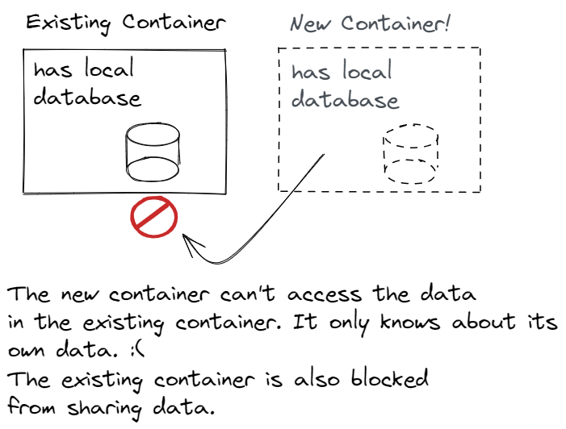

# Lesson: Docker Containers

## Introduction

Containers are arguably the most important Docker concept. They're the isolated computing environment in action. Containers are based on images, but we could always conceive of a different way to create containers. The container is the thing that does the work. It's the linchpin.

Docker provides ways to configure and interact with containers. Without configuration, a container is isolated. A container's default resource visibility is limited to its local resources. It can't see the host OS file system or the host OS network. Depending on how we use the container, we may want to provide limited access to the host operating system.

Containers are managed via the `docker` CLI or programmatically through the Docker Engine API. In this course, we stick to the `docker` CLI. We can't learn every command, but we'll learn enough to create, configure, troubleshoot, and run programs directly in a container.

### Outcomes

When you've finished this lesson and its exercises, you should be able to:
- list items that are packaged in a container
- display container configuration
- configure containers using command options in `docker run`
- check a container's configuration
- view both running and stopped containers

## Containers

A **container** is an isolated computing environment. It has at least one local file, but usually contains a fairly complete file system. Containers can also contain environment variables, a working directory, a command, a hostname, and additional configuration. Containers are generated from images. An image is a template for a container. When Docker runs a container, the default behavior is to disconnect all host OS resources using Linux namespaces. A container is isolated from the host OS. Host OS resources can be explicitly attached during the run step.

Containers have their own state. Three containers created from an image will each have their own local file system. They no longer reference the image. If an interaction changes a container, that container's change will not affect the other containers. Each container is independent.

Once a container is created, it can be in either a running or stopped state. A container without a command stops immediately. A container with a command that terminates will stop when the command terminates. 

We can explicitly start and stop containers. A stopped container still takes up disk space. To get rid of it completely, we must remove it.

### Rules of Thumb

1\. A container should only host one application or service. Doing too many things at once violates the [single responsibility principle](https://www.infoq.com/articles/microservices-design-ideals/). Containers are easy to network together. Prefer networking containers to solve a complicated problem versus solving a complicated problem all in one container.

2\. Containers should be stateless. Say that we have a REST API that caches data in memory or stores data in a local database. Then say we want to scale up the number of requests our API can handle by adding new replica containers. When we add our second container, it can't read from the memory or database in the first container. The containers are stateful. That's a big problem. Instead of the second container sharing the load, it's only able to manage a subset of the data. That's not what we want. It creates a complicated solution.

3\. Containers don't last. They are ephemeral and should be expected to crash. Luckily, containers are also easy to start. It's better to have few stateless containers with the possibility one can crash than to rely on a single container. The threat of a container crashing is a second reason we don't want stateful containers.

As always, there are exceptions to these rules.

## Container CRUD Commands

These commands create, display, start, stop, and delete containers.

Open a terminal.

<h3 class="icon-book"><a href="https://docs.docker.com/engine/reference/commandline/run/">docker run</a></h3>

Creates a container and starts it.

Runs a container based on an image in four steps:
1. Checks if there is a local image.
2. If not, pulls it. (The pull _can_ fail.)
3. Initializes the container based on the image, passing in any configuration.
4. Starts the container.

`docker run` is both a container and an image command.

#### Example

Below, we run a container based on the `docker/getting-started` image. When the command is complete, open your browser to http://localhost:8080. Note the layers in the output.

<pre class="console" noheader>
> docker run -d -p 8080:80 docker/getting-started
Unable to find image 'docker/getting-started:latest' locally
latest: Pulling from docker/getting-started
59bf1c3509f3: Already exists
8d6ba530f648: Already exists
5288d7ad7a7f: Already exists
39e51c61c033: Already exists
ee6f71c6f4a8: Already exists
f2303c6c8865: Already exists
0645fddcff40: Pull complete
d05ee95f5d2f: Pull complete
Digest: sha256:aa945bdff163395d3293834697fa91fd4c725f47093ec499f27bc032dc1bdd16
Status: Downloaded newer image for docker/getting-started:latest
8802715df700aebacfe7351c03ca85621b107a68a1490fd6e8adb9d68c6cd0a2
</pre>

Observations:
- We ignore our image `name:tag` rule by omitting the tag. To be fair, there are only three tags for `docker/getting-started`: `latest`, `vscode`, and `pwd`. We want `latest`. Should we have explicitly included it? Maybe.
- The `-d` option starts the container in detached mode. Without it, the container would run in the terminal foreground instead of running in the background. Since we're not interacting with it, we want it to run in the background.
- The `-p` option publishes a container port to the host OS port. The order is: `-p host-port:container-port`.

#### Options

The [docker run](https://docs.docker.com/engine/reference/commandline/run/) command is incredibly important. It's what initially configures our container so we get the behavior we expect. It's also the command with the most options. There are too many options to cover in a lesson. The options selected below demonstrate a range of features that will come in handy.

##### `--rm`

The `--rm` option removes a container when it stops. In a sense, it executes `docker rm` automatically. This is useful for one-off prototyping or batch processes that only need to run once. It's also nice to avoid cluttering your local machine with stopped containers.

<pre class="console" noheader>
> docker run -it --rm alpine:3.15
/ # exit
</pre>

Check `docker ps --all`. The container should be gone.

##### `-it`

This is two options rolled into one:
- `-i`: runs the container in interactive mode
- `-t`: creates a pseudo TTY. A pseudo TTY (short for TeleTYpewriter) makes it easy to use the container's shell even when we're in our own terminal.

##### `-p`

Publishes a port. In other words, connects a container's port to the host OS port.

Syntax: `-p host-port:container-port`, concrete: `-p 8080:80`

<pre class="console" noheader>
> docker run --rm -d -p 8765:80 nginx:1.21-alpine
ecd8a0bfb573b4be853b54e9d42852fd8406e0c3d1f08be4ddc8dbcf33880b62
</pre>

We can publish more than one port by adding additional `-p` options.

<pre class="console" noheader>
> docker run --name new_ubuntu -it -p 8080:8080 -p 15672:15672 -p 5432:5432 ubuntu:latest bash
</pre>

Visit http://localhost:8765 to see the Nginx default page. Then stop the container.

##### `-d`

Runs the container in detached mode. In detached mode, the container runs in the background. It doesn't tie up our terminal.

A container without the `-d` option is attached to the terminal. That doesn't necessarily make it interactive. That would require the `-it` options. An attached container prints its stdout and stderr messages to the terminal. Attached, non-interactive containers can be a bit of a pain to stop.

##### `-e`

Sets one or more environment variables. This is important so our containers behave dynamically. We never want to hard-code environment data into our apps. Instead we use environment variables. Then we can deploy them to different environments without changing our image.

<pre class="console" noheader>
> docker run --rm -it -e environment=production -e VARIABLE=value -e ANOTHER=3.14 alpine:3.15
/ # echo "$VARIABLE, $ANOTHER"
value, 3.14
/ # exit
</pre>

#### Constraining Resources

Docker's second superpower is constraining container resource consumption. A **resource** is memory, CPU, GPU, or I/O. Docker does that with Linux Cgroups. Resource constraints may be configured with `docker run`.

The [docker run reference](https://docs.docker.com/engine/reference/run/#runtime-constraints-on-resources) describes many resource constraint scenarios. We'll sample a few.

<pre class="console" title="Limit memory to half a gig.">
> docker run -m 500M image-name:tag
</pre>

<pre class="console" title="Use as much memory as we like, but limit kernel memory to 50 MB.">
> docker run --kernel-memory 50M image-name:tag
</pre>

<pre class="console" title="Limit CPU priority.">
# The default -c option is 1024.
# -c=256 gives this process 25% of the priority on the CPU.
# On a multi-core machine, this process may still use 100% of a core.
> docker run -c=256 image-name:tag
</pre>

<pre class="console" title="Limit to specific cores. In this case, cores 1 and 3.">
> docker run --cpuset-cpus="1,3" image-name:tag
</pre>

<!---->

<h3 class="icon-book"><a href="https://docs.docker.com/engine/reference/commandline/ps/">docker ps</a></h3>

Displays containers. Alias for `docker container ls`.

#### Example

Without options, `docker ps` displays _running_ containers.

<pre class="console" noheader>
> docker ps
CONTAINER ID   IMAGE                    COMMAND                  CREATED       STATUS          PORTS                               NAMES
8802715df700   docker/getting-started   "/docker-entrypoint.…"   8 hours ago   Up 24 minutes   0.0.0.0:8080->80/tcp                dreamy_shannon
8effe2975b79   mysql                    "docker-entrypoint.s…"   9 hours ago   Up 44 minutes   0.0.0.0:3306->3306/tcp, 33060/tcp   learn-mysql
</pre>

Add the `--all` option to display all containers.

<pre class="console" noheader>
> docker ps --all
CONTAINER ID   IMAGE                    COMMAND                  CREATED       STATUS                      PORTS                               NAMES
8802715df700   docker/getting-started   "/docker-entrypoint.…"   8 hours ago   Up 26 minutes               0.0.0.0:8080->80/tcp                dreamy_shannon
a03e21dc73e6   3900abf41552             "docker-entrypoint.s…"   9 hours ago   Exited (0) 44 minutes ago                                       sweet_brown
8effe2975b79   mysql                    "docker-entrypoint.s…"   9 hours ago   Up 46 minutes               0.0.0.0:3306->3306/tcp, 33060/tcp   learn-mysql
</pre>

<h3 class="icon-book"><a href="https://docs.docker.com/engine/reference/commandline/stop/">docker stop</a></h3>

Stops a running container using its container name or container ID. A stopped container still takes up room on disk.

#### Example

Find the generated name or the container ID from our `docker/getting-started` container. Use it to stop the container.

<pre class="console" noheader>
> docker stop dreamy_shannon
dreamy_shannon

> docker stop 8802715df700
8802715df700
</pre>

<h3 class="icon-book"><a href="https://docs.docker.com/engine/reference/commandline/start/">docker start</a></h3>

Starts a stopped container using its container name or container ID. A started container picks up where it left off. It does not reset to its initial state.

#### Example

Find the generated name or the container ID from our `docker/getting-started` container. Use it to start the container.

<pre class="console" noheader>
> docker start dreamy_shannon
dreamy_shannon

> docker start 8802715df700
8802715df700

> docker start not-a-container
Error response from daemon: No such container: not-a-container
Error: failed to start containers: not-a-container
</pre>

<h3 class="icon-book"><a href="https://docs.docker.com/engine/reference/commandline/rm/">docker rm</a></h3>

Permanently deletes a container using its container name or container ID. Can delete multiple containers.

#### Example

First, stop the container.

<pre class="console" noheader>
> docker stop dreamy_shannon
dreamy_shannon
</pre>

Then delete it.

<pre class="console" noheader>
> docker rm dreamy_shannon
dreamy_shannon
</pre>

Confirm the container is gone with `docker ps --all`.

Alternatively, we can force the deletion of a running container with the `--force` option. Be careful with this one.

<pre class="console" noheader>
> docker rm --force dreamy_shannon
dreamy_shannon
</pre>

## Container Interaction and Information Commands

It's not enough to be able to create, stop, start, and delete containers. What happens if our container isn't working properly? Without commands to interrogate and interact with our containers, we would have a hard time understanding a problem and how to fix it. The following commands help us troubleshoot and even work directly inside a container.

<h3 class="icon-book"><a href="https://docs.docker.com/engine/reference/commandline/logs/">docker logs</a></h3>

Displays container logs. We can [configure logging drivers](https://docs.docker.com/config/containers/logging/configure/). By default, `docker logs` shows anything written to stdout or stderr.

`docker logs` is the first thing we should check if we're having trouble with a container. When running containers in the cloud, cloud providers offer tools to capture `docker logs` output.

#### Example

First, run `docker/getting-started`.

<pre class="console" noheader>
> docker run -d -p 8080:80 --name get-started docker/getting-started
48c6dbcdf324c1eca28fc417cf82f51f91aa389d18ef03c6619174802e66f6be
</pre>

**Note**
- We use the `--name get-started` option here to explicitly name the container "get-started". This gives us an easy-to-remember handle.

Then, check the logs. Almost all of the output is from Nginx.

<pre class="console" noheader>
> docker logs get-started
/docker-entrypoint.sh: /docker-entrypoint.d/ is not empty, will attempt to perform configuration
/docker-entrypoint.sh: Looking for shell scripts in /docker-entrypoint.d/
/docker-entrypoint.sh: Launching /docker-entrypoint.d/10-listen-on-ipv6-by-default.sh
10-listen-on-ipv6-by-default.sh: info: Getting the checksum of /etc/nginx/conf.d/default.conf
10-listen-on-ipv6-by-default.sh: info: Enabled listen on IPv6 in /etc/nginx/conf.d/default.conf
/docker-entrypoint.sh: Launching /docker-entrypoint.d/20-envsubst-on-templates.sh
/docker-entrypoint.sh: Launching /docker-entrypoint.d/30-tune-worker-processes.sh
/docker-entrypoint.sh: Configuration complete; ready for start up
2022/03/15 05:20:46 [notice] 1#1: using the "epoll" event method
2022/03/15 05:20:46 [notice] 1#1: nginx/1.21.6
2022/03/15 05:20:46 [notice] 1#1: built by gcc 10.3.1 20211027 (Alpine 10.3.1_git20211027)
2022/03/15 05:20:46 [notice] 1#1: OS: Linux 5.4.72-microsoft-standard-WSL2
2022/03/15 05:20:46 [notice] 1#1: getrlimit(RLIMIT_NOFILE): 1048576:1048576
# more output...
</pre>

<h3 class="icon-book"><a href="https://docs.docker.com/engine/reference/commandline/inspect/">docker inspect</a></h3>

 Displays container configuration. Works on both images and containers. Alias for `docker container inspect`.

 Use `docker inspect` to quickly troubleshoot configuration.

 #### Example

 Check the output. Can you find:
 - the container's name?
 - a port mapping from host OS port 8080 to container port 80?
 - environment variables?

<pre class="console" noheader>
> docker inspect get-started
[
    {
        "Id": "48c6dbcdf324c1eca28fc417cf82f51f91aa389d18ef03c6619174802e66f6be",
        "Created": "2022-03-15T05:20:46.229191Z",
        "Path": "/docker-entrypoint.sh",
        "Args": [
            "nginx",
            "-g",
            "daemon off;"
        ],
        "State": {
            "Status": "running",
            "Running": true,
            "Paused": false,
            "Restarting": false,
      ...output truncated...
</pre>

<h3 class="icon-book"><a href="https://docs.docker.com/engine/reference/commandline/exec/">docker exec</a></h3>

Runs an application or script in the container. Can run either interactively or detached.

`docker exec` is very flexible. It has many uses. One common use is troubleshooting. To troubleshoot, start up a shell in interactive mode and explore a bit.

#### Example

Below, we connect to our get-started container and start its shell.

<pre class="console" noheader>
> docker exec -i -t get-started /bin/sh
/ #
</pre>

- Pass the `-i` option for interactive mode.
- Pass the `-t` option for a pseudo-TTY (enables a seamless terminal experience).
- Specify the container's name or its ID.
- Specify the executable file to run. `docker/getting-started` is an Alpine-based image, so it uses `sh` or `/bin/sh`. Other Linux distros use `bash` or `/bin/bash`.

Note the updated command prompt, `#`. That means we're conceptually _inside_ the container. We're viewing the file system, the users, and the applications from the container's viewpoint.

Navigate to Nginx's static file directory and list its contents. Then `exit` the container's shell. We should end up back in our host OS shell (terminal).

<pre class="console" noheader>
/ # cd /usr/share/nginx/html/
/usr/share/nginx/html # ls -l
total 60
-rw-r--r--    1 root     root         11176 Feb 10 09:02 404.html
-rw-r--r--    1 root     root           497 Jan 25 15:26 50x.html
drwxr-xr-x    1 root     root          4096 Feb 10 09:02 assets
drwxr-xr-x    2 root     root          4096 Feb 10 09:02 css
drwxr-xr-x    2 root     root          4096 Feb 10 09:02 fonts
drwxr-xr-x    2 root     root          4096 Feb 10 09:02 images
-rw-r--r--    1 root     root          8697 Feb 10 09:02 index.html
drwxr-xr-x    2 root     root          4096 Feb 10 09:02 search
-rw-r--r--    1 root     root          1484 Feb 10 09:02 sitemap.xml
-rw-r--r--    1 root     root           203 Feb 10 09:02 sitemap.xml.gz
drwxr-xr-x   11 root     root          4096 Feb 10 09:02 tutorial
/usr/share/nginx/html # exit
>
</pre>

<h3 class="icon-book"><a href="https://docs.docker.com/engine/reference/commandline/cp/">docker cp</a></h3>

Copies a file from the host OS into the container file system or vice versa. 

**Syntax**
- `docker cp source-path container:destination-path`
- `docker cp container:source-path destination-path`

#### Example

Our goal is to replace the get-started container's index.html with one of our own.

<ol>
<li>
Download the replacement <a class="icon-file-download" href="assets/index.html" download>index.html</a>.
</li>
<li>
Use <code>docker cp</code> to copy the file from our host OS into the container.

<pre class="console" noheader>
> docker cp C:\Users\username\Downloads\index.html get-started:/usr/share/nginx/html/index.html
>
</pre>
</li>
<li>
Reload Nginx use <code>docker exec</code>.

<pre class="console" noheader>
> docker exec get-started nginx -s reload
2022/03/15 08:29:12 [notice] 36#36: signal process started
>
</pre>
</li>
<li>
View the new index.html at <a href="http://localhost:8080">http://localhost:8080</a>. You may need to disable your browser's cache. 

You should see:

</li>
</ol>

<h3 class="icon-book"><a href="https://docs.docker.com/engine/reference/commandline/diff/">docker diff</a></h3>

Displays files and directories that have changed beyond the original image file system. Each entry is prefaced by a letter.

- A: file or directory was added.
- D: file or directory was deleted.
- C: file or directory was changed.

#### Example

Below we see the Nginx configuration changed. That happens during image creation.

We added a new file, `/run/nginx.pid`. The file tracks Nginx's process id, so that makes sense. We can't add the file until we start the Nginx process.

Nginx creates a few cache items.

We added a new file, `/root/.ash_history`. That file is our shell command history. It was created when we executed `/bin/sh`.

Finally, we updated `/usr/share/nginx/html/index.html`. That was the file we replaced with `docker cp`.

<pre class="console" noheader>> docker diff get-started
C /etc
C /etc/nginx
C /etc/nginx/conf.d
C /etc/nginx/conf.d/default.conf
C /run
A /run/nginx.pid
C /var
C /var/cache
C /var/cache/nginx
A /var/cache/nginx/client_temp
A /var/cache/nginx/fastcgi_temp
A /var/cache/nginx/proxy_temp
A /var/cache/nginx/scgi_temp
A /var/cache/nginx/uwsgi_temp
C /root
A /root/.ash_history
C /usr
C /usr/share
C /usr/share/nginx
C /usr/share/nginx/html
C /usr/share/nginx/html/index.html
</pre>
