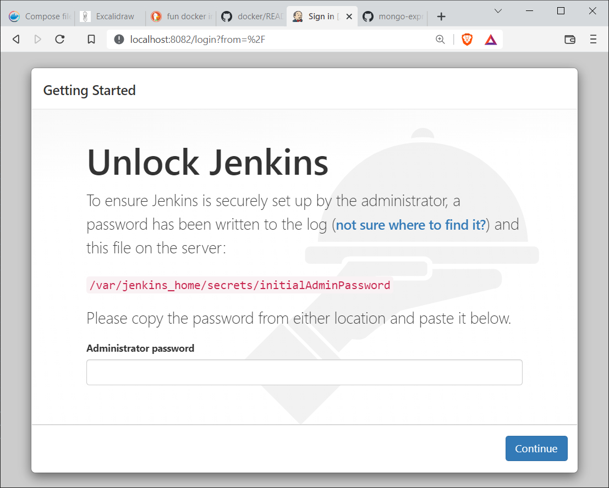
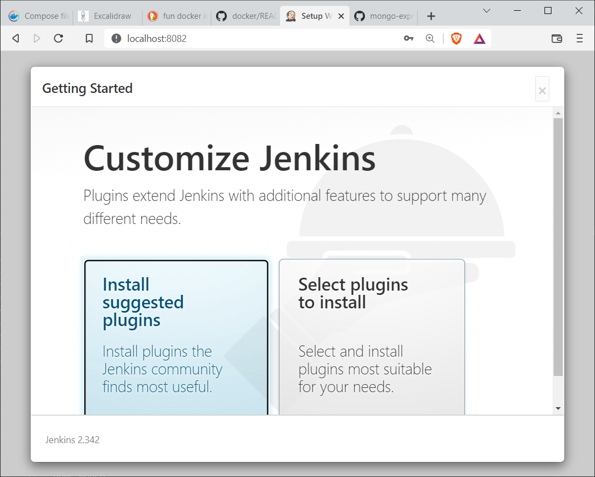
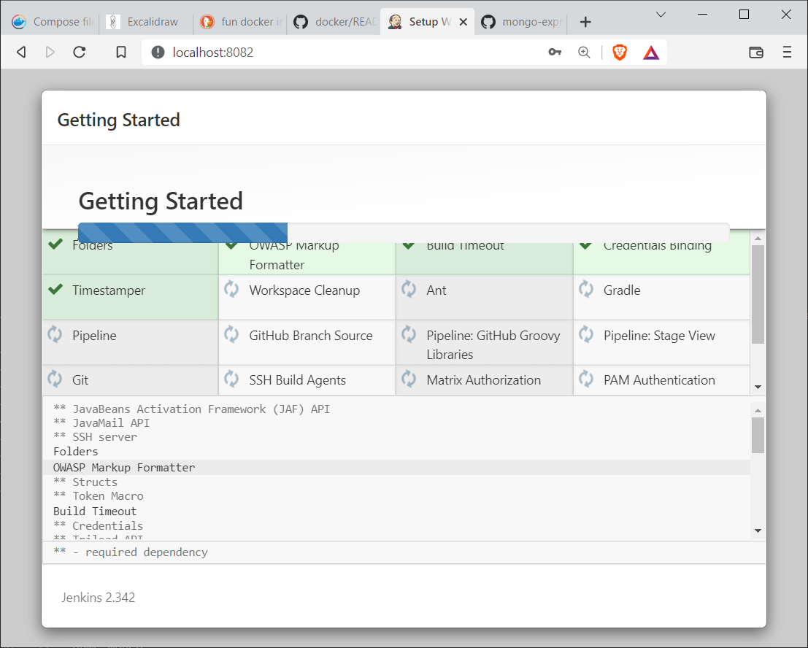
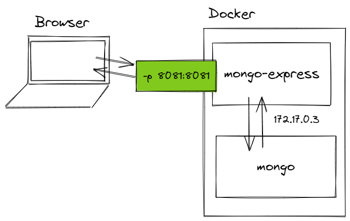
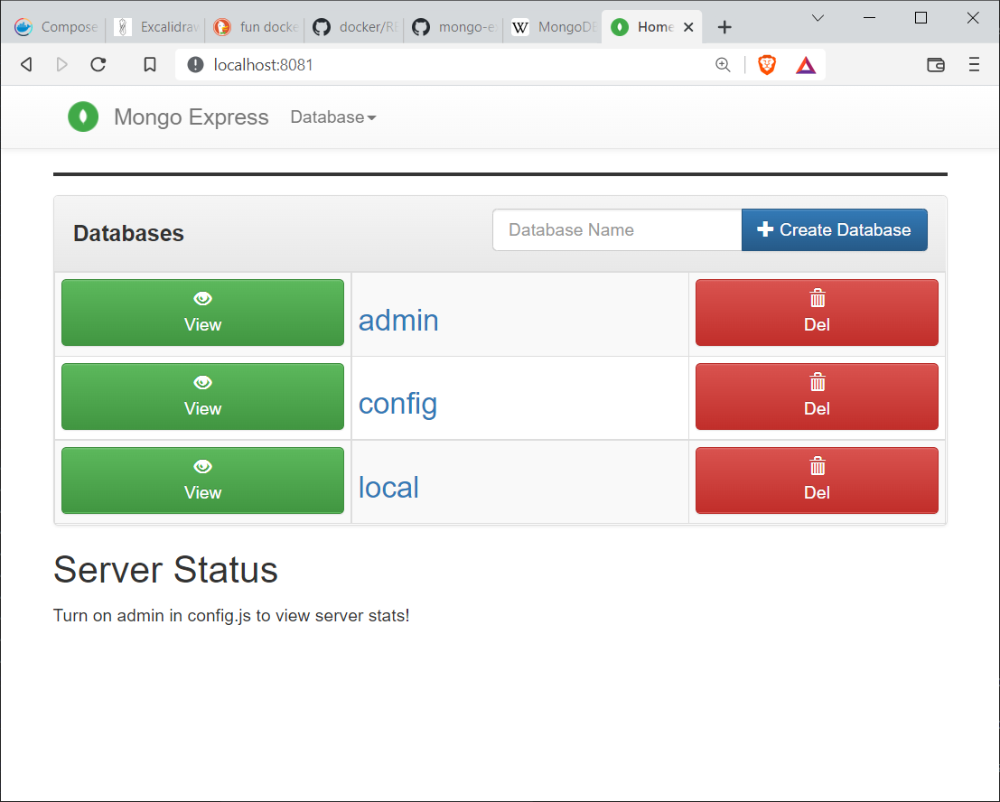

# Exercise: Jenkins and Mongo Containers

## Goals
- Configure and run a [Jenkins](https://www.jenkins.io/) container.
- Configure and run a [MongoDB](https://www.mongodb.com/) container.
- Configure and run a [Mongo Express](https://github.com/mongo-express/mongo-express) container.

## Jenkins

 [Jenkins](https://www.jenkins.io/) is a CI/CD (continuous integration/continuous delivery) tool.

 It can:
 - fetch source code from any remote source repository
 - build projects in Java, JavaScript, C#, Rust, Golang, and more
 - test projects
 - package projects
 - deploy projects
 - provide notification when anything goes wrong via email or text message

 Jenkins is a relatively easy install, but it's even easier with Docker.

 ### 1. Configure and Run

<pre class="console" noheader>
> docker run --name jenkins -p 8082:8080 -p 50000:50000 -d jenkins/jenkins
</pre>

Details
- Give the container a name with `--name jenkins`. Makes it easier to remember in the future.
- Publish the container port 8080 to the host port 8082. Used for the UI.
- Publish the container port 50000 to the host prot 50000. Used for plugin integration.
- Start the container in detached mode with the `-d` option.

### 2. Find the Password

When we browse to http://localhost:8082, we're faced with a login challenge.

To solve the challenge, we must log in to the running container and view the `/var/jenkins_home/secrets/initialAdminPassword` file. That's easy enough with `docker exec`.

<pre class="console" noheader>
> docker exec -it jenkins bash
jenkins@b459b333dbac:/$ cat /var/jenkins_home/secrets/initialAdminPassword
8cf5872a05e942cbaa5c02dc59c0a64a
jenkins@b459b333dbac:/$ exit
</pre>

Steps:
- Run the `bash` command inside the `jenkins` container in interactive mode (`-it`).
- We're now inside the container's shell. Display file contents to standard out.
- There's our password! (Yours will be different.)
- Terminate the bash shell. We're back in our host shell.

Use the password to log in via the challenge UI.

### 3. Configure Jenkins

Once logged in, we can configure Jenkins with plugins, users, and projects.

You can continue configuring Jenkins, but it's not essential. 

The main point of this exercise is that Docker makes it easy to spin up complicated software. A Docker image is pre-installed software!

### 4. Shut Down

When we're done with Jenkins, we can stop and remove the container in one command.

<pre class="console" noheader>
> docker rm -f jenkins
</pre>

## MongoDB and Mongo Express

MongoDB is "a source-available cross-platform document-oriented database program". (from https://en.wikipedia.org/wiki/MongoDB) MongoDB is a database, but doesn't have the concept of tables, rows, and columns. It doesn't create relationships between tables using foreign keys. Instead, it saves whole objects as JSON documents.

MongoDB is a popular non-relational database.

Mongo Express is a web-based MongoDB admin interface. It's useful for viewing, adding, updating, and deleting MongoDB databases, collections, and documents.

### 1. Run a MongoDB Container

<pre class="console" title="Powershell">
> docker run `
--name mongo `
-e MONGO_INITDB_ROOT_USERNAME=your-db-username `
-e MONGO_INITDB_ROOT_PASSWORD=your-db-password `
-d `
mongo
</pre>

<pre class="console" title="Bash, Zsh">
> docker run \
--name mongo \
-e MONGO_INITDB_ROOT_USERNAME=your-db-username \
-e MONGO_INITDB_ROOT_PASSWORD=your-db-password \
-d \
mongo
</pre>

Details
- Give the container a name with `--name mongo`. Makes it easier to remember in the future.
- Set the environment variable `MONGO_INITDB_ROOT_USERNAME` to a value of your choice. This sets the admin username in MongoDB.
- Set the environment variable `MONGO_INITDB_ROOT_PASSWORD` to a value of your choice. This sets the admin password in MongoDB.
- Start the container in detached mode with the `-d` option.

Note that we don't publish a port here. We don't want access to the outside world. We want Mongo Express to connect privately to MongoDB and then open Mongo Express to the outside world.

### 3. Find the `mongo` IP Address

Use `docker inspect` to find the `mongo` container's IP address. Your IP address may be different!

<pre class="console" noheader>
> docker inspect -f "{{.NetworkSettings.Networks.bridge.IPAddress}}" mongo
172.17.0.3
</pre>

Your IP address may be different!

### 4. Run a Mongo Express Container

<pre class="console" title="Powershell">
> docker run `
--name mongo-express `
-e ME_CONFIG_MONGODB_ADMINUSERNAME=your-db-username `
-e ME_CONFIG_MONGODB_ADMINPASSWORD=your-db-password `
-e ME_CONFIG_MONGODB_SERVER=172.17.0.3 `
-d `
-p 8081:8081 `
mongo-express
</pre>

<pre class="console" title="Bash, Zsh">
> docker run \
--name mongo-express \
-e ME_CONFIG_MONGODB_ADMINUSERNAME=your-db-username \
-e ME_CONFIG_MONGODB_ADMINPASSWORD=your-db-password \
-e ME_CONFIG_MONGODB_SERVER=172.17.0.3 \
-d \
-p 8081:8081 \
mongo-express
</pre>

Details
- Give the container a name with `--name mongo-express`. Makes it easier to remember in the future.
- Set the environment variable `ME_CONFIG_MONGODB_ADMINUSERNAME` to match the `mongo` username. This allows Mongo Express to connect to MongoDB.
- Set the environment variable `ME_CONFIG_MONGODB_ADMINPASSWORD` to match the `mongo` password. This allows Mongo Express to connect to MongoDB.
- Set the environment variable `ME_CONFIG_MONGODB_SERVER` to the `mongo` IP address. This allows Mongo Express to connect to MongoDB.
- Start the container in detached mode with the `-d` option.
- Publish the container port 8081 to the host port 8081.

The final `mongo`/`mongo-express` arrangement is diagramed below.

### 5. Verify

Browse to http://localhost:8081. You should see the Mongo Express UI. 

The databases: admin, config, and local, are databases stored inside the `mongo` container. 

Use Mongo Express to explore databases, columns, and documents. 

If you're up for it, create a new database, a new collection, and a new document. Documents must be JSON. MongoDB is a schema-less database, so any JSON will work (though we usually try to give documents inside a collection the same "shape").

### 6. Verify Docker

#### inspect

Inspect the `mongo` and `mongo-express` containers. You can inspect both at once or one at a time.

<pre class="console" noheader>
> docker inspect mongo mongo-express

# Or

> docker inspect mongo
> docker inspect mongo-express
</pre>

Answer the following questions.
- What is the container's current state?
- What are its environment variables?
- Which ports are open/exposed?
- What is the container's Cmd?

#### logs

Display logs from `mongo` and `mongo-express`.

<pre class="console" noheader>
> docker logs mongo
> docker logs mongo-express
</pre>

What sort of database is being logged from each container?

### 7. Stop and Remove

Stop the containers.

<pre class="console" noheader>
> docker stop mongo mongo-express
</pre>

Then remove them.

<pre class="console" noheader>
> docker rm mongo mongo-express
</pre>