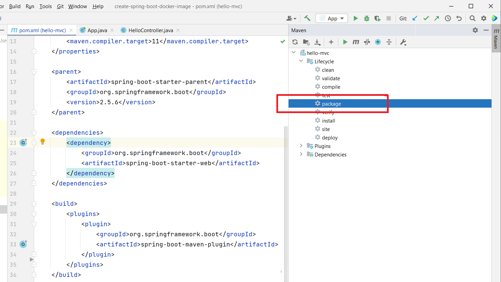
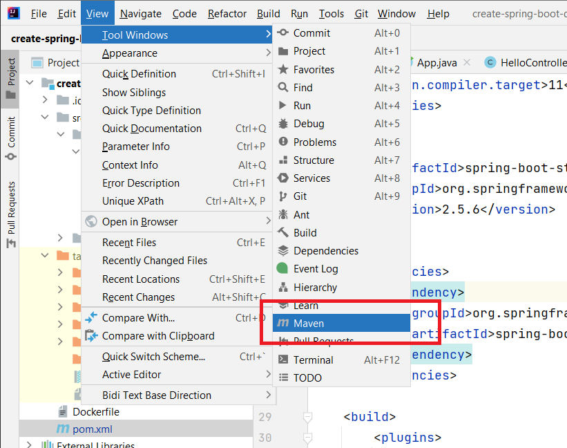
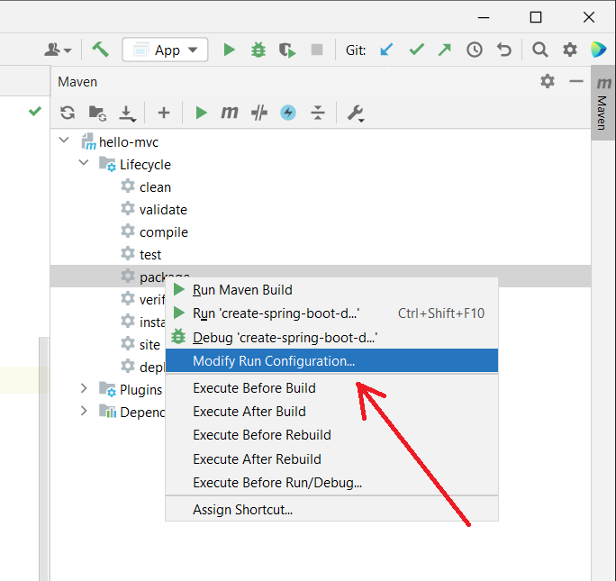
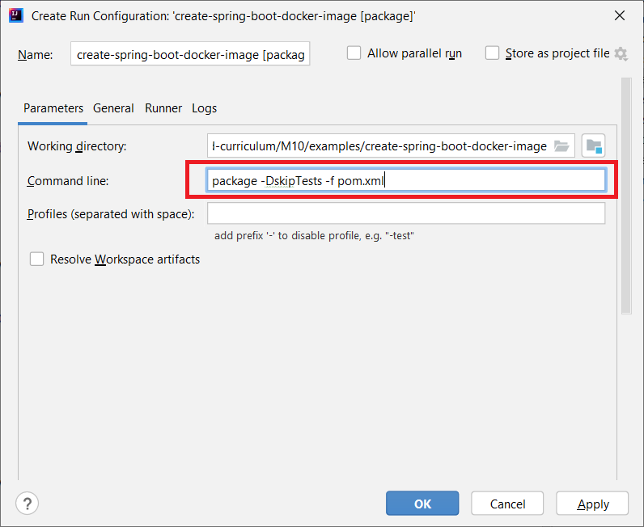
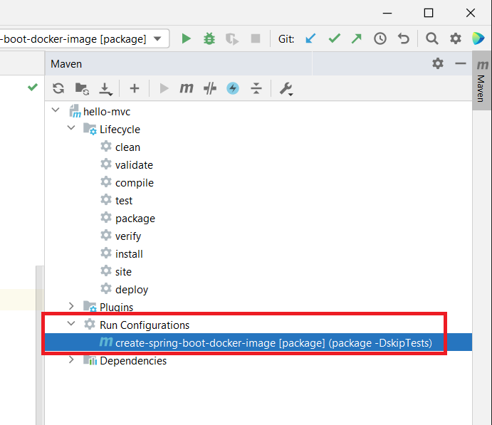

# Lesson: Creating a Spring Boot Docker Image

## Introduction

Docker is a powerful tool for running diverse application environments on a single host. As long as Docker (or another container runtime) is installed, the host doesn't need to know which virtual environments, applications, or application versions are running inside its containers. Docker makes it easy to build images and spin up containers. It's flexible.

Unfortunately, that flexibility can also cause confusion. There are many, many ways to build a Docker image. 

In this lesson, we narrow down the possibilities and build a Spring Boot image that's relatively small and not encumbered by license restrictions.

### Outcomes

When you've finished this lesson and its exercises, you should be able to:
- generate an executable `jar` for a Spring Boot application
- choose a JDK that's appropriate for your application
- build a Spring Boot Docker image
- weigh the costs and benefits of a JDK versus a JRE
- create a container from your Spring Boot image and run it

## Set Up

<blockquote class="icon-block-file-download">
Download the <a href="assets/hello-mvc.zip" download>hello-mvc</a> project. It's a bare-bones Maven Spring MVC application without a database connection or front-end. Open it with IntelliJ.
</blockquote>

## Steps

The steps below create Spring Boot Docker images with increasing sophistication.

### 1. Package the Application

To date, we've built our Spring Boot applications and run them locally with an IDE. We configure and run our application's `main` method, debug, and troubleshoot. That's great for development, but not so great for sharing our application. To share, we must package our application into something that's easy to use.

That's where the `spring-boot-maven-plugin` comes in. The `spring-boot-maven-plugin` is a Maven _build_ plugin. It extends the Maven build process. In this case, it packages our compiled bytecode into a Java Archive or [jar](https://en.wikipedia.org/wiki/JAR_(file_format)) file and exposes an application entry point.

Maven is able to build `jar` files on its own, but those jars are structured as libraries. They're not executable. They're just bytecode classes we can use from another Java project. The `spring-boot-maven-plugin` knows how to package a runnable Spring Boot application. It understands the `application.properties` file. It resolves environment variables. It defines a starting point for our application.

Add the following to the hello-mvc `pom.xml` file.

```xml
    <!-- snip, lots of XML above -->
    </dependencies>

    <!-- the `build` element is defined after `dependencies` -->
    <build>
        <plugins>
            <plugin>
                <groupId>org.springframework.boot</groupId>
                <artifactId>spring-boot-maven-plugin</artifactId>
            </plugin>
        </plugins>
    </build>

</project>
```

Update/reload Maven.

After the update is complete, we can package our project using IntelliJ's Maven panel.



If the Maven panel isn't visible, reveal it using `View -> Tool Windows -> Maven`.



Under the hood, IntelliJ executes `mvn package` on the command-line. Maven is a command-line tool. 

Conceptually, Maven works on a sequence of goals: validate, compile, test, package, and install. (There are other goals, but these are the main concepts.) The `mvn package` goal works through earlier goals in order: validate, compile, and test. If any goal in the sequence fails, the goals that follow don't occur. That means if any of our tests fail or our code doesn't compile, we don't get a jar.

For that reason, we may choose to omit tests, especially integration tests that require a specific testing environment. Later in the lesson, we won't be able to rely on a testing environment. To omit tests, modify the `package` run configuration.



Add the command-line option `-DskipTests` to the package command.



Click _Okay_.

Our edited run configuration appears under Maven panel's _Run Configurations_.



Double-click the new `package` run configuration to trigger it. Maven, along with the `spring-boot-maven-plugin`, validates, compiles, and packages our Spring Boot application. Find the packaged `jar` in the `target` directory with the naming convention: `[artifactId]-[version].jar`. In our case, it's `hello-mvc-0.0.1.jar`.

To confirm we have a working Spring Boot application, open a terminal, change directories into the `target` directory, and run:

```
java -jar hello-mvc-0.0.1.jar
```

You should see the Spring Boot console greeting.

```
  .   ____          _            __ _ _
 /\\ / ___'_ __ _ _(_)_ __  __ _ \ \ \ \
( ( )\___ | '_ | '_| | '_ \/ _` | \ \ \ \
 \\/  ___)| |_)| | | | | || (_| |  ) ) ) )
  '  |____| .__|_| |_|_| |_\__, | / / / /
 =========|_|==============|___/=/_/_/_/
 :: Spring Boot ::                (v2.5.6)

2021-11-17 16:15:54.235  INFO 7604 --- [           main] learn.App                                : Starting App v0.0.1 using Java 11.0.11
etc...
2021-11-17 16:15:55.503  INFO 7604 --- [           main] learn.App                                : Started App in 1.737 seconds (JVM running for 2.231)
etc...
```

### 2. Choose a JDK

Once we have a `jar` file, we can run it on almost any JDK. That's one of Java's superpowers. Bytecode isn't platform dependent (though a JDK implementation is) and a higher version JDK, say 17, can run bytecode compiled with a Java 11 compiler. We can choose the JDK that works best for us. Take a moment to review http://whichjdk.com/. 

We will continue to use the Eclipse Temurin JDK, version 17, for Docker images. Depending on the circumstances, we may choose a different JDK. For example, if we're deploying to AWS (Amazon Web Services), we may want to use the Corretto JDK. Corretto is optimized for AWS cloud deployment and contains implementations that integrate well with Amazon services.

### 3. Copy a JAR into an Image

The simplest way to create a Spring Boot Docker image is to copy our packaged `jar` into an existing JDK image and run the `jar` when we create a container based on the image.

#### Dockerfile

Create a `Dockerfile` in the project root. 

Add the following.

```Dockerfile
# 1. Alpine is a lightweight base image, use Eclipse Temurin 17.
FROM eclipse-temurin:17-alpine
# 2. Create the directory and navigate to it.
WORKDIR /home/app
# 3. Copy our packaged jar to the working directory and rename.
COPY ./target/hello-mvc-0.0.1.jar app.jar
# 4. Run the jar.
CMD ["java", "-jar", "./app.jar"]
```

From the comments:

1. The `FROM` instruction specifies a starting, base image. Here we use Eclipse Temurin 17 running on Alpine Linux. Alpine is a very lightweight image, weighing in at less than 6MB. Though, when we add the Temurin JDK with all its dependencies, we're up to 335MB!

2. The `WORKDIR` instruction navigates to a directory and sets it as the [working directory](https://en.wikipedia.org/wiki/Working_directory). If the directory doesn't exist, `WORKDIR` creates it first.

3. The `COPY` instruction copies files and directories from a source, in this case our host environment/local file system, to a destination inside the image. The [COPY](https://docs.docker.com/engine/reference/builder/#copy) instruction is incredibly flexible. It can set permissions, use an alternative file system source, match on file patterns, and more. Here, we copy a single file, `hello-mvc-0.0.1.jar`, to our working directory and rename it as `app.jar`.

4. By default, Docker containers start their execution with a shell, `/bin/sh`. Bash is common though other shells work as well. The `CMD` instruction adds arguments to that shell execution. In this case, the final result is that the shell runs the `java` command with arguments, which starts our Spring Boot application.

    The `CMD` instruction is nuanced, especially when comparing it to the `ENTRYPOINT` instruction. If you're interested in learning more, try this [highly-upvoted Stackoverflow answer](https://stackoverflow.com/a/21564990/7625) or the [official Docker docs](https://docs.docker.com/engine/reference/builder/#understand-how-cmd-and-entrypoint-interact).

#### .dockerignore

Before we proceed, let's limit what is sent to the Docker build process by adding a `.dockerignore` file. When we specify a dot, `.`, at the end of `docker build .`, it tells the build command to grab all directories and files in the current directory recursively and make them available to the build context. This includes hidden directories (`.git`), documentation, and directories that contain intermediate build output. We don't want that. It slows down our build and increases the risk of copying secrets into our image.

Create a `.dockerignore` file in the project root. Add the following.

```
# just in case
.git
# IntelliJ
.idea
*.iml

# Docker artifacts
Dockerfile*
```

Each `.dockerignore` file is unique to the project being built. Spring Boot projects should ignore IDE files and directories, Maven's `target` directory (for now we leave the `target` directory because that's where our `jar` lives), and Docker files. React projects should ignore `node_modules` and Docker files. It's safe to ignore the `.git` directory in all projects. The `.git` directory contains a full repository history so if we ever accidentally added a secret, it could be revealed without the `.dockerignore`.

#### `docker build`

Open a terminal, change directories to your project root, and run the following `docker` command.

```
docker build -t hello-mvc:0.0.1 .
```

- `docker build` generates a Docker image from a `Dockerfile`.
- The `-t` option tags the image. It gives it a name and, optionally, a tag. (The word "tag" here is confusing and ambiguous. A tag is both a `name:tag` pair and the tag following the `:`.)
- The dot, `.`, starts the build process assuming there's a `Dockerfile` in the current directory. It creates a build context recursively from all directories and files in the current directory that aren't ignored by `.dockerignore`.  Then it uses paths relative to the current directory for paths in `Dockerfile` instructions like `COPY`.

The `docker images` command should show a `hello-mvc:0.0.1` image.

#### `docker run`

Run it.

```
docker run --rm -p 8080:8080 -d hello-mvc:0.0.1
```

- `docker run` creates and starts a container based on an image.
- `--rm` deletes the container when it's stopped.
- `-p 8080:8080` maps our host port 8080 (local network) to the container port 8080 (Docker network).
- `-d` starts in detached mode. Our container runs in the background.
- `hello-mvc:0.0.1` is the image used to create the container.

We should now be able to receive a 200 OK response from http://localhost:8080.

`hello-mvc` contains a route that requires an environment variable, http://localhost:8080/hello/mvc/message. It should fail with a 500 Internal Server Error. To fix it, stop the current container and re-run with the environment variable included.

```
docker run --rm -p 8080:8080 -d -e HELLO_MVC_MESSAGE="soup and sandwich" hello-mvc:0.0.1
```

Now the route, http://localhost:8080/hello/mvc/message, should return the string "soup and sandwich".

All Spring Boot environment variables may be passed as part of the `run` command and will resolve correctly.

#### Stop the Container

🛑 Stop the container before moving on to the next step. 

### 4. Build the Project Inside an Image

A second approach to building a Spring Boot Docker image is to copy the project's source into the image, compile it, package it, and run it. This makes sense since we have access to a full JDK. We don't need to build and package on the host if we have a JDK in the image.

This approach is especially useful in automated build environments where it's not practical to install every compiler required for a project. 

For example, say that we maintain the following applications:

- a legacy Java 8 app
- two Java 11 apps
- two Java 17 apps
- a .NET Framework 4.x app
- a .NET Core 5 app

With a little love and luck, we could probably configure a single Java compiler to build our Java apps. The Java 17 compiler can target most Java versions. Note that we say "most". It's not perfect. And when we need another version, maybe Java 19, what do we do then? The same idea applies to the various .NET platforms and versions. Installing and configuring all required compilers on a single host is temperamental.

Instead, why not grab exactly the compiler we need from Docker Hub? That's the touted benefit of Docker. There's no need to install directly "on the metal" when Docker is installed. We can grab any compiler, any version, and any platform without a second thought. When we don't need an image anymore, there's no need to uninstall and reinstall. We just stop using it.

#### Dockerfile

Create a second Dockerfile in the project root and name it `Dockerfile.buildinside`. 

Add the following.

```Dockerfile
FROM eclipse-temurin:17-alpine
# 1. Index the latest Alpine packages.
RUN apk update
# 2. Install Maven.
RUN apk add maven
WORKDIR /home/app
# 3. Safe to copy everything because of .dockerignore
COPY . .
# 4. Build and package.
RUN mvn package -DskipTests -f pom.xml
# 5. Run the jar.
CMD ["java", "-jar", "./target/hello-mvc-0.0.1.jar"]
```

1. Like most Linux distributions, Alpine Linux has a package manager. Alpine's package manager is called [apk](https://wiki.alpinelinux.org/wiki/Alpine_Linux_package_management). Here we use `apk` to index Alpine packages (scan for the latest versions).

2. Maven 3.6 is available as an Alpine package, which is good enough for us. We'll use it to build and package our app.

3. In a Maven project, we only really need the `src` directory and `pom.xml` to compile and package. If our `.dockerignore` file is good, that's all that's passed along in the build context via `COPY . .`.

4. Run the Maven `package` command, skip tests, and explicitly define the POM file. This command would work just fine without the `-f pom.xml` option. We simply copied our run configuration from earlier in the lesson.

5. Whenever we start a container based on this image, run our packaged `jar` file.

#### .dockerignore

Add the `target` directory to `.dockerignore`. Since we're building inside the image, we don't need a pre-packaged `jar` and we don't need any intermediate build artifacts.

```
.git
# IntelliJ
.idea
# NEW: Maven output
target

Dockerfile*
```

#### Docker Build and Run

The `docker build` command is the same as before with the exception that we must specify our Dockerfile since it's not named `Dockerfile` (the assumed default).

```
docker build -t hello-mvc:build-inside -f Dockerfile.buildinside .
```

The first build will take a while. You'll notice a lot of chatter from the `mvn` command. It fetches a lot of dependencies.

Subsequent builds will be faster because Docker remembers our image's layers. To see layer history, run:

```
docker history hello-mvc:build-inside
```

Layers are effectively temporary images which may be cached. Each `ADD`, `COPY`, or `RUN` may create a new layer. To learn more: https://dominikbraun.io/blog/docker/docker-images-and-their-layers-explained/.

The `docker run` command works as before.

```
docker run --rm -p 8080:8080 -d -e HELLO_MVC_MESSAGE="hat and mittens" hello-mvc:build-inside
```

#### Stop the Container

🛑 Stop the container before moving on to the next step.

#### Problems 😕

**Be warned.** This is not the approach we will use to generate our Spring Boot images. It has too many problems. It is only an intermediate step toward our ultimate goal.

The first problem is that the image is too big. The base Alpine image is less than 6MB. This image is over half a gig! Part of that is the Temurin JDK, but another big part of it is Maven dependencies and build artifacts. Maven fetches dependencies and stores them in the `.m2` directory. Then it compiles our code into intermediate `.class` files. Ultimately everything is bundled into the `jar`, but all of the intermediate files remain scattered across the file system.

If our only complaint was image size, we could look the other way, but there are bigger problems. Namely, security.

- Our source code and Java dependencies are hanging about. That's everything required to build the app from scratch.
- We have a full JDK installed that includes a compiler. Those are the tools required to build the app from scratch.

It's a worst-case scenario -- it should never happen -- but if someone was able to execute arbitrary commands on our virtual OS, they could alter our code and rebuild the project with no one being the wiser. Granted, if someone was able to execute arbitrary commands on our virtual OS _without_ the source code and compiler, we'd still be in trouble. But a fundamental security goal is to reduce the [attack surface](https://en.wikipedia.org/wiki/Attack_surface). We can't always predict how someone can exploit a system, so a best practice is to reduce complexity. Leaving source code, libraries, and compilers hanging about is complex. That set up isn't needed. It's best to include only what we need: a `jar` and a JRE.

That leads us to our final Spring Boot image approach.

### 5. Multi-Stage Build with a JRE

In Docker [multi-stage builds](https://docs.docker.com/develop/develop-images/multistage-build/), we start with an image that contains build tools, we build and package our project, and then we copy the output to a new image without build tools. 

When the image is complete, we'll have only the base Alpine image, a JRE (no compiler or build tools), and a single `jar` that, combined, weigh under 165MB.

#### Dockerfile

Go ahead and change your existing `Dockerfile` name to `Dockerfile.copy`. We're going to make this approach our default Spring Boot image approach. Create a new `Dockerfile` and add the following.

```Dockerfile
# 1. from the "build inside" approach
FROM eclipse-temurin:17-jdk-alpine as builder
RUN apk update
RUN apk add maven
WORKDIR /home/app
COPY . .
RUN mvn package -DskipTests -f pom.xml

# 2. Restart with a fresh JRE Alpine image.
FROM eclipse-temurin:17-jre-alpine

# 3. Continue with application deployment.
EXPOSE 8080/tcp
WORKDIR /home/app
COPY --from=builder /home/app/target/hello-mvc-0.0.1.jar app.jar
CMD ["java", "-jar", "./app.jar"]
```

1. The `builder` image is identical to our build-inside approach above. We use the Eclipse Temurin 17 JDK, index Alpine dependencies, install Maven, copy source code from our local environment, and then build and package.

2. We start fresh with a smaller JRE Alpine image. We no longer need a huge JDK. It will be discarded once the artifacts are copied to the new image.

3. Create a `/home/app` directory and make it the working directory. Copy the `jar` from `builder` to the next image and rename it. The `CMD` instruction will run the `jar` whenever we run a container based on the image.

    The `EXPOSE` instruction isn't strictly necessary, but it's polite. It creates metadata that let's image consumers know which ports our applications bind to.

#### Docker Build and Run

Since we shuffled Dockerfile names around, we can build without the file argument. 

```
docker build -t hello-mvc .
```

An image name without an explicit tag after the `:` is assumed to be `latest`. The image produced from the command above will be `hello-mvc:latest`.

Again, the first build will take a while. You probably won't see `mvn` activity since there's a cached layer.

The `docker run` command works as before.

```
docker run --rm -p 8080:8080 -d -e HELLO_MVC_MESSAGE="red, blue, yellow" hello-mvc
```

Try the following requests.

```http
GET http://localhost:8080 HTTP/1.1
```

```http
GET http://localhost:8080/hello/mvc/message HTTP/1.1
```

```http
POST http://localhost:8080 HTTP/1.1
Content-Type: application/json
Accept: application/json

{
    "value": "mango, banana, gooseberry"
}
```

#### Stop the Container

🛑 Stop the container to complete this lesson. You can also delete the lesson's images. They're no longer required.

## Conclusion

There are many, many ways to build a Docker image. We can choose from many Linux distros, many programming languages, and many language versions. 

The Spring Boot image approach above works well because the generated image:

- is relatively small.
- is relatively simple. (The build process itself might not be considered simple.)
- only includes what is required to run the app.