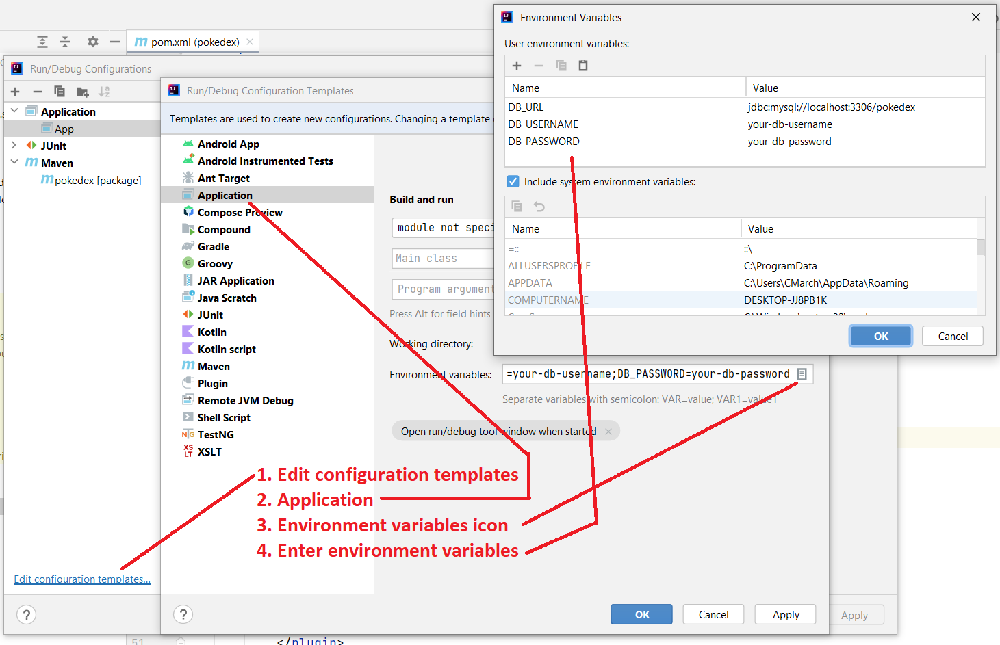

# Exercise: Build a Spring Boot Docker Image

## Goals

- Create a Docker image from an existing Spring Boot REST API.
- Run a container from the image.

## Set Up

<ol>
<li>
<blockquote class="icon-block-file-download">
Download the <a href="assets/pokemon-api.zip" download>Pokemon API</a> Maven project.
</blockquote>
</li>
</li>
<li>Extract the zip contents. They're a Maven project.</li>
<li>Open the project with IntelliJ.</li>
</ol>

## Pokemon API

The Pokemon API is a bare-bones Spring Boot API. It uses JPA for data access. It has only one API endpoint: `GET`: `/api/pokemon`. The endpoint serves up 10 Pokemon, Bulbasaur through Caterpie. (You could add more.)

We don't need to know all of the details behind the project. We're interested in its configuration.

## Phase 1: Test Locally

1. Open MySQL Workbench and connect to your `learn-mysql` instance.

2. Open the schema and data script found at `pokemon-api/sql/schema-and-data.sql` with Workbench.

3. Execute the script. Confirm you have a new database named `pokedex`.

4. Back in IntelliJ, the `application.properties` file contains environment variable placeholders instead of hard-coded values.

    ```
    spring.datasource.url=${DB_URL}
    spring.datasource.username=${DB_USERNAME}
    spring.datasource.password=${DB_PASSWORD}
    ```

    Set environment variables by editing run configurations: Run -> Edit Configurations

    

5. Run the application and troubleshoot any errors.

6. Visit http://localhost:8080/api/pokemon in a browser to view the Pokemon JSON. You could also use VS Code's REST Client.

7. Stop the application.

## Phase 2: Build the Image

1. Add spring-boot-maven-plugin to pom.xml.

    ```xml    
    <build>
        <plugins>
            <plugin>
                <groupId>org.springframework.boot</groupId>
                <artifactId>spring-boot-maven-plugin</artifactId>
            </plugin>
        </plugins>
    </build>
    ```

2. Create an appropriate `.dockerignore` file and add it to the project root.

    Things to look out for:
    - Don't include Git assets.
    - Don't include the `.idea` directory.
    - Don't include the `target` directory.

3. Create an appropriate `Dockerfile` and add it to the project root.

    Things to look out for: Make sure the COPY operation uses the correct jar name.

    ```Dockerfile
    FROM eclipse-temurin:17-jdk-alpine as builder
    RUN apk update
    RUN apk add maven
    WORKDIR /home/app
    COPY . .
    RUN mvn package -DskipTests -f pom.xml

    FROM eclipse-temurin:17-jre-alpine

    EXPOSE 8080/tcp
    WORKDIR /home/app
    # CHANGE: Copy the correct jar.
    COPY --from=builder /home/app/target/pokedex-1.0.jar app.jar
    CMD ["java", "-jar", "./app.jar"]
    ```

4. Open a terminal and browse to the project root.

5. Build the image.

    ```sh
    > docker build -t pokemon-api:1.0 .
    ```

## Phase 3: Test the Container Locally

Create and start a new container with `docker run`. Configure the container with the application's environment variables.

The host name "host.docker.internal" allows our new container to communicate with `learn-mysql`.

<pre class="console" title="Powershell">
> docker run `
--name pokedex `
-e DB_URL=jdbc:mysql://host.docker.internal:3306/pokedex `
-e DB_USERNAME=your-db-username `
-e DB_PASSWORD=your-db-password `
-p 8080:8080 `
-d `
pokemon-api:1.0
</pre>

<pre class="console" title="Bash, Zsh">
> docker run \
--name pokedex \
-e DB_URL=jdbc:mysql://host.docker.internal:3306/pokedex \
-e DB_USERNAME=your-db-username \
-e DB_PASSWORD=your-db-password \
-p 8080:8080 \
-d \
pokemon-api:1.0
</pre>

Visit http://localhost:8080/api/pokemon in a browser to view the Pokemon JSON.