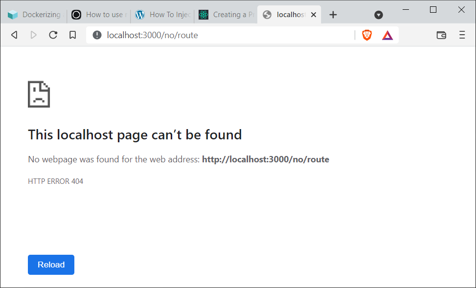

# Lesson: Creating a React Image

## Introduction

Every application bundled as a Docker image requires unique set-up steps and configuration. React is no different. Even a standard React application image can be built in different ways, with different underlying technologies and configuration, depending on the image use case.

In this lesson, we share an opinionated approach to building a production-grade React Docker image.

### Outcomes

When you've finished this lesson and its exercises, you should be able to:
- create an optimized React production build in a multi-stage Docker build
- configure Nginx
- use Nginx to serve a React build
- configure a React application when a container is created

## Set Up
<blockquote class="icon-block-file-download">
Download the <a href="assets/hello-react.zip" download>hello-react</a> project. It's a bare-bones React application created with CRA. It also uses React Router since proper route handling is required for our Docker image.
</blockquote>

## Goals

Docker image technologies and configuration are largely driven by our goals for an application. For example, if we only cared about manually testing a React app, a simple solution might be to copy all project files, `npm install`, and `npm start`. (To be clear, that's not what we want.)

In this case, we're interested in production-grade React delivery with the following goals:

- small(ish) HTML, CSS, and JavaScript resources
- fast HTTP transfer that's cache-able
- proper handling for React Router routes if the user reloads
- configuration at container run versus image creation

These goals may not be immediately obvious, but we'll discuss in more detail below.

## Creating a Production Build

**Create React App**'s `npm start` is only suitable for development. Its internal web server and on-the-fly compilation are amazing, but they're also slow and unnecessary when our React code doesn't change. React infrastructure can be confusing because the boundary between client and server are blurred. Conceptually, React always runs in the browser (aside from React Native) even though the React source code (JSX, ES6+) requires a compile step. The `npm start` command is always listening for code changes, compiling them, and delivering browser-friendly code to the browser.

**Create React App**'s [build script](https://create-react-app.dev/docs/production-build) can compile all project source code at once and bundle it in minimized format. The final output is browser-friendly HTML, CSS, and JavaScript. The bundle can be served with any HTTP server. A Node.js runtime isn't required.

This addresses two of our goals: "small(ish) HTML, CSS, and JavaScript resources" and "fast HTTP transfer that's cache-able".

Open a terminal, change directories into the `hello-react` project root, and run the following commands.

```sh
# install dependencies
npm install
# create a production build
npm run build
# serve the "build" directory on port 3000
# with a static web server
npx http-server -p 3000 ./build
```

Visit http://localhost:3000 and click through the React Router links. Everything should work as expected. 

Unfortunately, there's a failure scenario. Manually type a URL into the browser and hit enter, maybe a URL that doesn't have a matching route: http://localhost:3000/no/route. Previously, this would have displayed a "Not Found" message with navigation intact. Now, it displays a full 404 Not Found error.



The static web server assumes there's a `build/no/route` directory with an `index.html` file inside. There's not, so it returns a hard 404 response. Even manually entering a known route will fail: http://localhost:3000/login. Only http://localhost:3000 works. That's because React Router programmatically tampers with the browser's URL, never sends a GET request, and updates the rendered component in response to the URL and route definition. When we manually enter the `/login` URL, we send a fresh GET request and the web server, again, assumes there an `build/login/index.html` file.

We'll solve this problem by configuring the Nginx HTTP server below.

🛑 Stop the `http-server` before moving on to the next step.

## React Docker Image

Now that we're familiar with multi-stage Docker builds, we understand the benefits of building our projects with specific technology versions depending on the application.

### `.dockerignore`

Each application has unique Docker image requirements. Create a `.dockerignore` file in the project root and add the following rules. See comments for explanations.

```
# being paranoid
.git
# don't need the build directory since we'll rebuild the project
build
# copying node_modules is slow and we'll need a fresh install anyway
node_modules
# no docker artifacts
Dockerfile*
# no documentation
*.md
```

### Dockerfile, Part 1

Create a Dockerfile in the `hello-react` project root. Start with the following (we won't build yet).

```Dockerfile
# 1. active LTS
FROM node:16-alpine as builder
WORKDIR /home/app
COPY . .
# 2. similiar to `npm install`, uses package-lock.json 
# to guarantee versions
RUN npm ci && npm cache clean --force
# 3. create the optimized production build
RUN npm run build

# more to come...
```

1. We don't need Node.js to serve our application, but we do need it to _build_ our application. Here we use Node.js 16, which is the active LTS (long-term support) version. It will be maintained until April 2024.

2. `npm ci` (clean slate install) is similar to `npm install` with less variability in outcome. It uses the `package-lock.json` file instead of `package.json`. `package-lock.json` uses specific dependency versions while `package.json` usually specifies a _minimum_ version. `npm cache clean` removes all cached packages.

3. The `npm run build` command is identical in the step above. It generates static HTML, CSS, and JavaScript in a `build` directory. We'll use the contents soon.

### Nginx

There's nothing wrong with serving React from a Node.js server (or a Java server or a .NET server or...). The Node.js ecosystem has a lot of great tools. However, most Node.js setups recommend putting an Nginx server in front of the Node.js server. There are a few reasons for this: SSL-handling, load-balancing, and complex URL routing, but another important reason is that Nginx is extremely fast and resilient. Nginx is tied for the most-used HTTP server in the world. If we include its use as a proxy, no one serves more content. It is the most-used, most-tested HTTP server in the most-diverse set of environments.

We'll serve our React `build` directory with [Nginx](https://en.wikipedia.org/wiki/Nginx).

Nginx addresses two of our goals: "fast HTTP transfer that's cache-able" and "proper handling for React Router routes if the user reloads".

### Nginx Config

Nginx configuration has [many options](https://www.nginx.com/resources/wiki/start/topics/examples/full/). For our application, we use very few of them (and we don't need to know the details).

Create a file, `nginx.conf`, in the project root. Add the following.

```
server {

  # listening on port 80, the default HTTP port
  listen 80;

  location / {
    root /usr/share/nginx/html;
    index index.html index.htm;
    # 1. Try any uri/url with an optional slash.
    # If we don't find a file, serve index.html instead.
    try_files $uri $uri/ /index.html;
  }

  error_page 500 502 503 504 /50x.html;

  location = /50x.html {
    root  /usr/share/nginx/html;
  }

}
```

1. The main point of interest is that we now have a solution to our React Router refresh/GET problem. The `try_files` configuration inspects a request's URI with optional slash. If the path matches a file relative to `/usr/share/nginx/html`, it serves it. Otherwise, it serves the `index.html` file. That means that `/no/route` and `/login` will find no static files and Nginx will serve `index.html` instead. Then the React Router code will run in the browser and render the component that matches the URI route: "Not Found" in the first case and "Login" in the second.

### Dockerfile, Part 2

We're ready to copy the output from the first stage of the build to the second stage, the Nginx image. Replace existing Dockerfile content with the instructions below.

```Dockerfile
FROM node:16-alpine as builder
WORKDIR /home/app
COPY . .
RUN npm ci && npm cache clean --force
RUN npm run build

# NEW CODE
# 1. Nginx & Alpine
FROM nginx:1.21-alpine
# 2. replace nginx's default config with our nginx config
COPY nginx.conf /etc/nginx/conf.d/default.conf
# 3. copy build output from builder to the default static file location
COPY --from=builder /home/app/build /usr/share/nginx/html
EXPOSE 80
# 4. start nginx in the foreground
CMD ["nginx", "-g", "daemon off;"]
```

1. Nginx is already a lean application. Pairing it with an Alpine distro makes for a small image.

2. Nginx's configuration files are stored in `/etc/nginx/config.d`. We can add one to many configuration files to the directory -- to configure specific hosts, applications, proxy scenarios, and more. Our application image requires none of that. We replace the `default.conf` file with our `nginx.conf`.

3. Nginx looks for static resources: HTML, CSS, JavaScript, images, video, etc, in `/usr/share/nginx/html` because that's what is configured. We copy the output from our `builder` stage into the static resource directory. Nginx will be able to find our build files and serve them.

4. Some Nginx implementations push the application into the background as a daemon. That's useful when a machine is running several applications. In a Docker image, it makes sense to host a single application per image. In that case, we disable the "daemon" mode and allow Nginx to run in the foreground so we can read the output it generates and troubleshoot.

#### Build and Run

Open a terminal, change directories to the project root, and build the image.

```sh
docker build -t hello-react:0.0.1 .
```

The build process may take a while. There's a lot to do. 

You may see scary messages about `package-lock.json` being created from an older Node.js version and security warnings. Don't sweat it. You may have noticed similar messages during the `npm install` process above. The security warnings pertain to development tools. They don't find their way into a production build.

Spin up a new container.

```sh
docker run --rm -d -p 80:80 --name nginx-react hello-react:0.0.1
```

To see Nginx output, execute `docker logs`.

```sh
docker logs nginx-react
```

Visit http://localhost and try various URLs (URIs). See if you can break the app with a true 404 status: http://localhost/no/route, http://localhost/login.

🛑 Stop all `hello-react` containers before proceeding.

## CRA Environment Variables

**Create React App** has some [ability to bind environment variables](https://create-react-app.dev/docs/adding-custom-environment-variables/). Environment variables can be passed on the command-line or defined in `.env` files.

Custom environment variables must start with `REACT_APP_`.

Let's define an environment variable for development and then override the variable when we create a production build.

### 1. Create a .env File for Development

Add a file named `.env` to the `hello-react` project root. Add the following key and value.

`.env`

```
REACT_APP_MESSAGE="This is a development build."
```

### 2. Reference the Environment Variable in Code

CRA resolves environment variables with the prefix `process.env`. The full name of our environment variable is `process.env.REACT_APP_MESSAGE`. Change the environment message to use `REACT_APP_MESSAGE`.

```jsx
import { Link, Routes, Route } from 'react-router-dom';
import './App.css';

function App() {
  return (
    <>
      <div>
        <Link to="/">Home</Link>
        <Link to="/contact">Contact</Link>
        <Link to="/login">Login</Link>
        {/* NEW CODE */}
        <Link to="/environment">Environment</Link>
      </div>
      <Routes>
        <Route path="/" element={<h1>Home</h1>} />
        <Route path="/contact" element={<h1>Contact</h1>} />
        <Route path="/login" element={<h1>Login</h1>} />
         {/* NEW CODE */}
        <Route path="/environment" element={<h1>{process.env.REACT_APP_MESSAGE}</h1>} />
        <Route path="*" element={<h1>Not Found</h1>} />
      </Routes>
    </>
  );
}

export default App;
```

### 3. Test Locally

Start the application with `npm start`. Navigate to _Environment_. We should see the message, "This is a development build."

Stop the app.

### 4. Dockerfile

We explicitly override the `REACT_APP_MESSAGE` environment variable during the build step. See new code below.

```Dockerfile
FROM node:16-alpine as builder
WORKDIR /home/app
COPY . .
RUN npm ci && npm cache clean --force
# NEW CODE
RUN REACT_APP_MESSAGE="this is a production build" npm run build

FROM nginx:1.21-alpine
COPY nginx.conf /etc/nginx/conf.d/default.conf
COPY --from=builder /home/app/build /usr/share/nginx/html
EXPOSE 80

CMD ["nginx", "-g", "daemon off;"]
```

### 5. Build and Run

Use the `Dockerfile` to build the image. Consider giving the image a tag that distinguishes between our build approaches. Below we use `cra-env`.

```sh
docker build -t hello-react:cra-env .
```

Spin up a new container.

```sh
docker run --rm -d -p 80:80 hello-react:cra-env
```

Check the environment message at http://localhost/environment.

🛑 Stop all `hello-react` containers before proceeding.

<blockquote class="icon-block-sticky-note">
<p>This is a good point to stop with React Docker images. Our image does everything we need. We can target specific environments per image. This is all we expect in this course.</p>
<p>However, if you want to go further, there's more. It's possible to create a single image that can handle any environment. Read more below.</p>
</blockquote>

## Advanced: Starting a Container with Environment Variables

Our final goal is "configure a React application when a container is created". This goal's solution isn't immediately obvious. Since our optimized production build is just a bunch of static resources, there's no language runtime to read environment variables and embed them.

CRA has limited support for environment variables. Unfortunately, variable binding occurs at compile time, not run-time. That means we're forced to create Docker images for each environment. There's no way to create a single image that works across many environments. Worse, targeting a new environment requires changes or additions to our build.

To solve the problem, we need to alter our React code a bit and try a bit of shell scripting. Before we get started, let's make it clear that it's 100% okay to create an image per environment. If this solution isn't for you, use CRA environment variables during the build process.

### 1. Create a Config File

Add a configuration file to the `public` directory in the `hello-react` project.

`config.js`

```js
window.HELLO_REACT_MESSAGE = "straw and hay";
```

Assign a value to the `window` global object using environment-variable-like naming conventions. Be very, very careful not to use a common name like `window.Array`. That would replace the JavaScript array type. Make your variable name unique without a doubt.

In reality, this value would probably be an API URL or the like. This value is for demonstration only.

Never embed secrets! Secrets must never find their way to a web browser, even "obfuscated" secrets.

### 2. Link `config.js` in `public/index.html`

Add a script reference right before the close `body` tag.

The `%PUBLIC_URL%` variable will always resolve to the `public` folder, regardless of build/start modifications.

```html
<!DOCTYPE html>
<html lang="en">

<head>
  <meta charset="UTF-8">
  <meta name="viewport" content="width=device-width, initial-scale=1.0">
  <title>Hello React</title>
</head>

<body>
  <div id="root"></div>
  <!-- NEW CODE -->
  <script src="%PUBLIC_URL%/config.js"></script>
</body>

</html>
```

### 3. Reference the Variable

Always use the `window` object to reference global variables. Without it, the CRA linter will be very grouchy.

https://create-react-app.dev/docs/using-global-variables

```jsx
import { Link, Routes, Route } from 'react-router-dom';
import './App.css';

function App() {
  return (
    <>
      <div>
        <Link to="/">Home</Link>
        <Link to="/contact">Contact</Link>
        <Link to="/login">Login</Link>
        {/* NEW CODE */}
        <Link to="/environment">Environment</Link>
      </div>
      <Routes>
        <Route path="/" element={<h1>Home</h1>} />
        <Route path="/contact" element={<h1>Contact</h1>} />
        <Route path="/login" element={<h1>Login</h1>} />
         {/* NEW CODE */}
        <Route path="/environment" element={<h1>{window.HELLO_REACT_MESSAGE}</h1>} />
        <Route path="*" element={<h1>Not Found</h1>} />
      </Routes>
    </>
  );
}

export default App;
```

Try the project locally using `npm start`. You should see "straw and hay" when you click the _Environment_ link.

### 4. Create an Nginx Initialization Script

Nginx stores a series of initialization scripts in `/docker-entrypoint.d/`. This allows users to tweak how Nginx starts up. The scripts are evaluated in order. In the `nginx:1.21-alpine` image, there are already three scripts.

```sh
/ # ls -l /docker-entrypoint.d
total 16
-rwxrwxr-x    1 root     root          1961 Nov 13 05:02 10-listen-on-ipv6-by-default.sh
-rwxrwxr-x    1 root     root          1037 Nov 13 05:02 20-envsubst-on-templates.sh
-rwxrwxr-x    1 root     root          4613 Nov 13 05:02 30-tune-worker-processes.sh
```

We can add our own initialization script prefaced with `85-`, though the order of our execution doesn't really matter.

Our script overwrites the `config.js` file and replaces the `window` variables with environment variables.

The trick to this approach is that the React files from `npm run build` already exist in the image. We need a way to replace a value or two when a container first starts. That's where Nginx initialization comes in. Nginx initializes when the container starts, allowing us to grab environment variables and embed them into code.

Add the file, `85-set-environment-vars.sh`, to the `hello-react` project root and add the following.

```sh
cat << EOF > /usr/share/nginx/html/config.js
window.HELLO_REACT_MESSAGE = "$HELLO_REACT_MESSAGE";
EOF
```

The script uses the Bash [heredoc](https://linuxize.com/post/bash-heredoc/) syntax to replace the contents of a file. We can add more than one line of text using this syntax, which may come in handy later.

### 5. Dockerfile

Replace the Dockerfile content with these instructions.

```Dockerfile
FROM node:16-alpine as builder
WORKDIR /home/app
COPY . .
RUN npm ci && npm cache clean --force
RUN npm run build

FROM nginx:1.21-alpine
COPY nginx.conf /etc/nginx/conf.d/default.conf
COPY --from=builder /home/app/build /usr/share/nginx/html

# NEW CODE
# 1. Copy the initialization script to the Nginx init scripts directory.
COPY 85-set-environment-vars.sh /docker-entrypoint.d
# 2. Make it executable.
RUN chmod +x /docker-entrypoint.d/85-set-environment-vars.sh

EXPOSE 80
CMD ["nginx", "-g", "daemon off;"]
```

1. Copy `85-set-environment-vars.sh` into the Nginx initialize script directory, `/docker-entrypoint.d`.

2. Make the script executable.

### 6. Build and Run

Build the image as before with a new tag. I chose `true-ev` for "true environment variables".

```sh
docker build -t hello-react:true-ev .
```

Run it. Remember to pass the `HELLO_REACT_MESSAGE` environment variable.

```sh
docker run --rm -d -p 3001:80 -e HELLO_REACT_MESSAGE="peas and corn" hello-react:true-ev
```

Run two more containers on different ports with different messages.

```sh
docker run --rm -d -p 3002:80 -e HELLO_REACT_MESSAGE="autumn is a better word than fall" hello-react:true-ev
docker run --rm -d -p 3003:80 -e HELLO_REACT_MESSAGE="nouns, verbs, adjectives" hello-react:true-ev
```

Check messages:
- http://localhost:3001/environment
- http://localhost:3002/environment
- http://localhost:3003/environment

🛑 Stop all `hello-react` containers.

## Conclusion

We never create a React Docker image with `npm start`. Other than that, the sky's the limit. 

Since React apps are built for browsers in production, we can build locally and copy into the image or build inside an image with a multi-stage build. There are many HTTP servers that are suitable for serving React applications.

In this lesson, we share an opinionated approach to building a React Docker image that focuses on speed, small resource size, proper route handling, and containers that can be configured at run-time.