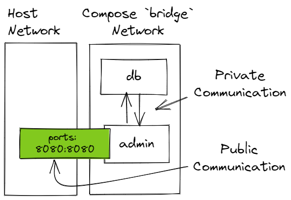
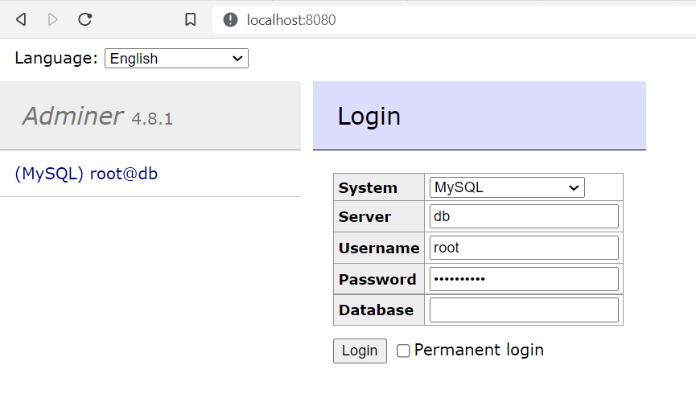
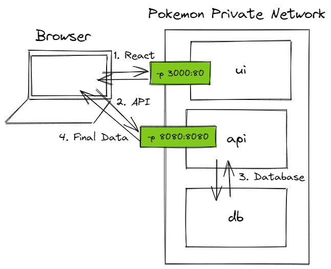

# Lesson: Docker Compose

## Introduction

Docker Compose is a command-line application to build, spin up, and wind down multiple containers. It uses a file to define containers, volumes, and networks. The file is usually [YAML](https://yaml.org/), but JSON can be used as well.

A Compose file looks like this.

```yaml
services:
  # nginx is a service name
  nginx:
    image: nginx:1.21-alpine
    ports:
      - 8080:80
    environment:
      - KEY="the value"
```

A container specification is called a **service**. A **service** is a template for one to many replica containers.

Compose files grow in complexity. They can define many services that represent a full-stack application. Compose files define volumes, networks, environment data, and more.

To run containers using a file named `docker-compose.yml`, use the terminal. It's convention to name our file `docker-compose.yml`. When the convention is used, we don't have to explicitly pass the file name.

<pre class="console" noheader>
> docker compose up
</pre>

### Outcomes

When you've finished this lesson and its exercises, you should be able to:
- distinguish between the commands `docker-compose` and `docker compose`
- create a valid Docker Compose YAML file
- create and start multiple containers with `docker compose up`
- terminate and remove multiple containers with `docker compose down`
- list two Docker Compose default behaviors

## History

The original Docker Compose CLI, V1, was written in Python. It was a stand-alone CLI that was not related to `docker`, though it used the same Docker Engine API as `docker`. V1 ran as `docker-compose` in the terminal.

<pre class="console" noheader>
> docker-compose up -d
</pre>

Docker Compose V2 is written in Golang. It can run stand-alone as `docker-compose`, but it can also run integrated in the `docker` CLI. The V2 docs suggest using the `docker compose` syntax versus `docker-compose`.

<pre class="console" title="Docker Compose V2 equivalent commands">
# stand-alone
> docker-compose up -d

# docker integration
> docker compose up -d
</pre>

## Installation

Docker Compose comes preinstalled with Docker Desktop. If you're running Windows or Mac, no installation is necessary.

Confirm in the terminal. If you get a help response, you're ready to go.

<pre class="console" noheader>
> docker compose help

Usage:  docker compose [OPTIONS] COMMAND

Docker Compose

...snip...
</pre>

Linux requires a manual install. See install docs here: https://docs.docker.com/compose/cli-command/#install-on-linux.

## Learning Docker Compose

To gain proficiency in Docker Compose, we need two things.

1. An understanding of the [Compose file specification](https://docs.docker.com/compose/compose-file/). The Compose file is almost always YAML (JSON is an alternative). We won't cover the details of the [YAML](https://yaml.org/) language. We leave that to you. (See [Learn X in Y Where X=yaml](https://learnxinyminutes.com/docs/yaml/).) Instead, we focus on Compose-specific schema in examples. Over time, we'll get the hang of YAML _and_ Compose YAML.

2. An understanding of the [docker compose](https://docs.docker.com/engine/reference/commandline/compose/) commands. Again, examples are the best strategy here. There are infinite ways to run multiple containers. We focus on a few illustrative examples until we get the hang of it.

  In this course, we prefer `docker compose` over `docker-compose`.

## Examples

Consider creating a directory for Compose examples and creating sub-directories for each example. Examples use the default file name, `docker-compose.yml`, to avoid specifying an explicit file name with the `-f` option. There can't be more than one `docker-compose.yml` file in a directory.

### Single Container from an Image

#### Step 1: `docker-compose.yml`

Create a file named `docker-compose.yml`. Add the following content.

```yaml
version: "3"                 # 1
services:                    # 2
  web-server:                # 3
    image: nginx:1.21-alpine # 4
    ports:                   # 5
      - 8080:80              # 6
```

Let's cover each line.
1. The `version` element is optional. As of the latest Compose file spec, it's deprecated. It's informational only. It can't be used to target a specific file version.
2. The `services` element groups one or more service definitions. Note there's no white space to the left. It's a top-level element.
3. The `web-server` element defines a service. Unlike `version` and `services`, the name isn't special. We can use any name we want. By default, it's used as part of the container name and as a host name, though both can be overridden.

    Note that `web-server` is indented under `services`. All service definitions have the same indentation level under `services`.

4. `image` defines the image to be used for this service. It's a good idea to include a tag in the value, just like `docker run`. If the image isn't local, Compose will attempt to pull it from a registry first, just like `docker run`.

    Note that `image` is indented under `web-server`. It belongs to the `web-server` definition.

5. `ports` defines one or more port mappings from host to the container. It's the same as the `-p` option in `docker run`.
6. There's no element key on this line. It's only a value. The `ports` key can include one to many port mappings. This value maps host port 8080 to container port 80.

#### Step 2: `docker compose up`

Open a terminal. Navigate to the directory that holds the `docker-compose.yml` file. Execute [docker compose up](https://docs.docker.com/engine/reference/commandline/compose_up/).

The `docker compose up` command is similar to `docker run`. It pulls an image if required, creates containers, and starts them. The only difference is that it runs many containers instead of one.

The command started our container. Check that it's running on http://localhost:8080. You should see Nginx's default welcome HTML.

<pre class="console" header>
> docker compose up
[+] Running 2/2
 - Network single-from-existing-image_default         Created                                                      0.0s
 - Container single-from-existing-image-web-server-1  Creat...                                                     0.1s
Attaching to single-from-existing-image-web-server-1
single-from-existing-image-web-server-1  | /docker-entrypoint.sh: /docker-entrypoint.d/ is not empty, will attempt to perform configuration
single-from-existing-image-web-server-1  | /docker-entrypoint.sh: Looking for shell scripts in /docker-entrypoint.d/
single-from-existing-image-web-server-1  | /docker-entrypoint.sh: Launching /docker-entrypoint.d/10-listen-on-ipv6-by-default.sh
single-from-existing-image-web-server-1  | 10-listen-on-ipv6-by-default.sh: info: Getting the checksum of /etc/nginx/conf.d/default.conf
... lots more output...
</pre>

#### Step 3: `docker compose down`

Unfortunately, we started our container in the terminal foreground. (We could prevent that by using `docker compose up -d` to "detach" all containers.) Go head and force terminate the Compose process with <kbd>Ctrl+C</kbd>.

We're not finished. The container (and a network) are still there. The container is stopped. To clean up our mess, execute [docker compose down](https://docs.docker.com/engine/reference/commandline/compose_down/).

`docker compose down` does the following:
- If containers are running, it stops them.
- Removes containers.
- Removes networks.

The command must be executed in the directory that contains `docker-compose.yml`.

<pre class="console" noheader>
> docker compose down
[+] Running 2/2
 - Container single-from-existing-image-web-server-1  Remov...                                                     1.5s
 - Network single-from-existing-image_default         Removed                                                      0.1s
</pre>

#### Service Definitions and `docker run`

Compose service definitions offer the full range of [options from docker run](https://docs.docker.com/engine/reference/commandline/run/#options). There are at least 100 `docker run` options. Compose supports all of them in one way or another.

Let's start with a `docker run` example. We use seven options and override the image's command.

<pre class="console" title="Powershell">
> docker run `
-p 8080:80 `
-e KEY="the value" `
--name nginx1 `
--hostname nginx1 `
--pull never `
--restart no `
-d `
nginx:1.21-alpine /bin/sh
</pre>

In YAML, it would look like this.

```yaml
services:
  my-service:
    image: nginx:1.21-alpine
    container_name: nginx1
    hostname: nginx1
    pull_policy: never
    restart: "no"
    command: /bin/sh
    ports:
      - 8080:80
    environment:
      - KEY="the value"
```

To replicate the detach option, `-d`, we add it to `docker compose up -d`.

Be sure to clean up with `docker compose down`.

### Compose Defaults

Compose has several default behaviors that may not be obvious.

1\. `docker compose up` creates a new `bridge` network and assigns all containers to the new network. This allows containers to communicate without being added to Docker's default network. Containers inside the network can communicate via IP or host name.

2\. `docker compose up` uses the `docker-compose.yml` parent directory's name as the default **project name**. The project name is a string added as a preface to all resource names unless they're explicitly configured.

If we create three containers and the Compose network in a directory named `some-directory`, we would get names like:

```
some-directory_default      (network)
some-directory-web-server-1 (container)
some-directory-db-1         (container)
some-directory-front-end-1  (container)
```

The project name can be overridden by using the `-p` option during `docker compose up`.

<pre class="console" title="Example">
> docker compose -p blue up -d
- Network blue_default         Created        0.0s
- Container blue-web-server-1  Started        0.7s
- Container blue-db-1          Started        0.7s
- Container blue-frontend-1    Started        0.7s
</pre>

The project name must be provided during the `down` step as well or Compose won't recognize the resources.

<pre class="console" title="Example">
> docker compose -p blue down
</pre>

3\. Service definition names are used as container names and host names. 

In the example below, container names would be `parent-directory-foo-1` and `parent-directory-bar-1`. Inside the `bridge` network, containers can communicate using the host names `foo` and `bar`.

```yaml
services:
  foo:
    image: nginx:1.21-alpine
    ports:
      - 8080:80
  bar:
    image: busybox
```

### Multiple Containers from an Image, a Volume, Hidden Network Communication

The goals for this example are:

- Create two services.
- Create a database service with appropriate configuration.
- Create a named volume.
- Map the database service data directory to the named volume.
- Add a database admin UI service that talks to the database.
- Open the host network to the admin UI but do **not** open the host network to the database. The database and admin UI should communicate privately.



#### Step 1: `docker-compose.yml`

Create a new directory. I used the name `mariadb-adminer` since those are the images we're using.

Create a `docker-compose.yml` file. Add the contents below.

```yaml
services:
  # 1. database
  db:
    image: mariadb:10.7.3
    environment:
      - MYSQL_ROOT_PASSWORD=top-secret
    volumes:
      - maria-data:/var/lib/mysql
  # 2. database adminstration
  admin:
    image: adminer:4
    ports:
      - 8080:8080
    depends_on:
      - db
    restart: unless-stopped
# 3.
volumes:
  maria-data:
    driver: local
```

There are two top-level element: `services` and `volumes`. They're not evaluated top-to-bottom. For example, the `db` service requires a volume that's defined in `volumes`. `services` define services. `volumes` define volumes. Other top-level elements include: `configs`, `networks` and `secrets`.

1. The database service is named `db`. It uses the `mariadb:10.7.3` image. (The more specific the image version, the better.) MariaDB is largely compatible with MySQL, so here we set the root password using the MySQL environment variable, `MYSQL_ROOT_PASSWORD`. Read more on the [mariadb](https://hub.docker.com/_/mariadb) image.

    The most interesting part of this configuration is mapping the named volume, `maria-data`, to the image's data directory. Remember back to volumes. If the volume is empty, all contents of `/var/lib/mysql` will be copied into the volume. That's exactly what we want. The MariaDB system database schema and data will be copied into the `maria-data` volume. If the named volume is not empty, we would be in trouble.

2. The database admin UI service is named `admin`. It uses the `adminer:4` image. [Adminer](https://hub.docker.com/_/adminer) is a bare-bones database administration app. It's not pretty (it _can_ be extended), but it gets the job done.

    We map the host port 8080 to the container port 8080. Adminer is a PHP web UI. We want to access it with our browser. That means we need a way to peer _inside_ the Compose private network. Publishing the port is the easiest way to accomplish our task. We do not publish the database port. Adminer is able to communicate privately with the database while still communicating publicly with the host.

    There are a couple additional configurations. `depends_on` controls start up order. If a service depends on another, then the dependency should start first. This doesn't guarantee that the service will actually be ready to receive requests. `depends_on` is largely symbolic. `restart: unless-stopped` indicates that the service should try to restart itself if it crashes, but not if we explicitly stop the service.

3. The `volumes` element defines one or more volumes. `maria-data` is the name of a named volume. Like standard Docker volumes, we can specify a driver if it's installed. Here we use the default `local` driver.

<blockquote class="icon-block-sticky-note">
<p>The <code>depends_on</code> element starts us down an interesting rabbit hole. What does it mean for a service to be ready to receive requests? Is it when the service starts? Is it when the service's application starts? What happens if our service goes down or is overloaded for a few minutes? These are important questions in a production environment.</p>
<p>Most production environments have the concept of a <strong>health check</strong>. A health check is a bit of configuration that confirms if a service is ready to receive requests. A health check can be defined in a Dockerfile or as part of Compose configuration. It's an advanced use case. We won't use it in this course, but you may see it in other projects.</p>
</blockquote>

#### Step 2: `docker compose up`

Open a terminal and browse to the `docker-compose.yml` file. Execute `docker compose up -d`.

The network is created first, then the volume since our database service needs it, then the database service, and finally the admin interface.

<pre class="console" noheader>
> docker compose up -d
[+] Running 4/4
 - Network mariadb-adminer_default      Created        0.1s
 - Volume "mariadb-adminer_maria-data"  Created        0.0s
 - Container mariadb-adminer-db-1       Started        1.4s
 - Container mariadb-adminer-admin-1    Started        2.0s
</pre>

Visit http://localhost:8080. You should see the Adminer interface.



Set the following values:
- **System**: MySQL
- **Server**: db (This is the database service's name which by default is also its host name. We can use the host name to identify the server.)
- **Username**: root
- **Password**: top-secret (or a password you specified)
- **Database**: (Leave blank.)

Log in. Then we can create databases, create tables, execute DML, and run queries.

#### Step 3: `docker compose logs`

Compose gathers all service logs into a single log stream. Display log output with `docker compose logs`. We get logs for both the `db` and `admin` service.

<pre class="console" noheader>
> docker compose logs
mariadb-adminer-db-1  | 2022-04-04 14:59:15+00:00 [Note] [Entrypoint]: Entrypoint script for MariaDB Server 1:10.7.3+maria~focal started.
mariadb-adminer-db-1  | 2022-04-04 14:59:15+00:00 [Note] [Entrypoint]: Switching to dedicated user 'mysql'
mariadb-adminer-db-1  | 2022-04-04 14:59:15+00:00 [Note] [Entrypoint]: Entrypoint script for MariaDB Server 1:10.7.3
...snip...
mariadb-adminer-db-1     | 2022-04-04 14:59:23 0 [Note] mariadbd: ready for connections.
mariadb-adminer-admin-1  | [Mon Apr  4 14:59:16 2022] PHP 7.4.28 Development Server (http://[::]:8080) started
mariadb-adminer-admin-1  | [Mon Apr  4 15:01:36 2022] [::ffff:172.18.0.1]:41520 Accepted
mariadb-adminer-admin-1  | [Mon Apr  4 15:01:36 2022] [::ffff:172.18.0.1]:41520 [200]: GET /
mariadb-adminer-admin-1  | [Mon Apr  4 15:01:36 2022] [::ffff:172.18.0.1]:41520 Closing
...snip...
</pre>

#### Step 4: `docker compose ls`

To view all Compose deployments and their statuses, use `docker compose ls`. This command can be executed in any context, not just inside Compose projects.

<pre class="console" noheader>
> docker compose ls
NAME                STATUS              CONFIG FILES
mariadb-adminer     running(2)          ~\examples\mariadb-adminer\docker-compose.yml
</pre>

#### Step 5: `docker compose down -v`

Once we're satisfied with our example, we should shut it down. The `docker compose down` command stops containers, deletes containers, and deletes the project's default network. It does not remove volumes by default. If we want to remove the volume as well, use the `-v` option. (We may want to leave volumes intact so we can pick up where we left off.)

<pre class="console" noheader>
> docker compose down -v
 - Container mariadb-adminer-admin-1  Removed        3.3s
 - Container mariadb-adminer-db-1     Removed        0.9s
 - Volume mariadb-adminer_maria-data  Removed        0.0s
 - Network mariadb-adminer_default    Removed        0.2s
</pre>

### Build Images, Run Containers

The goals for our final example are:

- Create three services.
- Instead of using an existing image, build an image on the fly. 
- Create a database image that pre-populates schema and data.

Docker Compose can build images as well as use existing images.

The basic workflow:
1. Build an image from a service definition using the `build` element.
2. Once images are built, configure and run containers based on the image.

#### Step 1. Set Up

<ol>
<li>
<blockquote class="icon-block-file-download">
Download the <a href="assets/pokemon-stack.zip" download>Pokemon application stack</a>.
</blockquote>
</li>
</li>
<li>Extract the zip contents. Inside you'll find a database project, a Spring REST API, and a React application. You'll also find Docker and Docker Compose assets to facilitate Docker deployment.</li>
</ol>

Review the general directory structure below.

```
pokemon-stack
│   .env                    # environment variables
│   docker-compose.yml      # Compose file - brings it all together
│
├───api
│   │   .dockerignore
│   │   Dockerfile          # Specs for the api image
│   │   pom.xml
│   │
│   ├───.idea               # IntelliJ settings
│   │
│   ├───sql                 # database initialization scripts
│   │
│   └───src                 # API source code
│
├───db
│       Dockerfile          # Specs for the db image
│       schema-and-data.sql # database initialization script
│
└───ui
    │   .dockerignore
    │   .env                # CRA environment variables
    │   Dockerfile          # Spec for the ui image
    │   nginx.conf          # Nginx configuration
    │   package-lock.json
    │   package.json
    │
    ├───public              # CRA public assets
    │
    └───src                 # React source code
```

#### Step 2. `docker-compose.yml`

Open the `docker-compose.yml` file in `pokemon-stack`.

```yaml
services:
  # the database service
  db:
    build: ./db
    environment:
      - MYSQL_ROOT_PASSWORD=${DB_PASSWORD}
  # Spring REST API service
  api:
    build: ./api
    environment:
      - DB_URL=${DB_URL}
      - DB_USERNAME=${DB_USERNAME}
      - DB_PASSWORD=${DB_PASSWORD}
    ports:
      - 8080:8080
    depends_on:
      - db
    restart: on-failure:3
  # React UI service
  ui:
    build: ./ui
    ports:
      - 3000:80
    depends_on:
      - db
      - api

```

- There's one new element: `build`. The [build](https://docs.docker.com/compose/compose-file/build/) element accepts a path to a Dockerfile, a Git repository URI, or child elements that configure the build process. Using one of those things, it attempts to build an image.

  Our example uses a relative path to a Dockerfile. Go ahead and confirm that a Dockerfile exists in the `./db`, `./api`, and `./ui` subdirectories.

  To launch a service, we must have either the `image` or `build` element. `image `runs a container with a local or remote image. `build` builds an image from a Dockerfile and then runs a container with the local, just-in-time image.

- Another item of interest is the element `restart: on-failure:3`. As mentioned earlier, the `depends_on` element controls start up order, but there's no way to ensure a service is ready to receive requests. By default, our Spring API will try to make a database connection since it's using [JPA](https://spring.io/projects/spring-data-jpa). If it fails to make the connection, it will crash. 

  On first run, our database container must: 1. initialize a brand new database schema and 2. initialize `pokedex` database data. It's likely that the database container won't be ready to receive requests from the `api`. That means the `api` will crash. To safeguard against the issue, add the element `restart: on-failure:3`. That means:
  - Apply a restart policy to the `api` service.
  - Only restart on failure. Don't restart if someone manually stops the container.
  - On failure, try a restart a maximum of three (3) times.

- The final item of interest is the `${SOME_KEY}` syntax. Like Spring Boot, we can define configuration placeholders that get their data from somewhere else. In this case, the data is stored in the `.env` file at the `pokemon-stack` root. The `.env` file defines key/value pairs. If `docker compose` finds a value for a key, it substitutes that value for the key.

#### Step 3. `./db/Dockerfile`

Peek inside the `./api` and `./ui` subdirectories. They contain the standard Spring API Dockerfile and React UI Dockerfile described in lessons.

The `db` Dockerfile is different. It builds an image based on a database image, in this case `mariadb`, and then initializes schema and/or data with SQL initialization scripts. Several database images support initializing schema and data, including MySQL and MariaDB. This is extremely useful for bootstrapping our database into an immediately useable state.

For `mysql` and `mariadb`, copy one of more SQL files into the `/docker-entrypoint-initdb.d/` directory. Scripts are executed as the root user. They're evaluated in lexicographic order. If a script needs to run first, name scripts with a numeric prefix.

```Dockerfile
FROM mariadb:10.7.3

COPY *.sql /docker-entrypoint-initdb.d/
```

In this scenario, our `schema-and-data.sql` file is copied into the image's `docker-entrypoint-initdb.d` directory. On container start, once and only once, the container start-up script executes our `schema-and-data.sql` against the database as root.

#### Step 4. `docker compose up`

Open a terminal and browse to the `docker-compose.yml` file. Execute `docker compose up -d`.

Containers are created in the order specified by `depends_on`: `db` first, `api` second, and `ui` third.

<pre class="console" noheader>
> docker compose up -d
[+] Running 4/4
 - Network pokemon-stack_default  Created          0.0s
 - Container pokemon-stack-db-1   Started          1.4s
 - Container pokemon-stack-api-1  Started          1.1s
 - Container pokemon-stack-ui-1   Started          1.4s
</pre>

Open http://localhost:3000/ with a browser. With a little luck, the `ui` service served a React bundle to the browser, the browser made a secondary request to the `api`, the `api` made a database call to `db`, and 10 Pokemon appeared in the browser. Communication between `api` and `db` occurs in a private network. The `db` service is not exposed to the outside world.



The app's not fancy, but it demonstrates a communication interplay between three containers.

#### Step 5. Rebuild Compose Images

Inevitably, our Pokemon app (or any app) will change and grow. We'll add new features or fix bugs. That means we'll need to rebuild our images to stay up-to-date.

Use the `--build` option to force a rebuild.

<pre class="console" noheader>
> docker compose up -d --build
</pre>

In some cases, the Docker [build cache](https://docs.docker.com/develop/develop-images/dockerfile_best-practices/#leverage-build-cache) may not pick up image changes. Force a complete rebuild with the `--no-cache` option.

<pre class="console" noheader>
> docker compose build --no-cache
</pre>

Then relaunch containers fresh with the `--force-recreate` option.

<pre class="console" noheader>
> docker compose up -d --force--recreate
</pre>

The `compose` subcommand can also stop, start, and remove containers define in Compose file services.

<pre class="console" noheader>
# Stop all containers defined in the Compose file.
> docker compose stop

# Start all containers defined in the Compose file.
> docker compose start

# Remove all containers defined in the Compose file.
> docker compose rm
</pre>

#### Step 6. `docker compose down`

Shut everything down with `docker compose down`.