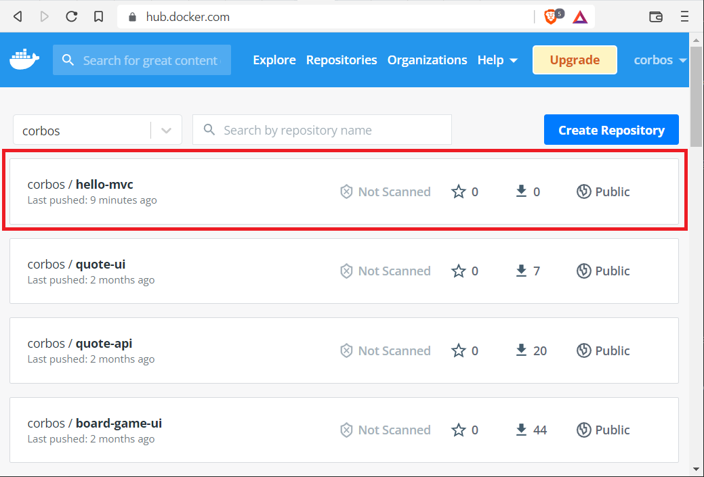

# Quick-start: `docker push`

## Introduction

This quick-start demonstrates pushing a Docker image to Docker Hub. Docker Hub is a public image registry. We can also create private repositories with a Docker Hub paid account.

Once we've uploaded an image, we can `docker pull` that image from anywhere: a new development machine, a build server, or via cloud container services.

## Goals

- tag an image with `docker tag`
- log in to Docker Hub with `docker login`
- push an image to a repository with `docker push`

## Steps

Open a terminal. All steps use the terminal other than the last.

### 1. Locate an Image

Locate a suitable image with `docker images`. Ideally, we'd use an image that we built with a Dockerfile. For this example, I'll use the `hello-mvc` image generated from _Lesson: Creating a Spring Boot Docker Image_.

If you don't have `hello-mvc`, use a small image like `busybox` or `alpine`. They'll work fine.

<pre class="console" noheader>
> docker images
REPOSITORY               TAG           IMAGE ID       CREATED             SIZE
<strong>hello-mvc                latest        a1de6d188eca   3 weeks ago         164MB</strong>
mariadb                  10.7.3        665218ee5fdf   2 days ago          414MB
adminer                  4             1ce5b489aaa5   5 days ago          90.5MB
busybox                  latest        2fb6fc2d97e1   3 weeks ago         1.24MB
docker/getting-started   latest        bd9a9f733898   7 weeks ago         28.8MB
nginx                    1.21-alpine   bef258acf10d   2 months ago        23.4MB
alpine                   3.15          c059bfaa849c   4 months ago        5.59MB
eclipse-temurin          17-alpine     cf55f05132a1   4 months ago        335MB
mysql                    8             0716d6ebcc1a   7 months ago        514MB
mysql                    latest        0716d6ebcc1a   7 months ago        514MB
</pre>

### 2. Tag the Image

Docker Hub (and other registries) require a special image naming convention to allow a push.

Instead of:

`image-name:tag`

we need:

`username/image-name:tag`

where `username` is your Docker Hub username.

Use `docker tag` to add a new tag to an image.

<pre class="console" noheader>
# syntax
# docker tag source-name:tag new-name:tag

> docker tag hello-mvc:latest username/hello-mvc:1.0
</pre>

Confirm the tag was added with `docker images`. Note that the image IDs are the same. We're not creating copies of images. We're adding additional tags to an existing image.

<pre class="console" noheader>
> docker images
REPOSITORY               TAG           IMAGE ID       CREATED        SIZE
username/hello-mvc       1.0           a1de6d188eca   2 hours ago    164MB
hello-mvc                latest        a1de6d188eca   2 hours ago    164MB
...snip...
</pre>

### 3. Log In

We can't push our newly tagged image if Docker Hub doesn't know who we are. Use the `docker login` command to log in.

The Password prompt doesn't show the characters we type for security. Know that they're there.

<pre class="console" noheader>
> docker login
Login with your Docker ID to push and pull images from Docker Hub. If you don't have a Docker ID, head over to https://hub.docker.com to create one.
Username: username
Password:
Login Succeeded

Logging in with your password grants your terminal complete access to your account.
For better security, log in with a limited-privilege personal access token. Learn more at https://docs.docker.com/go/access-tokens/
</pre>

Your `docker login` process may be different. If you're already logged in via Docker Desktop, the login may use existing credentials. Some versions of Docker Desktop open a web form to collect credentials.

### 4. Push the Image

We're finally ready to push our image. Use `docker push` with the full image name and tag.

<pre class="console" noheader>
> docker push username/hello-mvc:1.0
The push refers to repository [docker.io/username/hello-mvc]
48e349ead13a: Pushed
a91f3acafefb: Pushed
24b6198ec33a: Mounted from library/eclipse-temurin
9e88bae5549f: Mounted from library/eclipse-temurin
b36f046768ca: Mounted from library/eclipse-temurin
a1c01e366b99: Mounted from library/eclipse-temurin
1.0: digest: sha256:d41ba72bb9258941a9a32d32c40718c6d5f7c9a11c8d1841cb4c661dd4b59813 size: 1576
</pre>

Docker Hub deals in layers. Above we see there are six layers and four of them already exist in `eclipse-temurin`. We only had to push two layers!

### 5. Confirm

Visit https://hub.docker.com/ in your browser. Sign in if you haven't. Confirm that your image is there.

