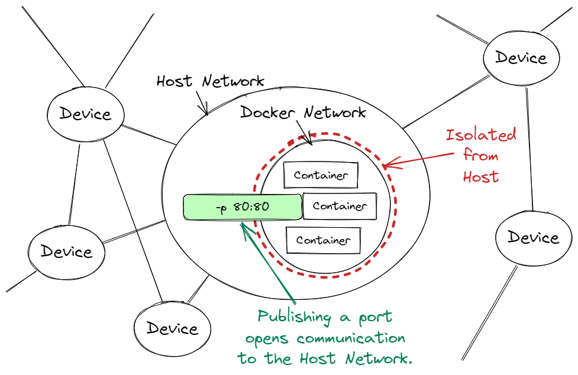
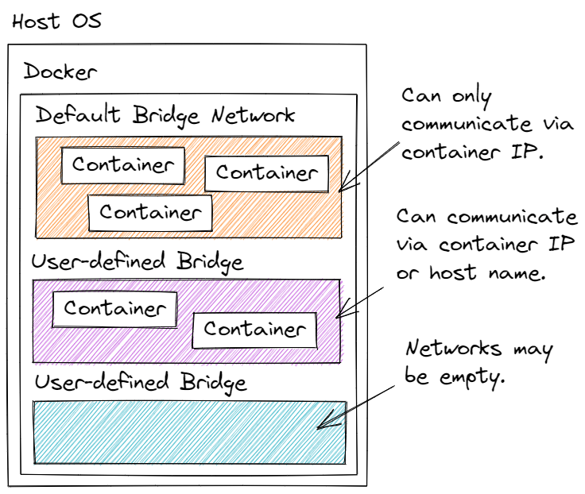
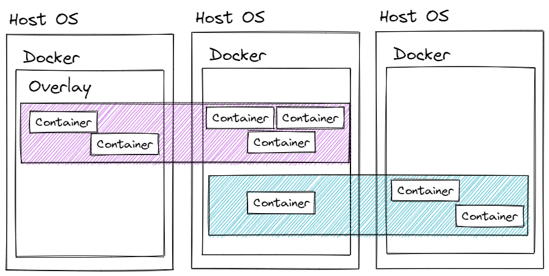
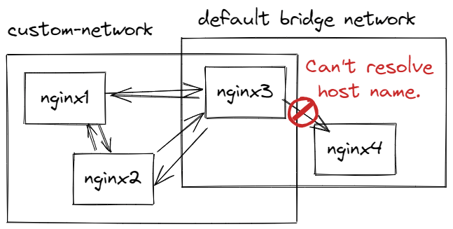

# Lesson: Docker Networking

## Introduction

It may not be obvious, but we're already using Docker networking. Any time we `docker run` a new container, `dockerd` assigns that container to a default private network. All containers that aren't explicitly assigned to a network get assigned to the default. Those containers are able to talk to one another via IP addresses. 

Docker's default network can't talk to the outside world. That's why we selectively publish container ports with the `-p` option. Port publishing maps a container port to a host network port. That makes it available to the outside world.

There's a lot more to Docker networking. We can build our own networks, add containers to a network, remove containers from a network, and configure IP addresses per network. **Bridge networks** are local, private networks. **Overlay networks** allow communication between Docker instances. Third-party network implementations are diverse. Some are designed for cloud environments. Some for specific vendor software. Docker even provides a network plug-in that sends anonymous network data to Docker!

The `docker` CLI has the commands we need to create networks, add containers to networks, remove containers from networks, inspect a network, and delete a network. 

### Outcomes

When you've finished this lesson and its exercises, you should be able to:
- explain Docker's default network behavior
- create a `bridge` network with `docker network create`
- inspect a network with `docker network inspect`
- connect a container to a network with either `docker run` or `docker network connect`
- communicate between containers in a network

## Default Behavior

Docker uses Linux namespaces to isolate a container from the host OS and its network. We've heard that before. It's a little vague. Let's dig into the details. 

When Docker creates a container, it doesn't prevent _all_ network traffic. Instead, it creates a private network that isn't connected to the outside world. Then it assigns the new container to the private network. This behavior can be changed, but it's the default. Each container is given an IP address. Containers can communicate inside the private network using their IP addresses. They cannot communicate with the host OS network or the outside world.

Containers are also assigned host names. A **host name** is a name that uniquely identifies a node on a network. (A **node** is a physical machine, virtual machine, isolated computing environment, router, or absolutely any device, including your electric meter, connected to a network.) If a host name is not explicitly assigned, Docker uses the container ID. A container cannot communicate inside Docker's default private network using a host name. Host names don't work, only IP addresses.

When we publish a port with docker run:

`docker run -p 80:80 some-image`

Docker connects a host OS port to a container port. There's a port-to-port mapping between the host network and the container. This doesn't expose the entire container to the host network. It publishes a single port. It also doesn't expose the private network. The mapping doesn't know anything about the private network. It only knows about a single container.

## Beyond the Default

Docker can create and configure other networks beyond the default. Some are private and some public. That's another beautiful thing about Docker: Since we have full control over our isolated computing environments, we can create abstractions at the network level. Networking becomes malleable and flexible. That isn't as easy with a standard operating system.

### Types of Docker Network Drivers

A **network driver** is software that configures and runs virtual networks. Some drivers enable public networks. Others enable private networks. Some work well in the cloud and others are more concerned with making containers appear to be physical machines.

#### Bridge

A **bridge network** is a private network that allows two or more containers to communicate on a single Docker instance. Without explicit port publishing, containers are isolated and not allowed to communicate with the host OS or the outside world.

Docker's default network is a bridge network. We can also create a user-defined bridge network. There's a subtle difference between the default bridge and a user-defined bridge. The default bridge can only use container IP addresses to communicate. A user-defined bridge may use both container IP addresses and container host names.

We will only use bridge networks in this course. Other network types are included for awareness.

#### Host

A second network type is the host operating system's network. When a container is assigned to the host network, it has full access to the network.

The publish option, `-p`, has no effect when a container is assigned to the host network. It is ignored.

There is only ever one host network.

#### None

The **none network** is another singular network that represents the _absence_ of networking. When a container is assigned to the `none` network, it loses all networking capabilities.

#### Overlay

An **overlay network** opens communication between multiple Docker instances.

As our container count grows, and it will, we need multiple `dockerd` instances to handle resource demands. Additionally, we may want to build in some redundancy. If our single `dockerd` process crashes, there's no fallback. Depending on the application, that may be unacceptable. We can add multiple `dockerd` instances to protect again a single point of failure. Summarized: In large production applications, we usually need more than one Docker instance.

Overlay networks are perfect for multiple `dockerd` environments. On overlay network configures container-to-container communication between Docker instances.

#### IPvlan

The "vlan" in IPvlan is short for "virtual local area network". An **ipvlan network** gives full control over IP addresses in a virtual LAN environment.

#### Macvlan

A **macvlan network** allows the assignment of a MAC address to a container. This makes the container appear to be a physical machine on the network.

#### Third-party Networks

There are many third-party network drivers and plug-ins. A driver is a complete network implementation. A plug-in augments and extends an existing driver's capabilities.

## Network Commands

<h3 class="icon-book"><a href="https://docs.docker.com/engine/reference/commandline/network_ls/">docker network ls</a></h3>

Lists existing networks.

#### Example

<pre class="console" noheader>
> docker network ls
NETWORK ID     NAME      DRIVER    SCOPE
9fa858da9376   bridge    bridge    local
ced5a81cb022   host      host      local
edd1d3babecc   none      null      local
</pre>

<h3 class="icon-book"><a href="https://docs.docker.com/engine/reference/commandline/network_create/">docker network create</a></h3>

Creates a new network.

In this course, we only create `bridge` networks.

#### Example

Create a new `bridge` network named `custom-network`. The `-d` option, short for _driver_, isn't required for a `bridge` network, `bridge` is the default. However, it's polite to be explicit.

<pre class="console" noheader>
> docker network create -d bridge custom-network
</pre>

Create two new containers from the Nginx Alpine image and connect them to our `custom-network`.

<pre class="console" noheader>
> docker run --rm -d -h nginx1 --name nginx1 --network custom-network nginx:1.21-alpine
> docker run --rm -d -h nginx2 --name nginx2 --network custom-network nginx:1.21-alpine
</pre>

Options:
- `--rm`, remove: Deletes the container once it stops.
- `-d`, detach: Run in the background with no terminal interaction.
- `-h name`, hostname: Assigns a host name to the container.
- `--name name`: Assigns an easy-to-remember name.
- `--network name`: Assigns this container to our custom network.

Next steps: Log into nginx1's shell. Make an HTTP request with `curl` using the nginx2 host name. If our request receives an HTML response with a "Welcome to nginx!" message, we've made a successful network connection inside a private network between nginx1 and nginx2.

<pre class="console" noheader>
> docker exec -it nginx1 /bin/sh
/ # curl http://nginx2
&lt;!DOCTYPE html&gt;
&lt;html&gt;
&lt;head&gt;
&lt;title&gt;Welcome to nginx!&lt;/title&gt;
...snip...
&lt;/head&gt;
&lt;body&gt;
&lt;h1&gt;Welcome to nginx!&lt;/h1&gt;
...snip...
&lt;/body&gt;
&lt;/html&gt;
/ # exit
</pre>

<blockquote class="icon-block-sticky-note">
<a href="https://curl.se/">curl</a>, short for "Client URL", is a command-line network application. It's similar to Postman and VS Code's REST Client in that it sends HTTP requests and receives HTTP responses.  <code>curl</code> does much more, however. It's a general network client. It may use many protocols: FTP, POP3, LDAP, SCP, and more, to download and upload data and files.
</blockquote>

<h3 class="icon-book"><a href="https://docs.docker.com/engine/reference/commandline/network_connect/">docker network connect</a></h3>

Connects an existing container to an existing network.

#### Example

Create two new Nginx Alpine containers. Don't assign them to a network. They are automatically assigned to Docker's default bridge network.

<pre class="console" noheader>
> docker run --rm -d -h nginx3 --name nginx3 nginx:1.21-alpine
> docker run --rm -d -h nginx4 --name nginx4 nginx:1.21-alpine
</pre>

Add the nginx3 container to custom-network. nginx3 is now assigned to two networks: custom-network and the default Docker bridge network.

<pre class="console" noheader>
> docker network connect custom-network nginx3
</pre>

Log into nginx3's shell. Make an HTTP request with `curl` using the nginx2 host name. A successful response indicates we're communicating inside of custom-network.

<pre class="console" noheader>
> docker exec -it nginx3 /bin/sh
/ # curl http://nginx2
&lt;!DOCTYPE html&gt;
&lt;html&gt;
&lt;head&gt;
&lt;title&gt;Welcome to nginx!&lt;/title&gt;
...snip...
&lt;/head&gt;
&lt;body&gt;
&lt;h1&gt;Welcome to nginx!&lt;/h1&gt;
...snip...
&lt;/body&gt;
&lt;/html&gt;
</pre>

Make an HTTP request with `curl` using the nginx4 host name. The request should fail. Docker's default bridge network can't communicate using host names, only IP addresses.

<pre class="console" noheader>
/ # curl http://nginx4
curl: (6) Could not resolve host: nginx4
</pre>

To communicate successfully in Docker's default bridge, we need to determine nginx4's IP address. Open a new terminal and inspect the container with an IP address filter. **Note**: Your IP address may be different!

<pre class="console" noheader>
> docker inspect -f '{{range.NetworkSettings.Networks}}{{.IPAddress}}{{end}}' nginx4
<strong>172.17.0.3</strong>
</pre>

Try the `curl` request with nginx4's IP address. A successful response indicates we're communicating inside of the default bridge network!

<pre class="console" noheader>
/ # curl http://172.17.0.3
&lt;!DOCTYPE html&gt;
&lt;html&gt;
&lt;head&gt;
&lt;title&gt;Welcome to nginx!&lt;/title&gt;
...snip...
&lt;/head&gt;
&lt;body&gt;
&lt;h1&gt;Welcome to nginx!&lt;/h1&gt;
...snip...
&lt;/body&gt;
&lt;/html&gt;
/ # exit
</pre>

<h3 class="icon-book"><a href="https://docs.docker.com/engine/reference/commandline/network_inspect/">docker network inspect</a></h3>

Displays network details.

#### Example

Inspect the custom-network. Note the containers assigned to the network. We see both their host names and IP addresses. The IP addresses are valid for this network only.

<pre class="console" noheader>
> docker network inspect custom-network
[
    {
        "Name": "custom-network",
        "Id": "67616e55fdb96fc284ab31c746e2f8b134edba05aafa25a93a0d5a76f4ce00ac",
        "Created": "2022-03-28T19:23:14.3159804Z",
        "Scope": "local",
        "Driver": "bridge",
        "EnableIPv6": false,
        "IPAM": {
            "Driver": "default",
            "Options": {},
            "Config": [
                {
                    "Subnet": "172.18.0.0/16",
                    "Gateway": "172.18.0.1"
                }
            ]
        },
        "Internal": false,
        "Attachable": false,
        "Ingress": false,
        "ConfigFrom": {
            "Network": ""
        },
        "ConfigOnly": false,
        <strong>"Containers": {
            "61bc60b6a1843aa3eff1b5309d81225ab06bffd24221dd55fcfa04857b417c33": {
                "Name": "nginx2",
                "EndpointID": "695b8f482c9517e1aa1034ad5816f5301364570a1b4805168792337027ca76db",
                "MacAddress": "02:42:ac:12:00:03",
                "IPv4Address": "172.18.0.3/16",
                "IPv6Address": ""
            },
            "ced17997b5780a14f3072c5e847f784cdb2d1d74bc1db6c83d3396e62bb4ff52": {
                "Name": "nginx3",
                "EndpointID": "30962f79df20e0ea5a617e155bb94f4de6185007e32812e63c16c0d0b0a83544",
                "MacAddress": "02:42:ac:12:00:04",
                "IPv4Address": "172.18.0.4/16",
                "IPv6Address": ""
            },
            "d53cd1dc366ec7b073fc95d1d863704e105251d4159a5bfc1aa8c9b7e2a51c84": {
                "Name": "nginx1",
                "EndpointID": "c8a48ae5759374bc10c9159df5af2ca02da27318f4e88c9d23b588f5e75fce2d",
                "MacAddress": "02:42:ac:12:00:02",
                "IPv4Address": "172.18.0.2/16",
                "IPv6Address": ""
            }
        }</strong>,
        "Options": {},
        "Labels": {}
    }
]
</pre>

<h3 class="icon-book"><a href="https://docs.docker.com/engine/reference/commandline/network_disconnect/">docker network disconnect</a></h3>

Removes a container from a network.

#### Example

Remove nginx3 from custom-network.

<pre class="console" noheader>
> docker network disconnect custom-network nginx3
</pre>

Confirm that nginx3 is gone with `docker network inspect`.

<pre class="console" noheader>
> docker network inspect custom-network
[
    ...snip...
        "Containers": {
            "61bc60b6a1843aa3eff1b5309d81225ab06bffd24221dd55fcfa04857b417c33": {
                "Name": "nginx2",
                "EndpointID": "695b8f482c9517e1aa1034ad5816f5301364570a1b4805168792337027ca76db",
                "MacAddress": "02:42:ac:12:00:03",
                "IPv4Address": "172.18.0.3/16",
                "IPv6Address": ""
            },
            "d53cd1dc366ec7b073fc95d1d863704e105251d4159a5bfc1aa8c9b7e2a51c84": {
                "Name": "nginx1",
                "EndpointID": "c8a48ae5759374bc10c9159df5af2ca02da27318f4e88c9d23b588f5e75fce2d",
                "MacAddress": "02:42:ac:12:00:02",
                "IPv4Address": "172.18.0.2/16",
                "IPv6Address": ""
            }
        },
    ...snip...
]
</pre>

<h3 class="icon-book"><a href="https://docs.docker.com/engine/reference/commandline/network_rm/">docker network rm</a></h3>

Permanently deletes a network.

#### Example

First, stop all nginx containers. Once they're stopped, they will be automatically deleted. This step is required. Without it, we can't delete a network because it has "active endpoints".

<pre class="console" noheader>
> docker stop nginx1 nginx2 nginx3 nginx4
nginx1
nginx2
nginx3
nginx4
</pre>

Next, delete custom-network. Use `docker network ls` to confirm the network is gone.

<pre class="console" noheader>
> docker network rm custom-network
custom-network

> docker network ls
NETWORK ID     NAME      DRIVER    SCOPE
9fa858da9376   bridge    bridge    local
ced5a81cb022   host      host      local
edd1d3babecc   none      null      local
</pre>

## Conclusion

There's a lot more to Docker networking than what we covered. It's possible to apply fine-tune control over container network communication with exotic network drivers, network plug-ins, and complex network topologies.

On the flip side, some cloud providers remove our choices about Docker networking. If a cloud provider has a container service, they might provide a default network that leverages their cloud networking services.

Think back on the lesson. Below, either answer a question or try a task:

- How does the Docker default bridge network differ from a custom bridge network?
- Draw two networks with five containers. "Network 1" is connected to containers "C1", "C2", and "C3". "Network 2" is connected to containers "C2", "C4" and "C5". Which containers can talk to each other?
- Create a bridge network named "my-network" with `docker network create`.
- Confirm the network as created with `docker network ls`.
- Inspect "my-network" with `docker network inspect`.
- Delete the network with `docker network rm`.