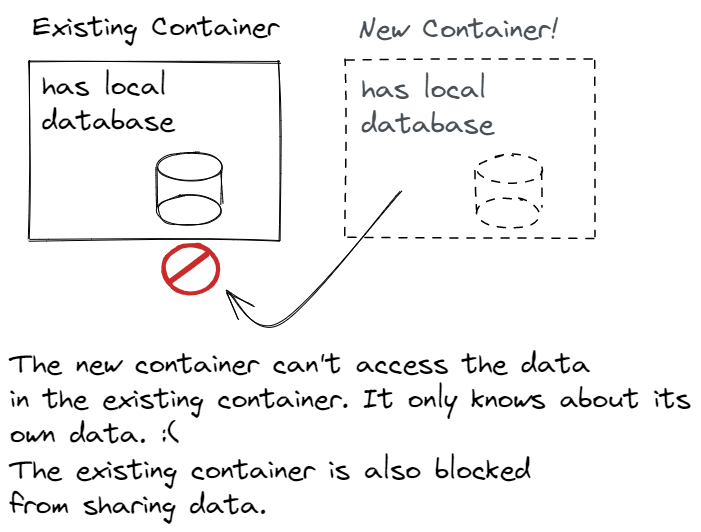
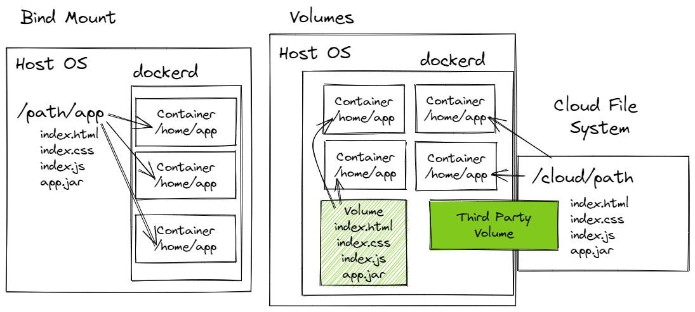

# Lesson: Docker Volumes

## Introduction

Earlier in this module, we mentioned three container rules of thumb.
1. A container should only host one application or service.
2. Containers should be stateless.
3. Containers don't last. They are ephemeral and should be expected to crash.

These are decent rules of thumb, but there's one glaring issue. If all containers are _stateless_, there's no way to save data to a database, upload a video, or generate a file to be downloaded later. At least one of our containers must be _stateful_ in order for a user to do anything useful with our software. Software that's 100% stateless is read-only. Read-only software isn't very useful. Think about the software we use everyday: email, text messaging, search, social media, Wikipedia, banking. All of these are stateful. They may not be 100% stateful, but at least one service must be stateful.

So, we need to loosen rule of thumb #2. We need to make at least one container stateful. We already know how to do that. Containers are isolated computing environments that include a file system. A container's file system maintains its state through stops, starts, and restarts. We've seen that in action with database containers. When we stop and start our database container, it picks up where it left off. It doesn't start fresh with no schema or data.

Unfortunately, we also highlighted a significant problem with stateful containers. If we want to add a second replica container to share the workload, we run into immediate problems. The new container only knows about its own state. It doesn't know about the first container's data and the first container doesn't know about the new container's data. We would need a complicated data partitioning strategy to ensure requests from a specific user were always routed to the correct container.

But even that's not enough. Take a look at rule of thumb #3. Paraphrased: Containers fail. Rule #3 isn't so much a rule of thumb. It's more a harsh reality. Containers work until they don't. It's no different than physical machines, really. Physical machines fail as well. That's why both physical machines and containers need a failure mitigation strategy. They need a more robust file system that might include features like file redundancy, high availability, and back up and restore mechanisms.

Docker's solution to a shared and robust file system are **volumes**. A volume is a file system managed by Docker. A volume can be attached to many containers so they can share data. With the right vendor hardware and software, volumes can be configured to support file redundancy, high availability, and back up and restore.

### Outcomes

When you've finished this lesson and its exercises, you should be able to:
- highlight differences in **bind mount** and **volume**
- display and inspect volumes
- create a named volume
- attach containers to a named volume
- list the contents of a volume
- delete a volume

## Overview

**Volumes** are file systems managed by Docker. They're a relatively recent feature, since Docker Engine API 1.21. Prior to volumes, Docker managed shared file systems with [bind mounts](https://docs.docker.com/storage/bind-mounts/). A **bind mount** is a directory on the host file system that's mapped to a directory in the container's file system. Many containers can share a single underlying file system with bind mounts.

Volumes don't rely on the host file system. They're managed internally by Docker. Volumes have several advantages:
- faster on Windows and Mac OS
- easier to backup and restore
- safer to share with multiple containers
- flexible: Third-party drivers allow mapping containers to cloud file systems, encrypting the file system, and additional features.

## Anonymous and Named Volumes

Just like networks, Docker has a default volume behavior and we're already using them! Each container is assigned an **anonymous** volume that represents its file system. An anonymous volume is a volume without a name. We can display all volumes with the `docker volume ls` command.

<h3 class="icon-book"><a href="https://docs.docker.com/engine/reference/commandline/volume_ls/">docker volume ls</a></h3>

Lists all volumes.

#### Example

The results below show three anonymous volumes. We know they're anonymous because the volume name is the volume identifier, not a friendly name. Your results will differ depending on your Docker volumes.

<pre class="console" noheader>
> docker volume ls
DRIVER    VOLUME NAME
local     4c0676684f7a346fb859c1c8da19a759e00278160280b1eddf4ffad5eec1dd37
local     5757e7719faca74414241b1c9a61dc3cf2d20797ef642f65a685aaeacc16b576
local     d91d8ac38e521329b9cbda014c7bc762dda96961537fd9f94f703b5666a6ca07
</pre>

Not all volumes are attached to containers. To display volumes without containers, use the filter option: `-f dangling=true`.

In the results below, here are two anonymous volumes that are not attached to a container.

<pre class="console" noheader>
> docker volume ls -f dangling=true
DRIVER    VOLUME NAME
local     4c0676684f7a346fb859c1c8da19a759e00278160280b1eddf4ffad5eec1dd37
local     d91d8ac38e521329b9cbda014c7bc762dda96961537fd9f94f703b5666a6ca07
</pre>

### Named Volumes

To create a named volume, use the `docker volume create` command.

<h3 class="icon-book"><a href="https://docs.docker.com/engine/reference/commandline/volume_ls/">docker volume create</a></h3>

Creates a volume.

#### Example

Create a volume named "joy".

<pre class="console" noheader>
> docker volume create joy
joy
</pre>

Confirm it was created.

<pre class="console" noheader>
> docker volume ls
DRIVER    VOLUME NAME
local     4c0676684f7a346fb859c1c8da19a759e00278160280b1eddf4ffad5eec1dd37
local     5757e7719faca74414241b1c9a61dc3cf2d20797ef642f65a685aaeacc16b576
local     d91d8ac38e521329b9cbda014c7bc762dda96961537fd9f94f703b5666a6ca07
<strong>local     joy</strong>
</pre>

## More Volume Commands

<h3 class="icon-book"><a href="https://docs.docker.com/engine/reference/commandline/volume_inspect/">docker volume inspect</a></h3>

Displays volume details.

#### Example

Inspect the named volume `joy`. `docker volume inspect` can also use the volume ID.

The "Mountpoint" is the volume's physical location. On Mac and Windows, the physical location is in a virtual machine, so it's not necessarily straight-forward to locate.

<pre class="console" noheader>
> docker inspect joy
[
    {
        "CreatedAt": "2022-04-02T16:00:10Z",
        "Driver": "local",
        "Labels": {},
        "Mountpoint": "/var/lib/docker/volumes/joy/_data",
        "Name": "joy",
        "Options": {},
        "Scope": "local"
    }
]
</pre>

<h3 class="icon-book"><a href="https://docs.docker.com/storage/volumes/#start-a-container-with-a-volume">docker run -v</a></h3>

Attaches a container to a volume. If a named volume is specified and it doesn't exist, Docker creates the volume.

#### Example: Attach a Container to a Volume

Create a new Alpine container and map the `joy` volume to its `/home/app` directory. If the container directory doesn't exist (it doesn't), it will be created. 

Run the container interactively. Once inside the shell:
- Change directories to `/home/app`.
- Confirm the directory is empty with `ls`.
- Create a small text file named "hello-world.txt" with the contents "Hello world file!".
- Confirm the directory contains hello-world.txt.
- Confirm the file contents are "Hello world file!".
- Exit the shell, which terminates and removes the container.

<pre class="console" noheader>
> docker run -it --rm -v joy:/home/app alpine:3.15
/ # cd /home/app/
/home/app # ls
/home/app # echo "Hello world file!" > hello-world.txt
/home/app # ls
hello-world.txt
/home/app # cat hello-world.txt
Hello world file!
/home/app # exit
</pre>

Run a new container with the same options.

Inside the container's shell:
- Change directories to `/home/app`.
- Use `ls` to Confirm the directory contains the `hello-world.txt` file.
- Confirm the file contents are "Hello world file!".
- Exit the shell, which terminates and removes the container.

This confirms that even though our original container was removed entirely, data in the volume persists.

<pre class="console" noheader>
> docker run -it --rm -v joy:/home/app alpine:3.15
/ # cd /home/app
/home/app # ls
hello-world.txt
/home/app # cat hello-world.txt
Hello world file!
/home/app # exit
</pre>

Another quick way to list the contents of a volume is to attach the volume to some directory in the container, specify the remove option, `--rm`, specify the interactive option, `-i`, and override the `CMD` with `find /some/directory`.

<pre class="console" noheader>
> docker run -i --rm -v joy:/some/directory busybox find /some/directory
Unable to find image 'busybox:latest' locally
latest: Pulling from library/busybox
554879bb3004: Pull complete
Digest: sha256:caa382c432891547782ce7140fb3b7304613d3b0438834dce1cad68896ab110a
Status: Downloaded newer image for busybox:latest
/some/directory
/some/directory/hello-world.txt
</pre>

#### Example: Copying Files from a Container into a Volume

If a volume is empty and we map the volume to a container directory that contains files, the container will automatically copy its files into the volume. This will not work if even a single file is in the volume. The volume must be empty.

The example below creates an Nginx Alpine container. We provide a volume named `nginx-files`, which doesn't exist, so Docker creates it. The new volume is empty. 

`/usr/share/nginx/html` is Nginx's default static resource directory. It already contains files. Those files are copied into the `nginx-files` volume.

<pre class="console" noheader>
> docker run -d --name nginx1 -p 8080:80 -v nginx-files:/usr/share/nginx/html nginx:1.21-alpine
3ddb18a6b794ef527f26f49226bbb96aaae4d73d972aa8a2aec7e576a047af0c
</pre>

Confirm the files were copied.

<pre class="console" noheader>
> docker run -i --rm -v nginx-files:/data/dump busybox find /data/dump
/data/dump
/data/dump/50x.html
/data/dump/index.html
</pre>

Next, create two new Nginx Alpine containers. But in this case, make the volume read-only by using the `:ro` modifier in the volume option. Careful with the container name and port number differences!

<pre class="console" noheader>
> docker run -d --name nginx2 -p 8081:80 -v nginx-files:/usr/share/nginx/html<strong>:ro</strong> nginx:1.21-alpine
18260aa35df2870afc2d280f87e3524c5a4612e3289885ce80d77cf905f8b8de

> docker run -d --name nginx3 -p 8082:80 -v nginx-files:/usr/share/nginx/html<strong>:ro</strong> nginx:1.21-alpine
aab40f86c848ae5a8e0e2ad061234e251a48f5922bf29e99573d750403a148cb
</pre>

Visit
- http://localhost:8080
- http://localhost:8081
- http://localhost:8082

and confirm we get the Nginx default HTML.

---

Finally, inspect nginx1 and nginx2 and compare their mount/volume configuration. nginx1 is allowed to read and write (RW:true), but nginx2 is not. nginx2's Mode is also "ro" (read only) compared to nginx1's Mode "z"(volume contents can be shared with other containers).

<pre class="console" noheader>
> docker inspect -f "{{json .Mounts}}" nginx1
[{"Type":"volume","Name":"nginx-files","Source":"/var/lib/docker/volumes/nginx-files/_data","Destination":"/usr/share/nginx/html","Driver":"local",<strong>"Mode":"z","RW":true,</strong>"Propagation":""}]

> docker inspect -f "{{json .Mounts}}" nginx2
[{"Type":"volume","Name":"nginx-files","Source":"/var/lib/docker/volumes/nginx-files/_data","Destination":"/usr/share/nginx/html","Driver":"local",<strong>"Mode":"ro","RW":false,</strong>"Propagation":""}]
</pre>

<h3 class="icon-book"><a href="https://docs.docker.com/engine/reference/commandline/volume_rm/">docker volume rm</a></h3>

Permanently deletes a volume.

A volume in use cannot be deleted.

#### Example

Our `joy` volume isn't used by a container, so we can delete it.

<pre class="console" noheader>
> docker volume rm joy
joy
</pre>

That's not the case with our `nginx-files` volume. We receive an error.

<pre class="console" noheader>
> docker volume rm nginx-files
Error response from daemon: remove nginx-files: volume is in use - [3ddb18a6b794ef527f26f49226bbb96aaae4d73d972aa8a2aec7e576a047af0c, 18260aa35df2870afc2d280f87e3524c5a4612e3289885ce80d77cf905f8b8de, aab40f86c848ae5a8e0e2ad061234e251a48f5922bf29e99573d750403a148cb]
</pre>

First we must delete our three Nginx containers. They're running, but we can use the force option to acknowledge that we know what we're doing.

<pre class="console" noheader>
> docker rm -f nginx1 nginx2 nginx3
nginx1
nginx2
nginx3
</pre>

Then we can remove the volume.

<pre class="console" noheader>
> docker volume rm nginx-files
nginx-files
</pre>

<h3 class="icon-book"><a href="https://docs.docker.com/engine/reference/commandline/volume_prune/">docker volume prune</a></h3>

Deletes all unused, detached (dangling) volumes.

Over time, Docker accumulates many anonymous and named volumes. If it's not sure it needs a volume, it keeps it around. The `prune` command is a useful tool to clean things up.

Practice caution. Think things through. If you have a detached volume full of amazing data, `prune` will wipe it out along with the rest.

#### Example

<pre class="console">
> docker volume prune
WARNING! This will remove all local volumes not used by at least one container.
Are you sure you want to continue? [y/N] y
Deleted Volumes:
4c0676684f7a346fb859c1c8da19a759e00278160280b1eddf4ffad5eec1dd37
d91d8ac38e521329b9cbda014c7bc762dda96961537fd9f94f703b5666a6ca07

Total reclaimed space: 252.4MB
</pre>

## Volume Drivers/Plug-ins

Docker supports [volume drivers](https://docs.docker.com/storage/volumes/#use-a-volume-driver) (also known as volume plug-ins). A **volume driver** is a full volume implementation. That implementation adheres to a contract so `dockerd` can swap in any implementation seamlessly. Volume drivers are diverse. Some target cloud providers. Others use different storage strategies.

A partial list is available here: https://docs.docker.com/engine/extend/legacy_plugins/#volume-plugins.

There are two steps to creating a volume with custom driver.
1\. Install the driver.
2\. Pass the driver option in the `docker volume create` command.

<pre class="console" noheader>
> docker volume create -d custom-driver volume-name
</pre>

Docker's default volume driver is the `local` driver. If we don't pass the driver option, the default is `local`. 

These commands are the same.

<pre class="console" noheader>
> docker volume create -d local volume-name
> docker volume create volume-name
</pre>

We only use the `local` volume driver in this course.