# Exercise: Deploy Quotes API to Elastic Beanstalk

## Goals

* Create and populate a MySQL RDS image with public access.
* Deploy a Spring Boot REST API to Elastic Beanstalk.
* Configure a deployed Elastic Beanstalk application to connect to an RDS instance.

## Set Up

1. > Download the [Quotes application stack](./assets/quotes-app-stack.zip).
2. Extract the zip contents. Inside you'll find a database schema, a Spring REST API, and a React application.

## Phase 1: Create the Database

1. Create an RDS DB instance with the following settings. Notice that we are choosing `Yes` for public access, this is different than our RDS exercise. Public access allows us to connect directly to the instance without using a bastion host.

* **Engine options** - Select `MySQL`
* **Template** - Select `Free tier`
* **DB instance identifier** - Enter `quotes-db`
* **Master username** - Leave the default value, `admin`
* **Master password** - Enter a memorable password
* **Security group** - Select `Create new`
* **Public access** - Choose `Yes`
* **New VPC security group name** - Enter the name `QuotesDbAccess`

2. The DB instance will take a few minutes to come online. When it does, copy the _Endpoint_ and create a new connection with MySQL Workbench. Enter the DB instance endpoint in the **Hostname** field. Set the **Username** to `admin`.

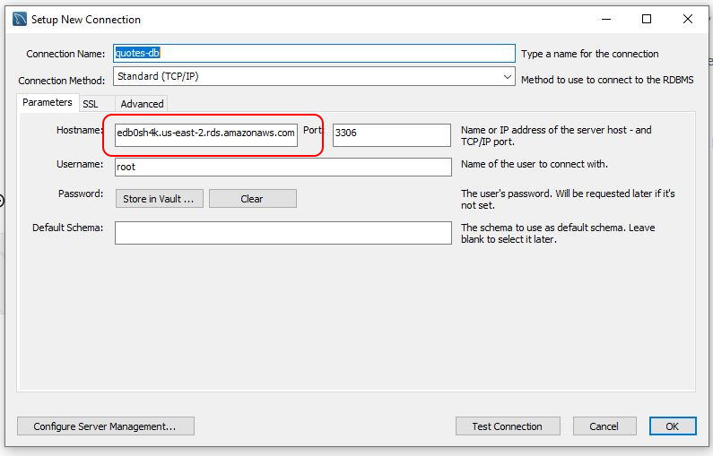

3. Create the `quotes` database on the remote instance with the script in the application folder.
4. Go to EC2 and click **Security groups** in the sidebar. Add a new Security Group called `API-Access` and leave just the default outbound rule.
5. Next, click on the `QuotesDbAccess` Security Group and add an inbound rule to allow MySQL connections from the `API-Access` Security Group.

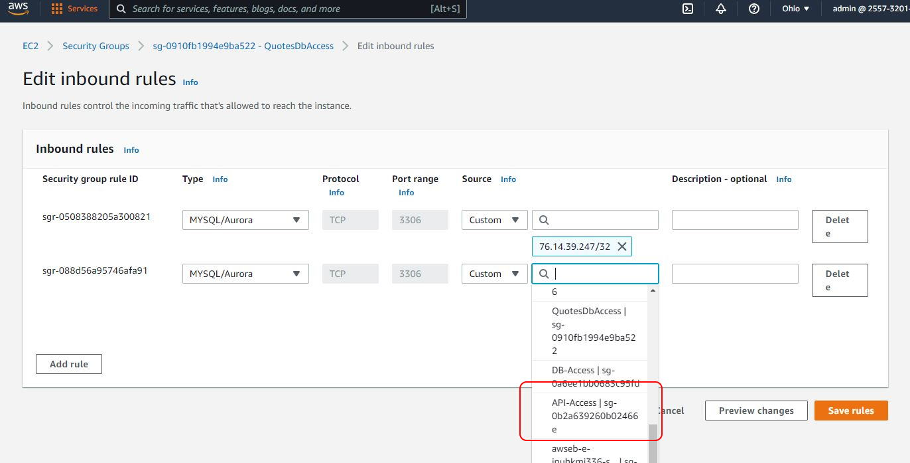

6. Click **Save changes**. We will use `API-Access` later to allow a connection from our Elastic Beanstalk application to the database.

## Phase 2: Docker Compose Quote API

This exercise requires the `quote-api` Docker image. The image should be installed locally and available from a public repository in your [Dockerhub](https://hub.docker.com/repositories) account.

If needed, revisit:

* _Exercise: Build a Spring Boot Docker Image_
* _Quickstart: Uploading to Docker Hub_.

### Steps

1. Run the `quote-api` Docker image. Use the database connection parameters for the `quotes-db` RDS instance.

```sh
> docker run `
  -p 8080:8080 `
  -e DB_URL=jdbc:mysql://<your-rds-endpoint>:3306/quotes `
  -e DB_USERNAME=admin `
  -e DB_PASSWORD=<your-rds-password> `
  <your-image-name>:<image-version>
```

2. Confirm the running Docker container is working with the `requests.http` file included in the provided project. Stop the container.
3. Create a `docker-compose.yml` file in the root of the `quote-api` folder. Configure the `quote-api` as a service.

```yml
version: "3.9"

services:
  quote-api:
    image: <your-dockerhub-username>/quote-api:<version>
    environment:
      - DB_URL=jdbc:mysql://<your-rds-endpoint>:3306/quotes
      - DB_USERNAME=admin
      - DB_PASSWORD=<your-rds-password>
    ports:
      - 8080:8080
```

4. Run the compose file.

```sh
> docker compose up
```

5. Again, confirm the container is working with the `requests.http` file included in the provided project.
6. Stop the container and remove it.

```sh
> docker compose down
```

### Troubleshooting

* Spring Boot errors? Check the database connection properties.

## Phase 3: Deploy Quote API

1. Go to the Elastic Beanstalk dashboard in AWS.
2. Click the **Environments** link in the sidebar, then click **Create a new environment**.

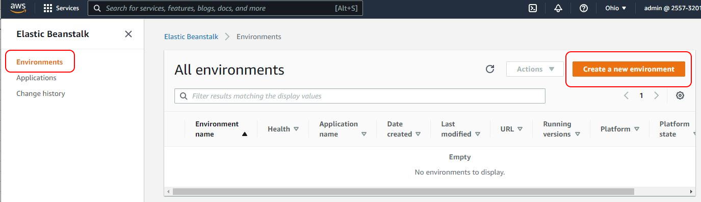

3. Select **Web server environment** and click **Select**.
4. For **Application name** enter `quote-api`. Leave the default values in the _Environment information_ section.
5. In the _Platform_ section, select the `Docker` in the **Platform** dropdown. Leave the rest as their default values.
6. In the _Application code_ section, select **Upload your code**. Upload the newly created `docker-compose.yml` file.
7. Click **Configure more options**.
8. Scroll up to the top of the page to the _Presets_ section. The default setting is **Single instance** which prevents us from adding a load balancer. We want our application to scale under load. Choose **Custom configuration**.
9. Scroll to the _Instances_ section and click **Edit**. Here we can specify a Security Group to be attached to any EC2 instance created for our application. Select `API-Access` and then click **Save**.

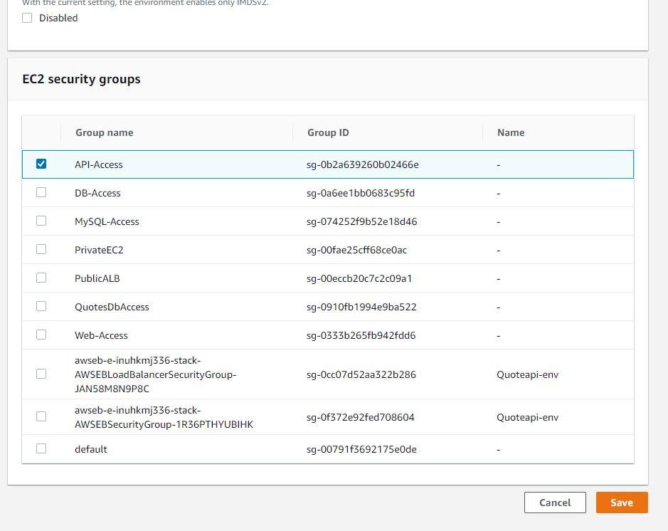

10. Click **Edit** in the _Capacity_ section. This is where we configure auto-scaling. Browse the settings. The only thing to change is to remove `t2.small` from _Instance types_. This will keep us in the free tier. Click **Save**.

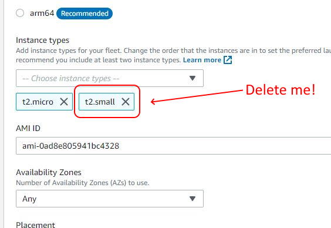

11. Click **Edit** in the _Load balancer_ section. Here we have an Application Load Balancer that listens on port 80. Scroll to the _Processes section_. Select the default process and click **Edit** from the _Actions_ menu. The port value must be changed to 8080 to match the `quote-api` Java process. This configuration will route traffic from the **listener** on port 80 to the application **process** on port 8080. Click **Save**, and then click **Save** again.

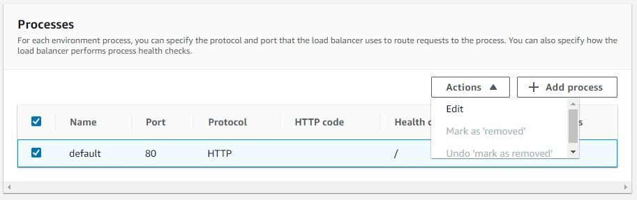

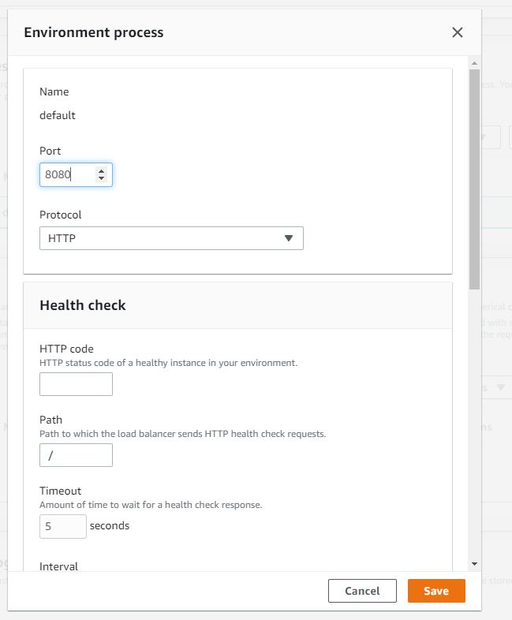

12. Finally, click **Create environment**. The screen will redirect to a scrolling log of events as the automatically created CloudFormation template is used to provision the application Stack.

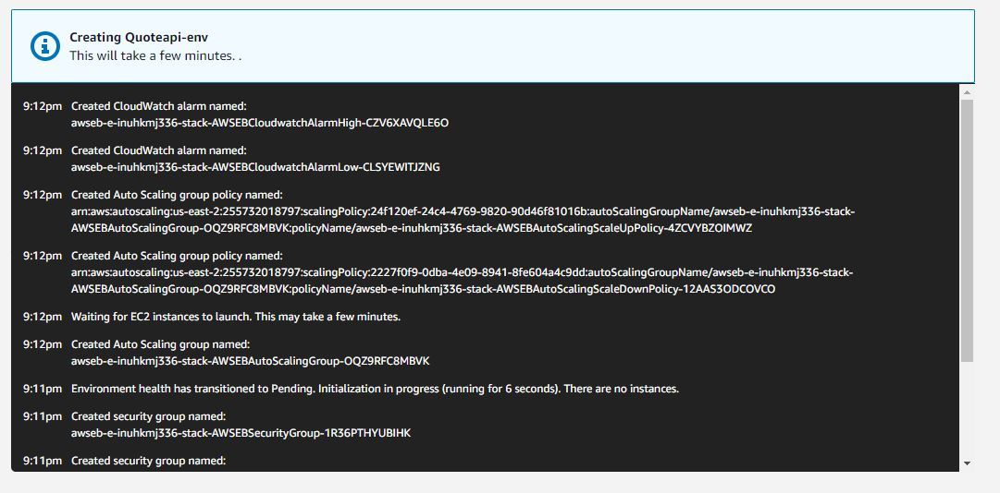

13. In the unlikely event that everything worked seamlessly on the first try, a big green checkmark and an "Ok" health status will show on the page. The `/` route of our API maps to the `HealthCheckController`, and that is where our configured load-balancer looks for healthy status. As long as that URL responds with HTTP 200 our health is considered good. Click the URL about the _Health_ status to view the "Healthy" response. Append a `/quote` to the URL to view the JSON response from the `QuoteController`.

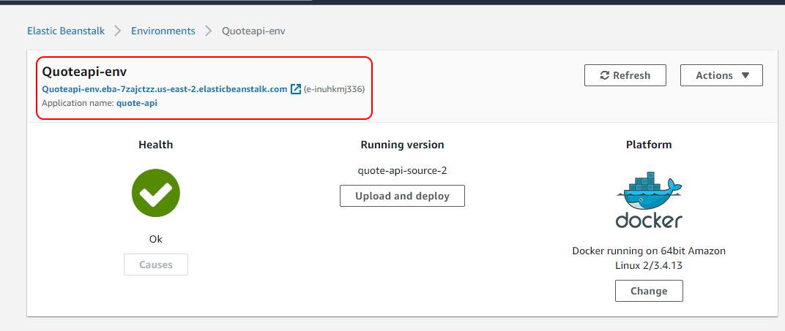

14. There are a lot of moving parts, and the Elastic Beanstalk UI has some quirks. More often than not, it takes a few tries before a new application deployment is running smoothly. If things do not go as planned a scary red "X" will appear with a "Severe" health status. Clicking the URL will likely result in a `502 Bad gateway` (look familiar? Elastic Beanstalk is running our API behind an Nginx webserver!). Click **Causes** to navigate to logs. If a new version of the code or `docker-compose.yml` files is needed, use the **Upload and deploy** feature.

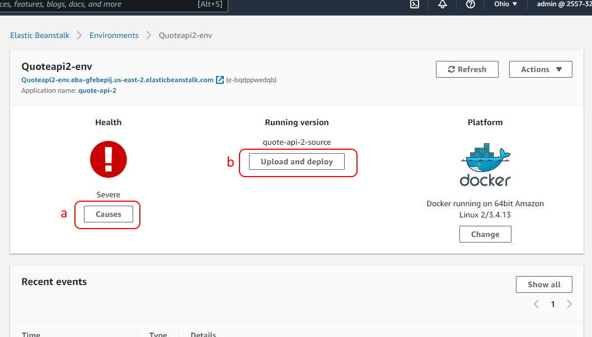

### Troubleshooting

* The UI is a little flaky. Verify the configuration is correct. Is `API-Access` set correctly on instances? Is the load-balancer process port set to 8080?

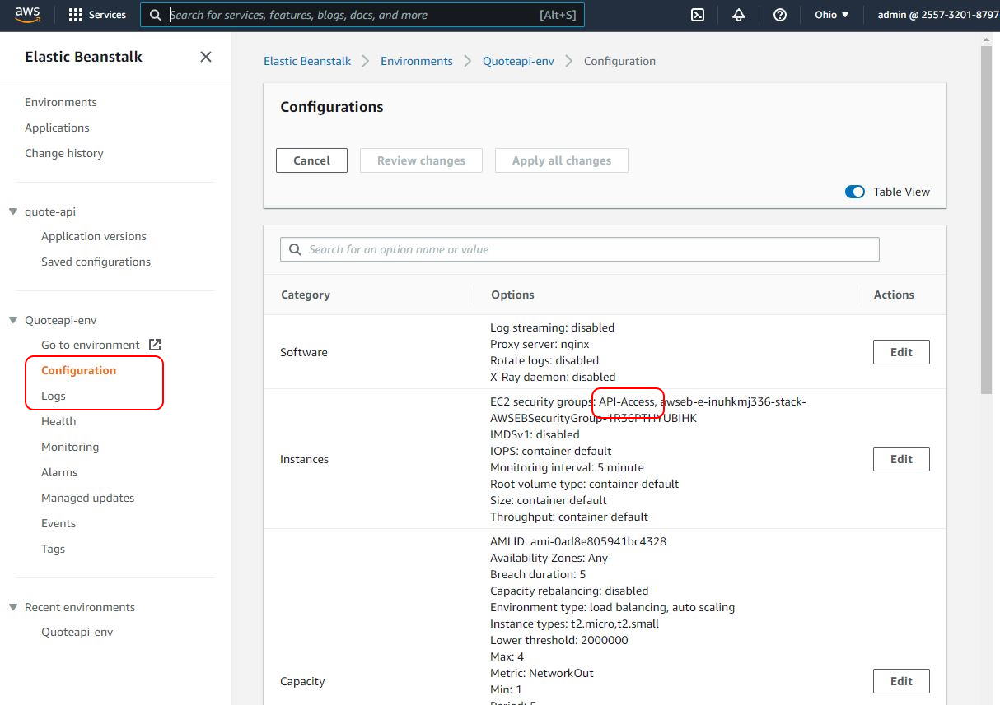

* Check the logs.

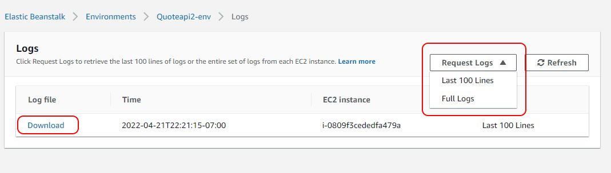

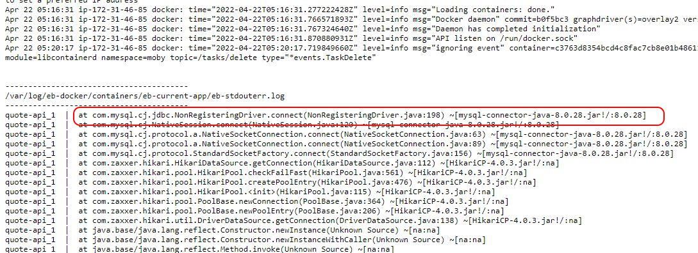

* Is there an issue with connecting to the database? Double-check that the `API-Access` security group has the access it needs. Temporarily add an inbound rule to `QuotesDbAccess` allowing Aurora/MySQL access to _any_ IP and test the app again.

## Conclusion

Leave `quote-api` running, we will need it for the next exercise.
