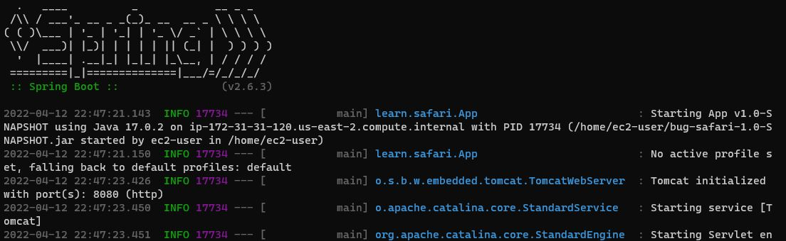

# Exercise: EC2

## Goals

* Configure an EC2 instance to run a Java application
* Deploy a Spring Boot app to EC2
* Deploy a Spring Boot Docker image to EC2

## Setup

Download the **bug-safari** Spring Boot project [here](./assets/bug-safari.zip).

This API manages its data in memory so we don't have to worry about connecting it to a database for now. Run it locally and explore the endpoints with the provided `requests.http` file.

This project includes the maven build plugin which can be used to create an executable `.jar` file.

```xml
    <!-- snip -->
    <build>
        <plugins>
            <plugin>
                <groupId>org.springframework.boot</groupId>
                <artifactId>spring-boot-maven-plugin</artifactId>
            </plugin>
        </plugins>
    </build>
```

## Part 1: Deploy a .jar

### Configure an EC2 Instance for Java

1. Launch a new EC2 instance with the following configuration:

  * **AMI** - Amazon Linux 2 AMI (HVM) - Kernel 5.10
  * **Instance Type** - t2.micro
  * **Security Groups** - Choose existing _Web-Access_ security group
  * **Key pair** - Choose your existing key pair

2. Add a security group rule that will allow TCP access (Cutom TCP) to **port 8080** from any IP address
3. Connect to your instance with `ssh`, update software, and install Java 17:

```sh
> sudo yum update -y
> sudo yum install java-17-amazon-corretto -y
```

Verify that Java is installed correctly.

```sh
> java --version
openjdk 17.0.2 2022-01-18 LTS
OpenJDK Runtime Environment Corretto-17.0.2.8.1 (build 17.0.2+8-LTS)
OpenJDK 64-Bit Server VM Corretto-17.0.2.8.1 (build 17.0.2+8-LTS, mixed mode, sharing)
```

### Package and Deploy

1. Run the `package` command in the Maven window to generate a `.jar`
2. In your terminal, navigate to the _target_ directory and run your `.jar`:

```sh
> java -jar bug-safari-1.0-SNAPSHOT.jar
```

If the app runs, it is ready to deploy.

3. Copy the Project to EC2 using `scp`

```sh
> scp -i <path-to-your-keypair.pem> `
    bug-safari-1.0-SNAPSHOT.jar `
    ec2-user@<your-instance-public-ip-or-dns>:~/
```

* Note the trailing `:~/` - this will copy the artifact to the root folder for _ec2-user_. If this command throws an error, try replacing `:~/` with `:.`

### Run

1. Connect to the instance with `ssh` (if not still connected)
2. Run the java project.

```sh
> java -jar bug-safari-1.0-SNAPSHOT.jar
```

You should see something similar to this:



3. Update the provided `requests.http` file and test the application endpoints.

#### Troubleshooting

* Make sure to use `http` and not `https`
* Confirm the HTTP port in URL
* If there are issues, watch the terminal window of your connected ssh session for Java errors.

### Clean Up

* Ctrl+c to stop the Spring Boot app
* Exit from ssh session
* Terminate the EC2 instance
