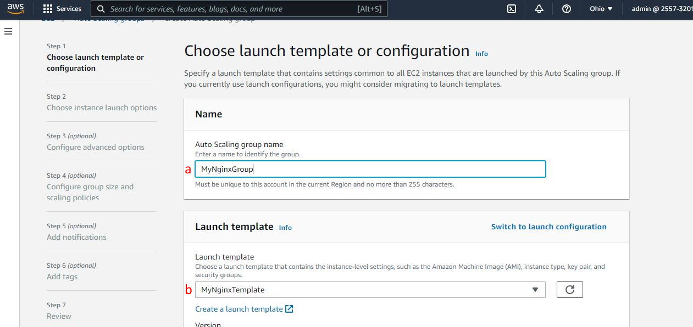
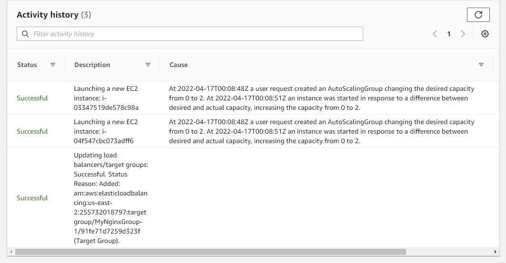
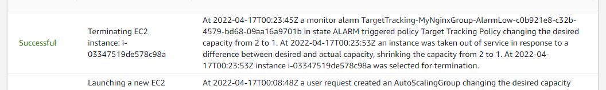

# Exercise: Load Balancing and Auto Scaling Groups

## Goals

* Create a Launch Template based on an EC2 instance
* Launch an Auto Scaling Group
* Alter CPU load to trigger automatic launching of EC2 instances.

## Phase 1: Create Launch Template

1. Go to the EC2 dashboard.
2. Launch a new EC2 instance with the following configuration:
  a. **AMI** - Amazon Linux 2 AMI (HVM) - Kernel 5.10
  b. **Instance Type** - t2.micro
  c. **Configure Instance Details** - add the `bash` script below in the **User data**.
  d. **Security Groups** - Choose existing _Web-Access_ security group
  e. **Key pair** - Choose your existing key pair

_User data for launch template instance:_

```sh
#!/bin/bash
yum update -y
sudo amazon-linux-extras install nginx1 -y 
sudo systemctl enable nginx
sudo systemctl start nginx
```

3. Give the instance a few minutes to come online.
4. When the instance is running, click on the link in the _Instance ID_ column to go to the summary page.
5. Test the public DNS (remember to use `http` and _not_ `https`). You should see the default `nginx` landing page.

4. Create a Launch Template from this instance. Click **Actions > Image and templates > Create template from instance**.
5. In the _Create launch template_ screen, fill in **Launch template name** and click **Create launch template**.
6. Click **View launch templates**.
7. Go back to _Instances_ and terminate the running instance.

## Phase 2: Create an Auto Scaling Group

1. Click **Auto Scaling Groups** in the left sidebar.
2. Click **Create Auto Scaling Group**.
3. Give the Auto Scaling group a name (a) and choose the Launch Template that was just created (b). Click **Next**.



4. Leave the default VPC selected. Add 2 Availability Zones to launch instances in. Click **Next**.
5. In the _Load balancing_ section, select **Attach a new load balancer**
6. In the _Attach to a new load balancer_ section, select **Application load balancer** and **Internet-facing**. In _Listeners and routing_, select **Create a target group**.
7. In the _Health checks_ section, check **ELB**. Click **Next**.
8. In the following screen, _Group size_ section, set

* **Desired capacity:**  `2`
* **Minimum capacity:**  `1`
* **Maximum capacity:**  `4`

9. In the _Scaling policies_ section, select **Target tracking scaling policy**, set the **Target value** to `50`, and the suggested `300` second warm-up in **Instances needed**.
10. Click **Skip to Review**, then click **Create Auto Scaling group**.
11. Navigate around the EC2 UI to view the resources that have been created:

* Instances - there should be 2 initializing.
* Load balancer - the new load balancer should be visible.
* Target groups - the new target group should have the new EC2 instances as registered targets.
* Auto Scaling Groups - the new group should be visible. Click in to it and view the _Activity_ tab. There should be events there describing the creation of the load balancer, target group, and the launching of 2 instances.



12. Go to the Load Balancer and copy the DNS name and paste it into a browser window. The Nginx landing page should appear.
13. Take a 15-minute break.

## Phase 3: Trigger Auto Scaling Events

1. After your 15 minutes of rest, the first auto-scaling event should have been triggered. The Auto Scaling Group was set up with the desired capacity of 2 which caused 2 instances to be launched when the group was created. Because CPU usage in the group is extremely low and the group minimum number of instances was set at 1, the scaling policy causes 1 instance to be terminated.



2. Now that there is only one instance, some load can be applied to scale the group up. Go to the remaining instance and get the public DNS or IP, then use `ssh` to log into the instance.
3. Install the `stress` utility and use it to apply load to the CPU.

```sh
> sudo amazon-linux-extras install epel -y sudo yum install stress -y
> stress -c 8
```

4. After a couple of minutes the spike in CPU usage should trigger the Auto Scaling policy to launch instances. Go to the Auto Scaling Group, _Monitoring_ tab and select **EC2** to view CPU usage. Eventually it will scale up to 4 instances.
5. Check the _Activity_ tab and see the new events.
6. Go to EC2 instances and choose one of the newer instances to terminate. This will cause another instance to be launched as a replacement.

## Clean Up

* Delete Auto Scaling Group
* Terminate EC2 instances
* Delete Application Load balancer
* Delete Target Group
* The Launch Template doesn't cost anything, leave it for a later exercise.
