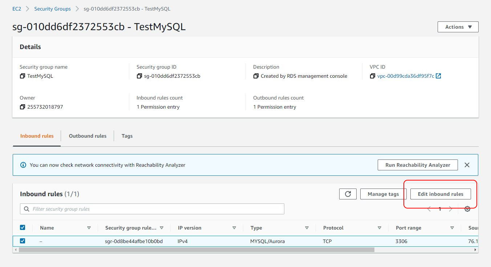
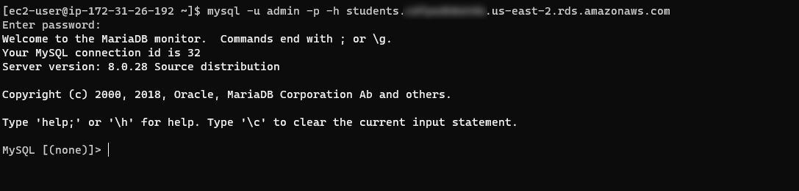
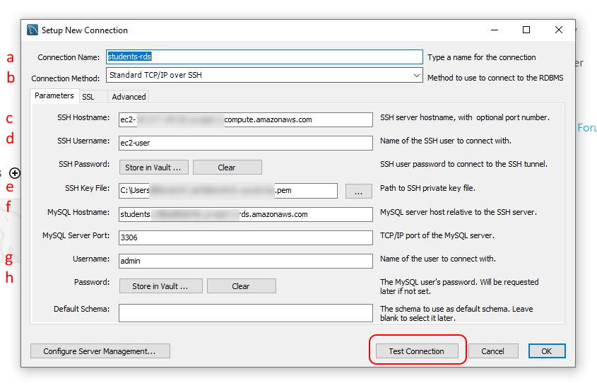
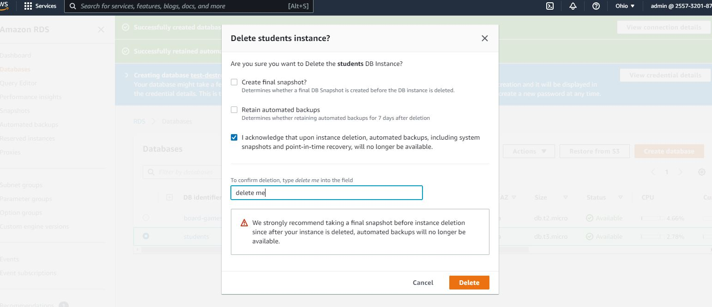

# MySQL on Amazon RDS

## Goals

* Create a private MySQL database on Amazon RDS.
* Launch an EC2 instance and Security Group as a bastion host.
* Connect with MySQL Workbench using a bastion host.

## Set Up

* > Download the [student-registrations.sql](./assets/student-registrations.sql)

## Phase 1: Create RDS Database

1. Navigate to the RDS dashboard in the AWS console.
2. Click **Databases** in the left-hand navigation menu.
3. In _Engine options_, select **MySQL** as the **engine type**
4. In the _Templates_ section, choose the **Free tier** template.
5. In _Settings_, change the **DB instance identifier** to something meaningful, like "students".
6. Optionally, change the **Master username**.
7. Set a **Master password** to something memorable.
8. In the _Connectivity_ section, create a security group and name it `Student-DB-Access`.

## Phase 2: Create a Bastion Host

Public access was not enabled on the RDS database. This is a security best practice. Resources that are open to the internet at large are often relentlessly under siege by malicious actors. We present as small of an attack surface as possible.

In order to connect to the DB to run scripts from a local machine, we will use an EC2 instance as a **bastion host**. A secure connection can be made over SSH through the bastion host to the RDS database. When we are done maintaining the database, the bastion host can be removed - one less attack vector.

1. Launch the usual Amazon Linux instance in the free tier. Give it the _Web-Access_ security group.
2. Next, find `Student-DB-Access` security group edit the inbound rules.



3. Update the rule to allow access from the _Web-Access_ Security Group, rather than an IP address.
4. Use `ssh` to connect to the EC2 instance.
5. To test access to the `students` database, we can install MySQL in the bastion host.

```sh
> sudo yum update -y
> sudo yum install mysql -y
```

6. Navigate to the `students` database in RDS. Find and copy the **Endpoint**.
7. In the terminal connected to the bastion host, connect to the database.

```sh
> mysql -u admin -p -h <students-rds-endpoint-here>
Password:
```

8. Enter the password. Something like the following should appear:



9. Type `exit` to disconnect.

### Troubleshooting

* Connecting to MySQL hangs? Look hard at the security group.
* Can't log in to MySQL? Double-check the endpoint, username, and password

## Phase 3: Connect with MySQL Workbench

1. Open MySQL Workbench and add a new connection.
2. Set up the connection with the following options:

* **Connection Name** - `students-rds` in the example.
* **Connection Method** - Standard TCP/IP over SSH.
* **SSH Hostname** - Bastion host EC2 instance public DNS.
* **SSH Username** - `ec2-user`.
* **SSH Key File** - Path to the key pair on the local machine.
* **MySQL Hostname** - RDS endpoint for the `students` database.
* **Username** - Username for `students` database, `admin` is the default.
* **Password** - Click **Store in Vault** and enter the `students` database password.

3. Click **Test Connection**.



4. Click **OK**.
5. Run the `student-registrations.sql` script. Run some queries.

## Clean Up

1. Terminate the bastion host EC2 instance
2. Delete the RDS database. Uncheck **Create final snapshot** and **Retain automated backups**. Check **Acknowledge...**, enter the required text and click **Delete**.



3. Delete the `Student-DB-Access` security group.
