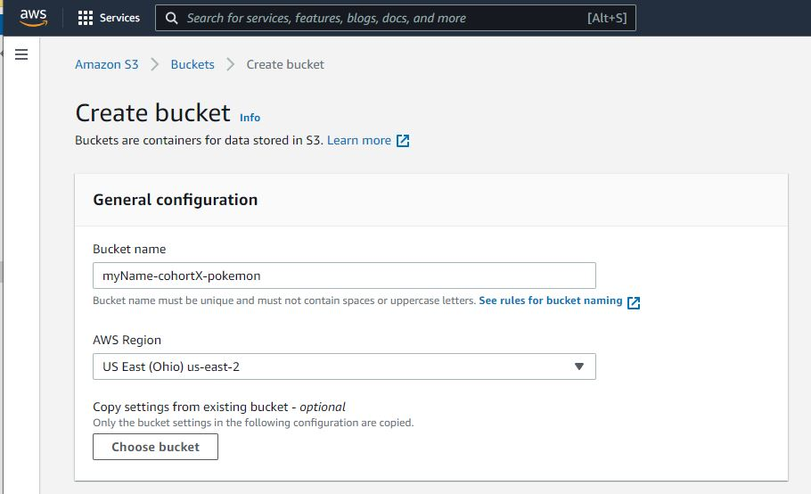
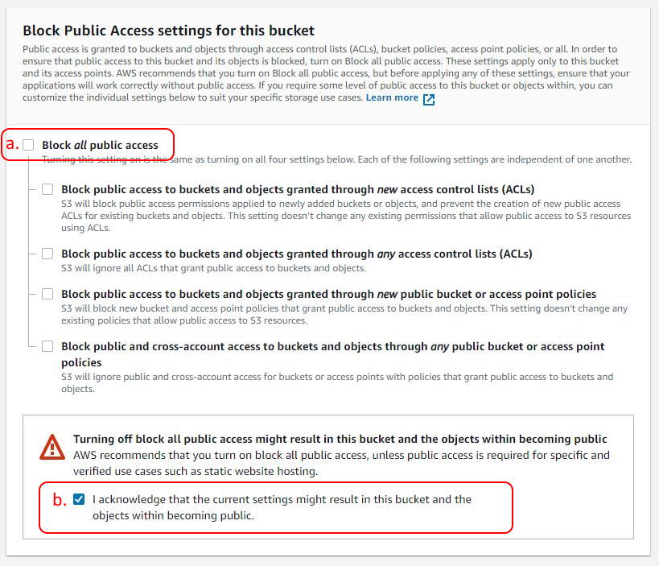
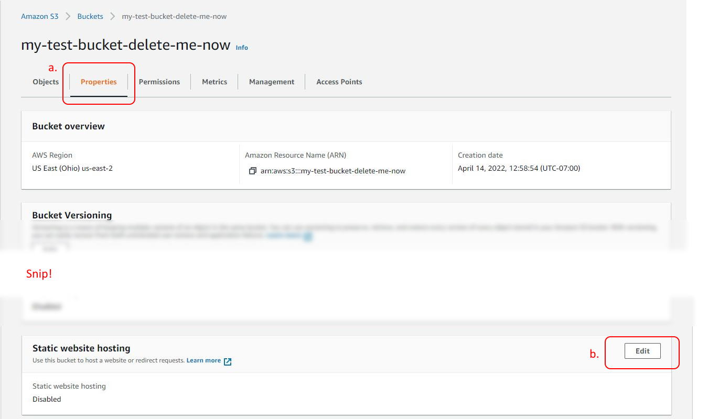
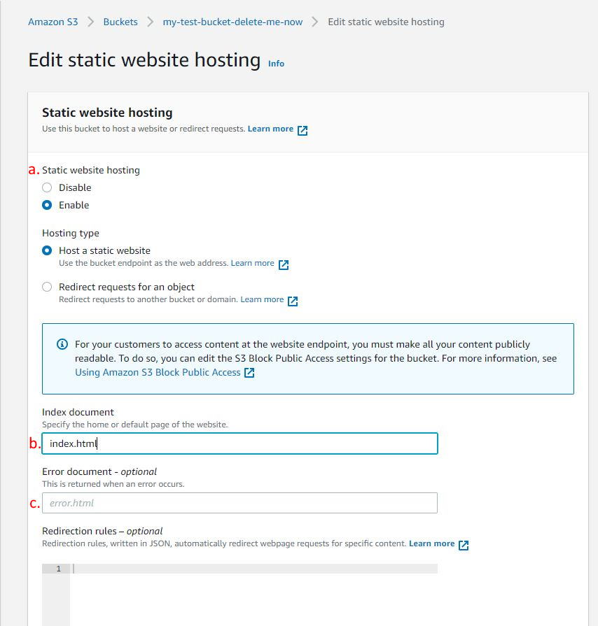
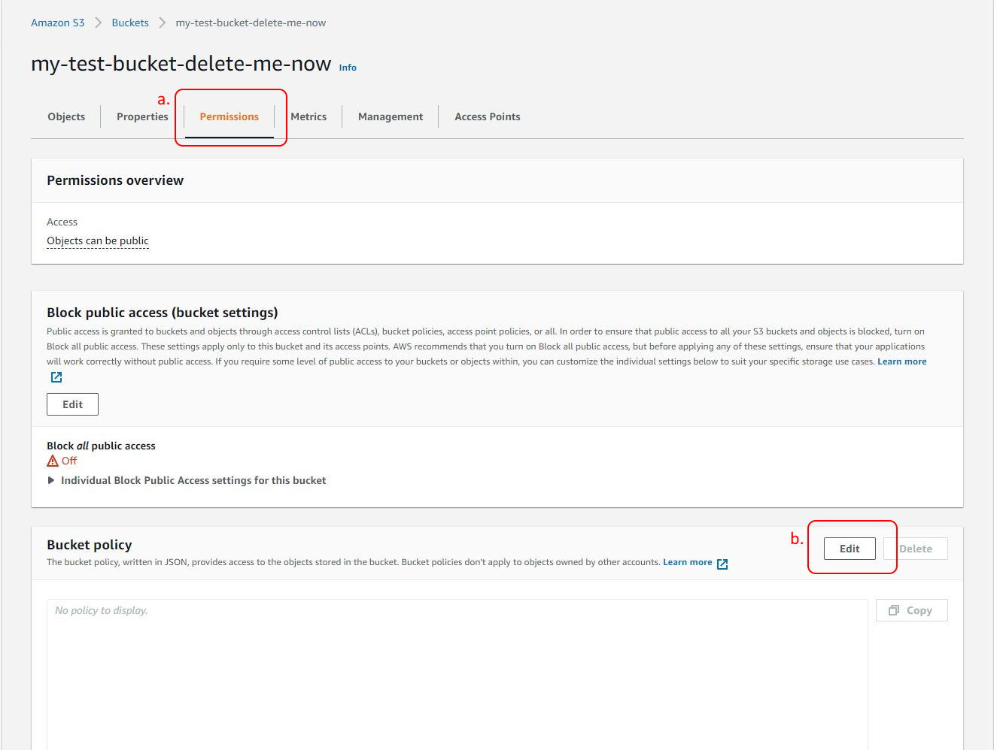
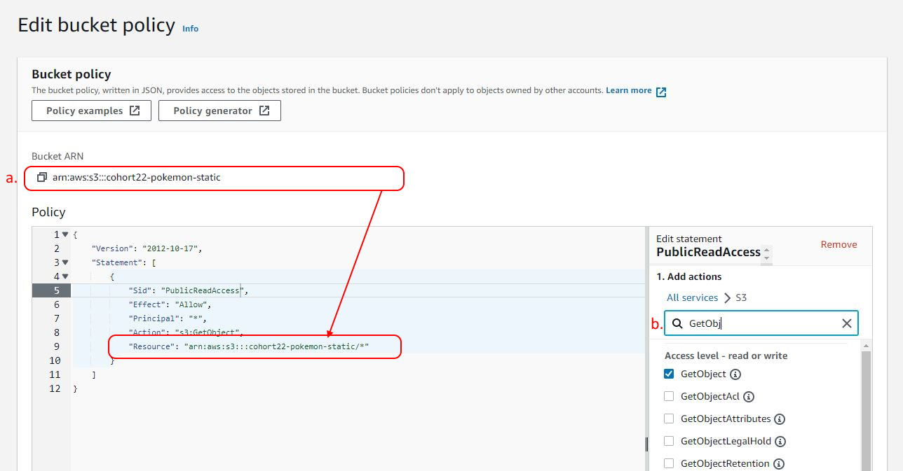
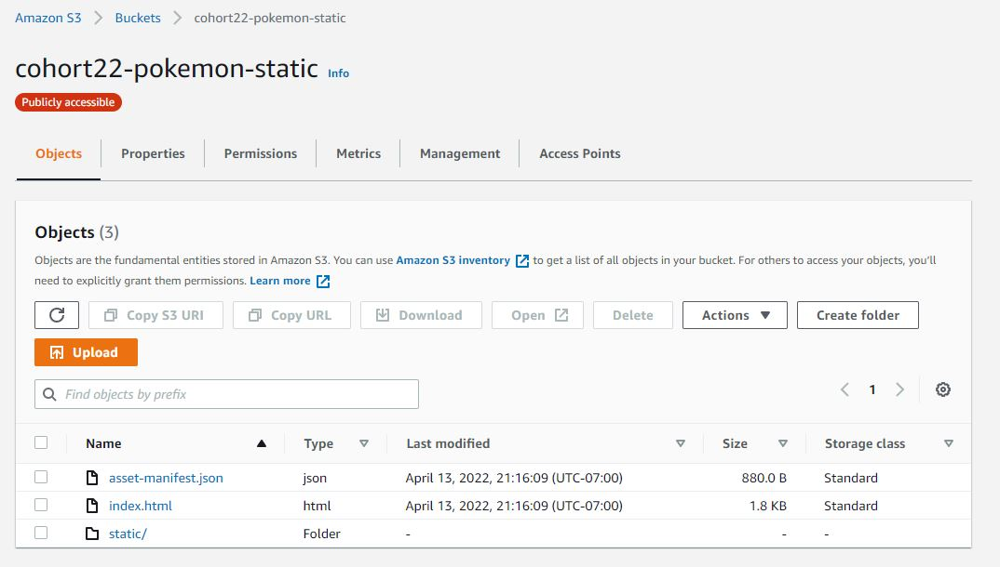
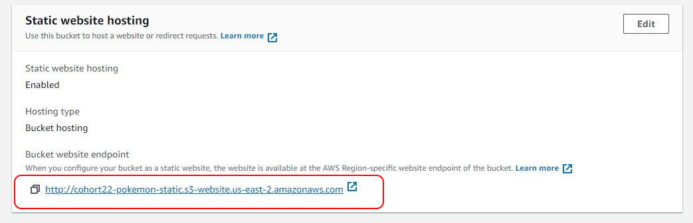

# Exercise: Deploy React to Amazon S3

## Goals

* Build provided Create React App
* Deploy static assets to an S3 bucket
* Configure an S3 bucket as a static website

## Set Up

1. > Download the [Pokemon S3](./assets/pokemon-s3.zip) React project.
2. Extract the zip contents. It's a CRA React project.
3. Open the project with VS Code.

## Pokemon S3

Pokemon S3 is React App with a few simple components. It uses the [PokeAPI](https://pokeapi.co/) as a backend to deliver some very cute pictures.

### Phase 1: Test Locally

1. Open the `requests.http` file in the project root. This file can be used to test the 2 endpoints used by the application code. This API can be used as a backend because the CORS rules allow requests from any origin.(`access-control-allow-origin: *`).
2. Open a terminal in the project root.
3. Install dependencies: `npm install`.
4. Run the app: `npm start`.
5. Confirm that a list of Pokemon appears at [http://localhost:3000](http://localhost:3000).
6. Confirm that you are able to navigate using the `View` button next to a Pokemon.
7. Shut down the app with `ctrl+c`.

### Phase 2: Build

1. Generate the static assets for deployment with `npm run build`.
2. Take note of the `build` directory that was created. This directory contains the all of static JavaScript, CSS, and HTML files needed for deployment.

### Phase 3: Create and Configure S3 Bucket

1. Open a web browser and go to the [Amazon S3 console](https://s3.console.aws.amazon.com/s3/buckets).
2. Click **Create bucket**.
3. Enter a bucket name. This name must be globally unique.
4. Choose an AWS region that is geographically close.



5. Uncheck **Block _all_ public access** (a) and acknowledge that public access is OK (b).



6. The remaining settings that need to change are available after bucket creation. Click **Create bucket** at the bottom of the screen. This will redirect to the bucket list.
7. Navigate to the new bucket by clicking the bucket name in the list.
8. Click the **Properties** tab (a) and scroll down to the section _Static website hosting_. Click **Edit** (b).



9. Select **Enable** Static website hosting (a) and enter `index.html` in the **Index document** text box (b). We don't have an error page, so skip **Error document** (c).



10. Click **Save changes**.

### Phase 4: Add Bucket IAM Policy

1. Click the **Permissions** tab (a). Click **Edit** in the _Bucket policy_ section (b).



2. Update the policy to allow read access to the public.
  a. The bucket `arn` is conveniently located on the page where you can easily copy it into your policy (a).
  b. The policy editor is very nice. Try to build the policy from scratch.



#### Policy JSON

```json
{
  "Version": "2012-10-17",
  "Statement": [
    {
      "Sid": "PublicReadAccess",                      // A reminder of the purpose of this policy
      "Effect": "Allow",                              // `Allow` as opposed to `Deny`
      "Principal": "*",                               // `*` = anyone and everyone
      "Action": "s3:GetObject",                       // Read access
      "Resource": "arn:aws:s3:::[your-bucket-name]/*" // Specify the bucket and put "/*" after your bucket name
    }
  ]
}
```

3. Click **Save changes**.

### Phase 5: Upload React App

1. Click on the **Objects** tab.
2. Click **Upload**.
3. It is important that the site structure remains the same as it is in the build directory on our local machine so that all the relative paths work when the app is deployed. Start by uploading the files from the root build directory. Click **Add files**.
4. Navigate to the build `pokemon-s3` build directory and choose the 2 files there: `asset-manifest.json` and `index.html`.
5. Next click **Add folder** and select the `static` folder.
6. Click **Upload**.
7. Once everything is uploaded, click **Close** to navigate back to the _Objects_ tab. The page should look something like this:



### Phase 6: Test the Deployment

1. Navigate back to the _Properties_ tab and scroll down to the _Static website hosting_ section.
2. At the very bottom is the _Bucket website endpoint_, the public URL of the website. Click it and test the app.



### Phase 7: Clean Up

1. Turn off public access (_Permissions -> Block public access_) or delete the bucket so that you do not inadvertently incur charges.
