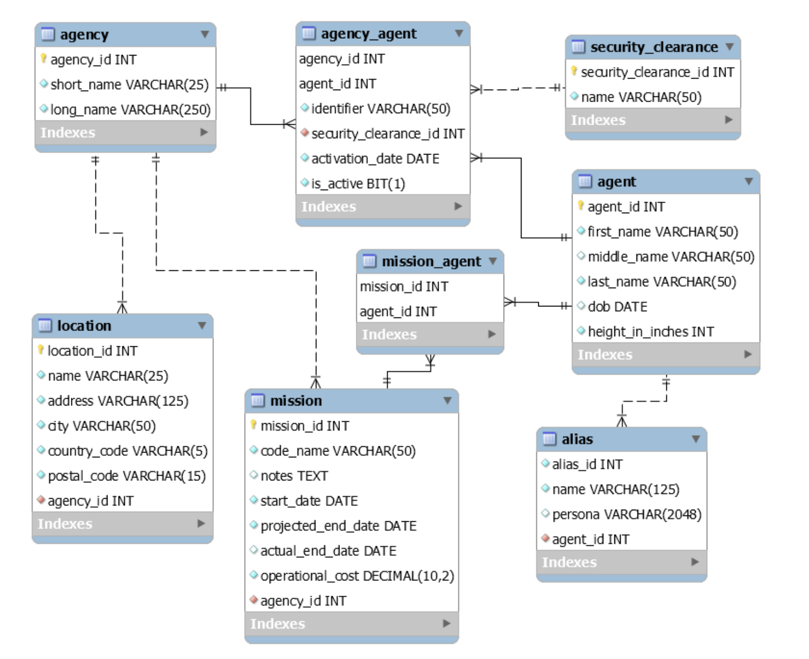

# Apache Cassandra Data Model Exercise

Use the [Solar Farm schema](../solar-farm/schema/cassandra.cql) example as inspiration.

Create a Cassandra Data Model for Field Agent.

1. Conceptual Data Model

  - This part is essentially already done for you as part of the MySQL schema.

2. Application Workflow

  - Document the queries your application must support.

3. Logical Data Model

  - Create tables to support each of the queries from 

4. Physical Data Model

  - Verify each of the queries will retrieve data from only 1 partition.

## Next
[Cassandra Query Language (CQL)](cql.md)

[Back to Overview](../README.md)