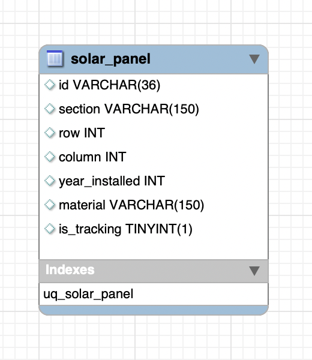

# Cassandra Data Model

Apache Cassandra stores data in tables, with each table consisting of rows and columns. CQL (Cassandra Query Language) is used to query the data stored in tables. Apache Cassandra data model is based around and optimized for querying. Cassandra does not support relational data modeling intended for relational databases.

## What is Data Modeling?

Data modeling is the process of identifying entities and their relationships. In relational databases, data is placed in normalized tables with foreign keys used to reference related data in other tables. Queries that the application will make are driven by the structure of the tables and related data are queried as table joins. In Cassandra, data modeling is query-driven. The data access patterns and application queries determine the structure and organization of data which then used to design the database tables.

## Query-driven modeling

Data is modeled around specific queries. Queries are best designed to access a single table, which implies that all entities involved in a query must be in the same table to make data access (reads) very fast. Data is modeled to best suit a query or a set of queries. A table could have one or more entities as best suits a query. As entities do typically have relationships among them and queries could involve entities with relationships among them, a single entity may be included in multiple tables.

Unlike a relational database model in which queries make use of table joins to get data from multiple tables, joins are not supported in Cassandra so all required fields (columns) must be grouped together in a single table. Since each query is backed by a table, data is duplicated across multiple tables in a process known as denormalization. Data duplication and a high write throughput are used to achieve a high read performance.

## High Level Data Modeling Steps

The high-level steps to do data modeling for Cassandra:

1. Conceptual Data Model
1. Application Workflow
1. Logical Data Model
1. Physical Data Model

### Conceptual Data Model

In this step, create an Entity-Relationship Diagram to describe the entities or models that your application needs to support. This should be familiar from data modeling with traditional RDMS.

### Application Workflow 

In this step, determine the queries your database needs to support.
  - Add a solar panel 
  - Find all solar panels in a section
  - Find solar panels by unique combination of section, row, column
  - Find a solar panel by id
  - Edit a solar panel by id
  - Delete a solar panel by id

### Logical Data Model 

Use the information gained from the Conceptual Data Model along with the Application Workflow to design tables that will support all of the queries. Some data from the Conceptual Data Model will have to be duplicated across tables (denormalized).

See [cassandra.cql](../solar-farm/schema/cassandra.cql)

### Physical Data Model

Goals
  1. Spread Data Evenly Around the Cluster
  1. Minimize the Number of Partitions Read

Consider each query. 
Determine for the query if only 1 partition will be queried. If multiple partitions will be queried, break down the queries further possibly by adding additional tables.

## Next
[Data Modeling Part 2](./data-model-2.md)

[Back to Overview](../README.md)