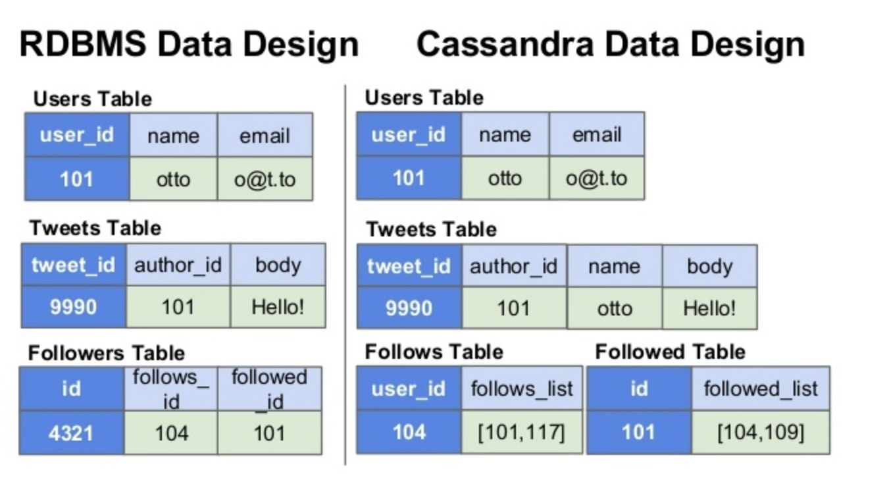
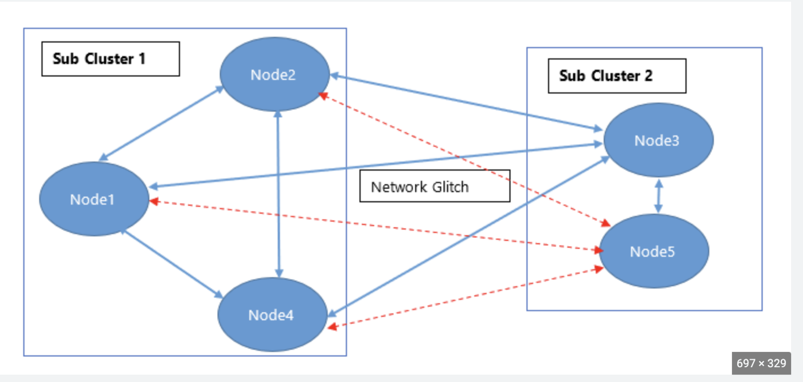

# Introduction to Apache Cassandra

## Introduction to Apache Cassandra

Apache Cassandra is a distributed, open-source NoSQL database that was originally developed by Facebook to handle large volumes of data across multiple commodity servers. It is designed to provide [high scalability](https://en.wikipedia.org/wiki/Scalability), [high availability](https://en.wikipedia.org/wiki/High_availability), and high performance, while also offering [tunable consistency](https://en.wikipedia.org/wiki/Consistency_model) and [fault tolerance](https://en.wikipedia.org/wiki/Fault_tolerance). Cassandra is based on a [decentralized architecture](https://en.wikipedia.org/wiki/Distributed_computing) that uses a peer-to-peer mechanism to manage data replication and distribution across nodes, allowing it to [scale horizontally](https://en.wikipedia.org/wiki/Scalability#Horizontal_(scale_out)_and_vertical_scaling_(scale_up)) and handle large volumes of data with ease.

Cassandra has a flexible data model that allows for the creation of tables with multiple columns and complex data structures. Cassandra is well-suited for use cases that require high write throughput, low latency, and the ability to handle large amounts of data, such as social media, IoT, financial services, and healthcare.

## How it Differs from Traditional Relational Databases

Data Model: Traditional relational databases use a table-based data model with a fixed schema, where each table has a predefined set of columns and data types. In contrast, Cassandra uses a flexible, column-family-based data model that allows for dynamic schema changes and the creation of complex data structures. Cassandra also supports denormalization and duplication of data, which can improve performance and reduce the need for joins.

Scalability: Traditional relational databases are designed to run on a single server or a cluster of tightly coupled servers, limiting their scalability. In contrast, Cassandra is designed to run on a cluster of commodity servers that can be easily added or removed, allowing it to scale horizontally to handle large volumes of data and high write throughput.

## CAP Theorem

CAP Theorem: The CAP theorem states that any distributed data store can provide only two of the following three guarantees:

1. Consistency
  - Every read receives the most recent write or an error.
2. Availability
  - Every request receives a (non-error) response, without the guarantee that it contains the most recent write.
3. Partition tolerance
  - The system continues to operate despite an arbitrary number of messages being dropped (or delayed) by the network between nodes.

Availability: Traditional relational databases often use a master-slave replication model, where a single server acts as the primary copy of the data and other servers act as backups. This can create a single point of failure and limit availability. In contrast, Cassandra uses a peer-to-peer replication model, where all nodes are equal and data is replicated across multiple nodes for fault tolerance and high availability.

Consistency: Traditional relational databases use strict consistency models, where all data updates are immediately visible to all nodes in the cluster, which can impact performance and scalability. In contrast, Cassandra uses a tunable consistency model, where users can choose the level of consistency they need for each operation, allowing for better performance and scalability.

### Quorum

`quorum = (sum_of_replication_factors / 2) + 1`

Examples:
  - Using a replication factor of 3, a quorum is 2 nodes. The cluster can tolerate 1 replica down.
  - Using a replication factor of 6, a quorum is 4. The cluster can tolerate 2 replicas down.
  - In a two datacenter cluster where each datacenter has a replication factor of 3, a quorum is 4 nodes. The cluster can tolerate 2 replica nodes down.
  - In a five datacenter cluster where two datacenters have a replication factor of 3 and three datacenters have a replication factor of 2, a quorum is 7 nodes.

### Write Consistency Levels: 

  - ALL
    - A write must be written to the commit log and memtable on all replica nodes in the cluster for that partition.	
  - EACH_QUORUM
    - Strong consistency. A write must be written to the commit log and memtable on a quorum of replica nodes in each datacenter.	
  - QUORUM
    - A write must be written to the commit log and memtable on a quorum of replica nodes across all datacenters.	
  - LOCAL_QUORUM
    - Strong consistency. A write must be written to the commit log and memtable on a quorum of replica nodes in the same datacenter as the coordinator. Avoids latency of inter-datacenter communication.	
  - ONE (TWO, THREE)
    - A write must be written to the commit log and memtable of at least one replica node.	
  - LOCAL_ONE
    - A write must be sent to, and successfully acknowledged by, at least one replica node in the local datacenter.	
  - ANY
    - A write must be written to at least one node. If all replica nodes for the given partition key are down, the write can still succeed after a hinted handoff has been written. If all replica nodes are down at write time, an ANY write is not readable until the replica nodes for that partition have recovered.	

### Read Consistency Levels: 

  - ALL
    - Returns the record after all replicas have responded. The read operation will fail if a replica does not respond.	
  - EACH_QUORUM
    - Not supported for reads.
  - QUORUM	
    - Returns the record after a quorum of replicas from all datacenters has responded.		
  - LOCAL_QUORUM
    - Returns the record after a quorum of replicas in the current datacenter as the coordinator has reported. Avoids latency of inter-datacenter communication.	
  - ONE (TWO, THREE)
    - Returns a response from the closest replica, as determined by the snitch. By default, a read repair runs in the background to make the other replicas consistent.	
  - LOCAL_ONE
    - Returns a response from the closest replica in the local datacenter.	
  - SERIAL
    - Allows reading the current (and possibly uncommitted) state of data without proposing a new addition or update. If a SERIAL read finds an uncommitted transaction in progress, it will commit the transaction as part of the read. Similar to QUORUM.	
  - LOCAL_SERIAL	
    - Same as SERIAL, but confined to the datacenter. Similar to LOCAL_QUORUM.	

Read Repair is the process of repairing data replicas during a read request. If all replicas involved in a read request at the given read consistency level are consistent the data is returned to the client and no read repair is needed. But if the replicas involved in a read request at the given consistency level are not consistent a read repair is performed to make replicas involved in the read request consistent. The most up-to-date data is returned to the client. The read repair runs in the foreground and is blocking in that a response is not returned to the client until the read repair has completed and up-to-date data is constructed.

Network Partition: a network failure that causes the members to split into multiple groups such that a member in a group cannot communicate with members in other groups.

## Strengths and Weaknesses

### Strengths

Scalability: Apache Cassandra is highly scalable and can easily handle large volumes of data and high write throughput. It uses a peer-to-peer architecture that allows it to scale horizontally by adding more nodes to the cluster.

High Availability: Apache Cassandra is designed to provide high availability and fault tolerance by replicating data across multiple nodes. This ensures that data is always available and consistent, even in the event of node failures.

Performance: Apache Cassandra is optimized for high performance, with low latency and high throughput. It achieves this by using an optimized data storage format, in-memory storage, and distributed caching. It can also perform real-time analytics and data processing on large data sets.

### Weaknesses

Complexity: Apache Cassandra can be more complex to set up and maintain compared to traditional relational databases, due to its distributed architecture and data model. It requires more planning and expertise to ensure optimal performance and scalability.

Querying: While Cassandra's data model provides flexibility, it can make querying more complex compared to traditional relational databases. Cassandra's query language (CQL) has some limitations, and complex queries may require additional coding and indexing. 

Transactions: Apache Cassandra does not support full ACID transactions, which can be a challenge for applications that require strict consistency (constraints not violated) and atomicity (all or nothing). While Cassandra does support some forms of transactional consistency, such as lightweight transactions, these may not be sufficient for some use cases.

### Misconceptions about Apache Cassandra and NoSQL Databases

NoSQL is a replacement for all SQL databases: NoSQL databases, including Apache Cassandra, are not necessarily a replacement for all SQL databases. Each database technology has its strengths and weaknesses, and the choice of database should be based on the specific requirements of the application.

NoSQL is always faster than SQL: While NoSQL databases are optimized for high write throughput and scalability, they may not always be faster than SQL databases for all use cases. The performance of a database depends on many factors, including the data model, hardware, and workload.

NoSQL is easier to use than SQL: NoSQL databases, including Apache Cassandra, can have a steeper learning curve than SQL databases. They have different data models and query languages, which can be more complex for some developers. Additionally, NoSQL databases may require more planning and expertise to ensure optimal performance and scalability.

## Features and Benefits of Apache Cassandra

### Distributed Architecture

The distributed architecture is one of the core features of Apache Cassandra, which makes it a highly scalable and fault-tolerant database. Cassandra is designed to work with large, distributed clusters of commodity hardware, allowing it to handle massive volumes of data and high write throughput. Cassandra's architecture consists of nodes that communicate with each other to manage data distribution and replication.

In Cassandra, data is partitioned across multiple nodes using a partition key. Each node in the cluster is responsible for a specific range of data, and the data is replicated across multiple nodes to ensure fault tolerance and high availability. Cassandra uses a peer-to-peer gossip protocol to maintain cluster membership and detect node failures.

Cassandra's distributed architecture provides several benefits, including high scalability, fault tolerance, and high availability. As new nodes are added to the cluster, Cassandra automatically rebalances the data to ensure an even distribution across the cluster. This makes it easy to scale Cassandra horizontally as your data needs grow. With data replication and no single point of failure, Cassandra provides fault tolerance and high availability, even in the event of node failures. Finally, Cassandra's distributed architecture allows it to handle high write throughput, making it well-suited for applications with high-volume data ingest.

Replication: Data is replicated across multiple nodes in the cluster, ensuring that there is no single point of failure.

### Fault Tolerance / High Availability

Fault tolerance refers to a system's ability to continue functioning in the face of hardware or software failures. In the context of a distributed database like Apache Cassandra, fault tolerance means that the system can continue to operate even if some of the nodes in the cluster fail. This is achieved through replication of data across multiple nodes and the ability to recover data in the event of node failures.

Apache Cassandra is designed to be highly fault tolerant, with support for replication of data across multiple nodes in the cluster. When data is written to Cassandra, it is automatically replicated to multiple nodes, with the number of replicas configurable by the user. This ensures that there are always multiple copies of the data available, even if some of the nodes fail.

In the event of node failures, Cassandra uses a [gossip protocol](https://docs.datastax.com/en/cassandra-oss/3.x/cassandra/architecture/archGossipAbout.html) to detect and communicate node status across the cluster. When a node fails, the other nodes in the cluster are notified and take over the failed node's responsibilities. Cassandra's architecture is designed to avoid having any single point of failure, which means that the system can continue to operate even if multiple nodes fail simultaneously.

Cassandra also provides mechanisms for repairing and recovering data in the event of failures. For example, Cassandra uses [hinted handoff](https://docs.datastax.com/en/cassandra-oss/2.1/cassandra/dml/dml_about_hh_c.html) to temporarily store writes that could not be written to a failed node. When the failed node comes back online, Cassandra uses the hints to replay the writes to the node. In addition, Cassandra provides support for repair operations that can detect and correct inconsistencies in data across the cluster. These features, along with Cassandra's distributed architecture and replication strategy, make it a highly fault-tolerant database that can continue to operate even in the face of node failures.

### Tunable Consistency 

Tunable consistency is a feature of distributed databases that allows application developers to specify the level of consistency they need for a particular read or write operation. With tunable consistency, developers can trade off between data consistency and system performance, based on the specific needs of their application.

In Apache Cassandra, tunable consistency is achieved through its support for [consistency levels](https://docs.datastax.com/en/cassandra-oss/3.0/cassandra/dml/dmlConfigConsistency.html). Cassandra provides four levels of consistency: one, quorum, all, and local quorum. Each level specifies the number of replicas that must respond to a read or write operation before it is considered successful.

The consistency level 'one' means that a read or write operation is considered successful as soon as one replica responds, whereas the consistency level 'quorum' requires a majority of replicas to respond. The consistency level 'all' requires all replicas to respond, and 'local quorum' requires a majority of replicas in the same data center as the client.

By default, Cassandra uses the consistency level 'quorum' for both reads and writes. However, application developers can specify a different consistency level for each operation, depending on their specific requirements. For example, if data consistency is critical for a particular operation, developers can use a higher consistency level like 'all' or 'local quorum'. On the other hand, if performance is more important, developers can use a lower consistency level like 'one' or 'quorum'.

In this way, Cassandra allows developers to achieve the optimal balance between consistency and performance, depending on the specific needs of their application. The ability to tune consistency levels is a key feature of Cassandra that makes it a highly flexible and adaptable database for a wide range of use cases.

## Futher Reading

[Amazon Dynamodb White Paper](https://www.google.com/search?q=amazon+dynamodb+white+paper)

## Next
[Exercise: Install Apache Cassandra](installation.md)

[Back to Overview](../README.md)