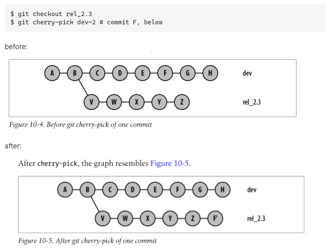

# Cherry Picking

Cherry Picking is for when you want the changes in 1 or more commits, but you don't want to replay all of a commits in a branch.

## Scenario

Create two branches. Branch A and Branch B.
  1. Branch A: Create 5 commits.
  2. Branch B: Create 2 or 3 commits.
  3. Checkout Branch B. Use `git log` or Sourcetree to determine the hash of the commit you want from Branch A.
    - `git cherry-pick 84497c4`

## Next
[Conclusion](./conclusion.md)