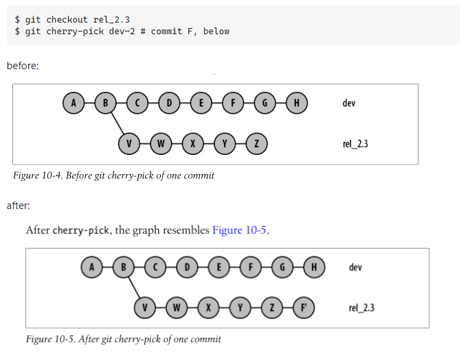

# Cherry Picking

Cherry Picking is for when you want the changes in 1 or more commits, but you don't want to replay all of a commits in a branch.

## Scenario

Create two branches. Branch feature/ABC-116 and Branch feature/ABC-117.
  1. Branch feature/ABC-116: Create 5 commits.
  2. Branch Bfeature/ABC-117: Create 2 or 3 commits.
  3. Checkout Branch feature/ABC-117. Use `git log` or Sourcetree to determine the hash of the commit you want from Branch feature/ABC-116.
    - `git cherry-pick 84497c4`

## Next
[Conclusion](./conclusion.md)
