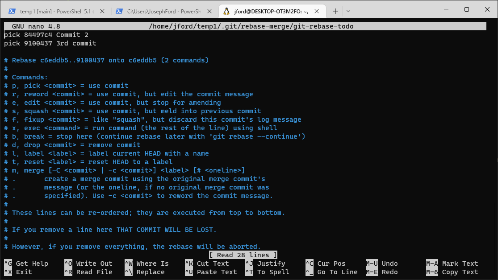

# Squash

Squashing is a way to combine multiple commits into a single commit. You can use squash before or after merge or rebase to make your pull requests "cleaner". I use interactive rebase for squashing. There are other ways to squash using git.


## Scenario

Suppose you created feature/ABC-115 and then have 5 total commits because of typos and fixing test failures, etc. If you don't want to air your dirty laundry, you can squash these 5 commits into a new single commit. There are two ways to do this. One involves you counting the total number of commits you want to squash. The other method involves finding the hash of the commit immediately before all the commits you want to squash.

Method 1: "Last 5 Commits"
```
git rebase -i HEAD~5
```

Method 2: "Squash until c56aa734c83b4" (not including c56aa734c83b4)
```
git rebase -i c56aa734c83b4
```

## Steps

  0. Checkout main and pull latest, make sure clean.
  1. Create/Checkout New Feature Branch
  2. Make code changes
  3. Commit
  4. Pretend you introduced a typo in your first commit, make a change, commit again.
  5. Repeat making changes and committing another 2 or 3 times.
  6. Use Sourcetree to determine how many commits you want to squash or the commit hash of the commit immediately previous to the commits you want to squash.
  7. `git rebase -i HEAD~3` or `git rebase -i c56aa734c83b4`
  8. In VI that comes up, change each row as desired, then write quit.

```
i   - Start insert mode
ESC - Cancel insert mode.
:wq - Write and Quit
:q! - Quit without Saving
```



## Next
[Reset / Revert](./undo.md)
