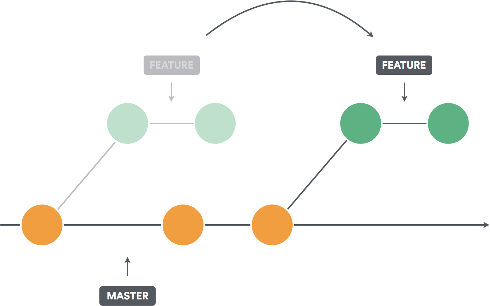

# Rebase

Rebase "replays" commits on top of another base commit. Rebase does not introduce a new commit.

Rebase is great when you are working independently. If you are working with other developers on the same branch (rare), you cannot use Rebase. Rebase does not introduce another commit. If you cannot use rebase, use merge. 

## Scenario

ABC-113: Add "Conclusion" to "book.md" at end of file.
  - assigned to you

ABC-114: Add "Summary" to "book.md" at end of file.
  - assigned to instructor

## Steps

  0. Checkout main and pull latest, make sure clean.
  1. Create/Checkout New Feature Branch
  2. Make code changes
  3. Commit
  4. Pretend you introduced a typo in your first commit. Make some more code changes and do another commit. Don't ammend your commit, create a new one so you have 2 commits in your feature branch. The reason we're doing this twice is because we want to experience the pain of merge conflicts twice. No pain no gain. 
  5. Commit again.
  6. Confirm with the instructor that they have already merged the ABC-114 pull request. Ensure you are 100% clean, then checkout main and pull latest, then re-checkout your feature branch.
  7. Perform a git rebase. Notice we are on feature/ABC-113 and we want to rebase onto the newly updated main. Another way of saying this is we want to replay all commits that we created on top of the new main commit.
  8. At this point, Git should be yelling at you that you have merge conflicts. 
  9. Fix merge conflicts using a [dedicated mergetool](https://www.perforce.com/products/helix-core-apps/merge-diff-tool-p4merge) or IntelliJ/VSCode
  10. `git add` to mark resolution of merge conflicts
  11. `git merge --continue` to finish merging (`git merge --abort` if you make a mistake and want to start over)
  12. Repeat 9, 10, 11 as necessary.
  13. Push / Create Pull Request

## Next
  - [Squash](./squash.md)
  