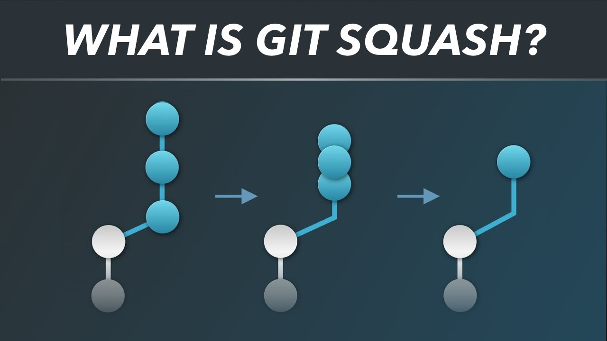

# Squash

Squashing is a way to combine multiple commits into a single commit. You can use squash before or after merge or rebase to make your pull requests "cleaner".



Suppose you created feature/ABC-111 and then have 5 total commits because of typos and fixing test failures, etc. If you don't want to air your dirty laundry, you can squash these 5 commits into a new single commit. There are two ways to do this. One involves you counting the total number of commits you want to squash. The other method involves 

Method 1: "Last 5 Commits"
```
git rebase -i HEAD~5
```

Method 2: "Squash until c56aa734c83b4" (not including c56aa734c83b4)
```
git rebase -i c56aa734c83b4

## Next
  - [Reset / Revert](./undo.md)
